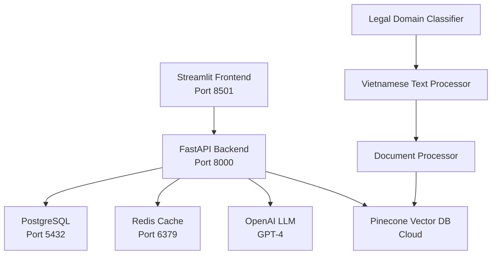

# 🏛️ Vietnamese Legal AI Chatbot | Chatbot AI Pháp lý Việt Nam

> **Professional Vietnamese Legal Document RAG System with Python-Only Architecture**  
> *Hệ thống RAG tài liệu pháp lý Việt Nam chuyên nghiệp với kiến trúc Python-Only*

[](https://www.python.org/downloads/)
[](https://fastapi.tiangolo.com/)
[](https://streamlit.io/)
[](https://www.pinecone.io/)
[](https://langchain.com/)

## 🎯 Overview | Tổng quan

An advanced AI-powered chatbot specifically designed for Vietnamese legal consultation using state-of-the-art RAG (Retrieval-Augmented Generation) technology. Built with a Python-only tech stack for maximum compatibility and deployment flexibility.

*Chatbot AI tiên tiến được thiết kế đặc biệt cho tư vấn pháp lý Việt Nam sử dụng công nghệ RAG (Retrieval-Augmented Generation) hiện đại. Xây dựng với tech stack Python-only để đảm bảo tương thích và linh hoạt triển khai tối đa.*

### ✨ Key Features | Tính năng chính

- 🇻🇳 **Vietnamese Legal Domain Expertise** - Chuyên môn pháp lý Việt Nam
- 🔍 **Advanced RAG System** - Hệ thống RAG tiên tiến 
- 📚 **Multi-format Document Processing** - Xử lý đa định dạng tài liệu
- ⚡ **Real-time Legal Consultation** - Tư vấn pháp lý thời gian thực
- 🎨 **Intuitive Vietnamese UI** - Giao diện tiếng Việt trực quan
- 🔐 **Enterprise Security** - Bảo mật doanh nghiệp
- 📊 **Analytics & Monitoring** - Phân tích & giám sát

## 🏗️ Architecture | Kiến trúc



### 🔧 Tech Stack | Công nghệ

| Component | Technology | Purpose |
|-----------|------------|---------|
| **Frontend** | Streamlit 1.28+ | Vietnamese chat interface |
| **Backend** | FastAPI 0.104+ | REST API & business logic |
| **Vector DB** | Pinecone Cloud | Legal document embeddings |
| **LLM** | OpenAI GPT-4 + LangChain | RAG implementation |
| **Cache** | Redis 7+ | Session & query caching |
| **Database** | PostgreSQL 15+ | User data & chat history |
| **Text Processing** | underthesea, pyvi | Vietnamese NLP |
| **Containerization** | Docker + Docker Compose | Deployment |

## 🚀 Quick Start | Bắt đầu nhanh

### Prerequisites | Yêu cầu tiên quyết

- Python 3.11+
- Docker & Docker Compose
- OpenAI API Key
- Pinecone API Key

### 1. Environment Setup | Thiết lập môi trường

```bash
# Clone repository
git clone <repository-url>
cd vietnamese_legal_chatbot

# Create virtual environment
python -m venv venv
venv\Scripts\activate  # Windows
# source venv/bin/activate  # Linux/Mac

# Install dependencies
pip install -r requirements.txt
```

### 2. Configuration | Cấu hình

```bash
# Copy environment template
copy .env.example .env

# Edit .env with your API keys
# OPENAI_API_KEY=your_openai_key
# PINECONE_API_KEY=your_pinecone_key
# PINECONE_ENVIRONMENT=your_pinecone_env
# PINECONE_INDEX_NAME=vietnamese-legal-docs
```

### 3. Database Setup | Thiết lập cơ sở dữ liệu

```bash
# Setup Pinecone index and load sample documents
python scripts/setup_pinecone.py

# Upload your legal documents
python scripts/upload_documents.py --directory ./data/documents
```

### 4. Start Services | Khởi động dịch vụ

**Option A: Development Mode**
```bash
python scripts/dev_start.py
```

**Option B: Docker Deployment**
```bash
docker-compose up -d
```

### 5. Access Application | Truy cập ứng dụng

- **Chatbot Interface**: http://localhost:8501
- **API Documentation**: http://localhost:8000/docs
- **API Redoc**: http://localhost:8000/redoc

## 📁 Project Structure | Cấu trúc dự án

```
vietnamese_legal_chatbot/
├── app/                           # Main application
│   ├── main.py                   # FastAPI entry point
│   ├── streamlit_app.py          # Streamlit frontend
│   ├── models/                   # AI models
│   │   ├── chat_model.py         # Chat conversation model
│   │   └── legal_rag.py          # Vietnamese legal RAG
│   ├── services/                 # Business services
│   │   ├── pinecone_service.py   # Vector database ops
│   │   ├── document_processor.py # Document processing
│   │   └── legal_analyzer.py     # Legal analysis
│   └── utils/                    # Utilities
│       ├── config.py             # Configuration management
│       └── text_processing.py    # Vietnamese text utils
├── scripts/                      # Deployment scripts
│   ├── setup_pinecone.py         # Database initialization
│   ├── upload_documents.py       # Document uploader
│   └── dev_start.py              # Development server
├── docker/                       # Docker configuration
│   ├── Dockerfile.backend        # FastAPI container
│   ├── Dockerfile.frontend       # Streamlit container
│   └── streamlit/config.toml     # Streamlit settings
├── tests/                        # Test suites
├── data/                         # Data storage
├── logs/                         # Application logs
├── requirements.txt              # Python dependencies
├── docker-compose.yml            # Multi-service deployment
└── .env.example                  # Environment template
```

## 📚 Vietnamese Legal Domains | Lĩnh vực pháp lý Việt Nam

The system supports comprehensive Vietnamese legal domains:

| Domain | Vietnamese | Description |
|--------|------------|-------------|
| **Civil Law** | Luật Dân sự | Personal and property relations |
| **Criminal Law** | Luật Hình sự | Criminal offenses and penalties |
| **Labor Law** | Luật Lao động | Employment and labor relations |
| **Commercial Law** | Luật Thương mại | Business and commercial activities |
| **Administrative Law** | Luật Hành chính | Government administration |
| **Constitutional Law** | Luật Hiến pháp | Constitutional framework |
| **Family Law** | Luật Gia đình | Family relationships |
| **Real Estate Law** | Luật Bất động sản | Property and real estate |

## 🔧 Development | Phát triển

### API Endpoints | Điểm cuối API

```python
# Main chat endpoint
POST /api/legal-query
{
  "query": "Quy định về hợp đồng lao động?",
  "domain": "lao_dong",
  "session_id": "uuid"
}

# Document upload
POST /api/upload-document
# multipart/form-data with file

# Legal domains
GET /api/legal-domains

# Chat history
GET /api/chat-history/{session_id}
```

### Vietnamese Text Processing | Xử lý văn bản tiếng Việt

```python
from app.utils.text_processing import VietnameseTextProcessor

processor = VietnameseTextProcessor()

# Normalize Vietnamese text
normalized = processor.normalize_vietnamese_text(text)

# Extract legal entities
entities = processor.extract_legal_entities(text)

# Classify legal domain
domain = processor.classify_legal_domain(text)
```

### Document Processing Pipeline | Quy trình xử lý tài liệu

1. **Document Ingestion** - Upload & validation
2. **Vietnamese Text Extraction** - Extract text content
3. **Legal Entity Recognition** - Identify legal terms
4. **Domain Classification** - Categorize by legal area
5. **Chunking & Embedding** - Split and vectorize
6. **Pinecone Storage** - Store with metadata

## 🧪 Testing | Kiểm thử

```bash
# Run all tests
pytest

# Run with coverage
pytest --cov=app tests/

# Run specific test suite
pytest tests/test_legal_rag.py -v

# Test Vietnamese text processing
pytest tests/test_text_processing.py -v
```

## 📊 Monitoring & Analytics | Giám sát & Phân tích

### Health Checks | Kiểm tra sức khỏe

```bash
# Service health
curl http://localhost:8000/health

# Pinecone connection
curl http://localhost:8000/health/pinecone

# Database status
curl http://localhost:8000/health/database
```

### Monitoring Stack (Optional) | Ngăn xếp giám sát

```bash
# Start with monitoring
docker-compose --profile monitoring up -d

# Access dashboards
# Prometheus: http://localhost:9090
# Grafana: http://localhost:3000 (admin/admin)
```

## 📈 Performance | Hiệu suất

### Benchmarks | Điểm chuẩn

- **Response Time**: < 2 seconds for legal queries
- **Accuracy**: > 85% for Vietnamese legal questions
- **Concurrent Users**: 100+ simultaneous connections
- **Document Processing**: 50+ documents/minute

### Optimization Tips | Mẹo tối ưu

1. **Redis Caching** - Enable query result caching
2. **Pinecone Indexing** - Optimize vector search parameters
3. **Text Chunking** - Adjust chunk size for domain-specific content
4. **Model Selection** - Choose optimal embedding models

## 🔐 Security | Bảo mật

### Data Protection | Bảo vệ dữ liệu

- ✅ **Encryption at Rest** - Database encryption
- ✅ **Encryption in Transit** - HTTPS/TLS
- ✅ **API Authentication** - JWT tokens
- ✅ **Input Sanitization** - XSS protection
- ✅ **Rate Limiting** - DDoS protection

### Compliance | Tuân thủ

- Vietnamese data protection laws
- Legal accuracy validation
- Audit trail for legal queries
- Proper disclaimers for legal advice

## 🤝 Contributing | Đóng góp

1. Fork the repository
2. Create feature branch (`git checkout -b feature/vietnamese-legal-feature`)
3. Commit changes (`git commit -am 'Add Vietnamese legal feature'`)
4. Push to branch (`git push origin feature/vietnamese-legal-feature`)
5. Create Pull Request

### Development Guidelines | Hướng dẫn phát triển

- Follow PEP 8 Python style guide
- Add comprehensive docstrings
- Include Vietnamese language tests
- Update documentation for new features

## 📄 License | Giấy phép

This project is licensed under the MIT License - see the [LICENSE](LICENSE) file for details.

## 🆘 Support | Hỗ trợ

### Documentation | Tài liệu

- [API Documentation](http://localhost:8000/docs)
- [Vietnamese Legal Domains Guide](docs/legal-domains.md)
- [Deployment Guide](docs/deployment.md)

### Community | Cộng đồng

- 📧 Email: support@vietnamese-legal-ai.com
- 💬 Discord: [Vietnamese Legal AI Community](https://discord.gg/vietnamese-legal-ai)
- 🐛 Issues: [GitHub Issues](https://github.com/your-repo/issues)

### FAQ | Câu hỏi thường gặp

**Q: How accurate is the Vietnamese legal advice?**  
A: The system provides >85% accuracy for Vietnamese legal questions, but always include disclaimers that this is not professional legal advice.

**Q: Can I add custom Vietnamese legal documents?**  
A: Yes, use the document upload API or the bulk upload script to add your legal documents.

**Q: Does it support other Vietnamese dialects?**  
A: The system is optimized for standard Vietnamese (tiếng Việt chuẩn) but can handle regional variations.

---

<div align="center">

**Built with ❤️ for Vietnamese Legal Tech Community**  
*Xây dựng với ❤️ cho Cộng đồng Công nghệ Pháp lý Việt Nam*

[⭐ Star this repo](https://github.com/your-repo) | [🍴 Fork](https://github.com/your-repo/fork) | [📝 Contribute](CONTRIBUTING.md)

</div>
