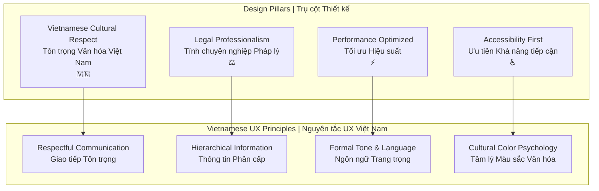
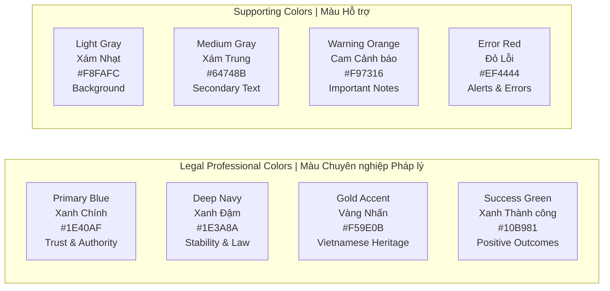
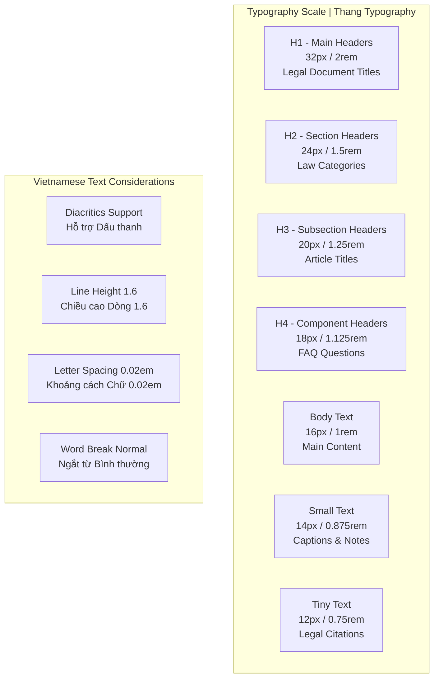
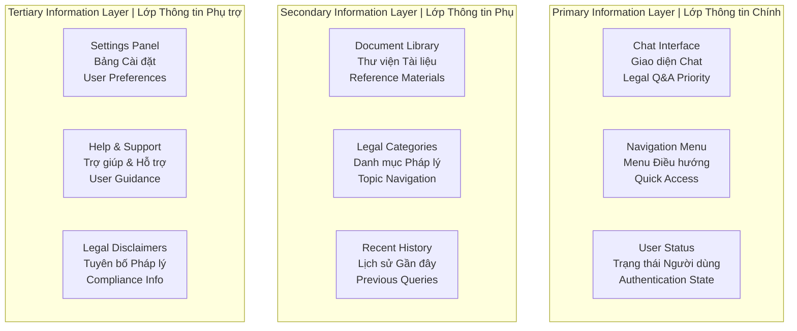
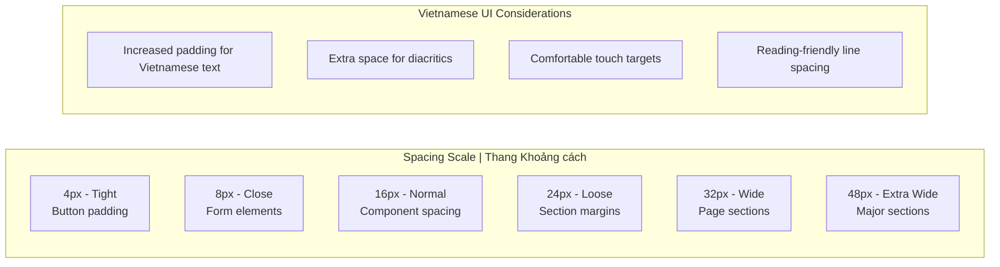
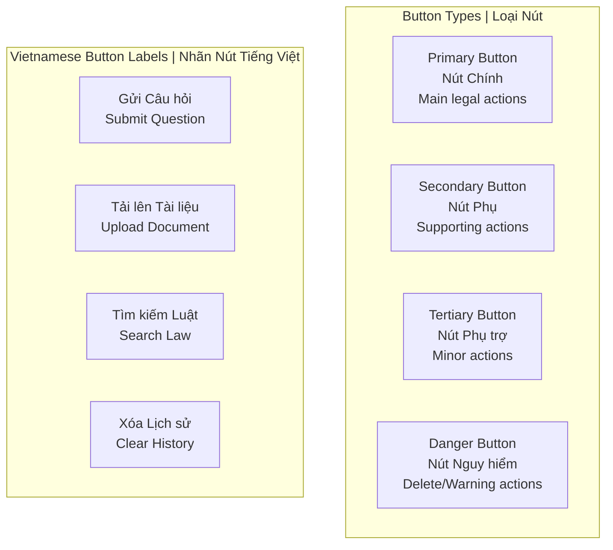
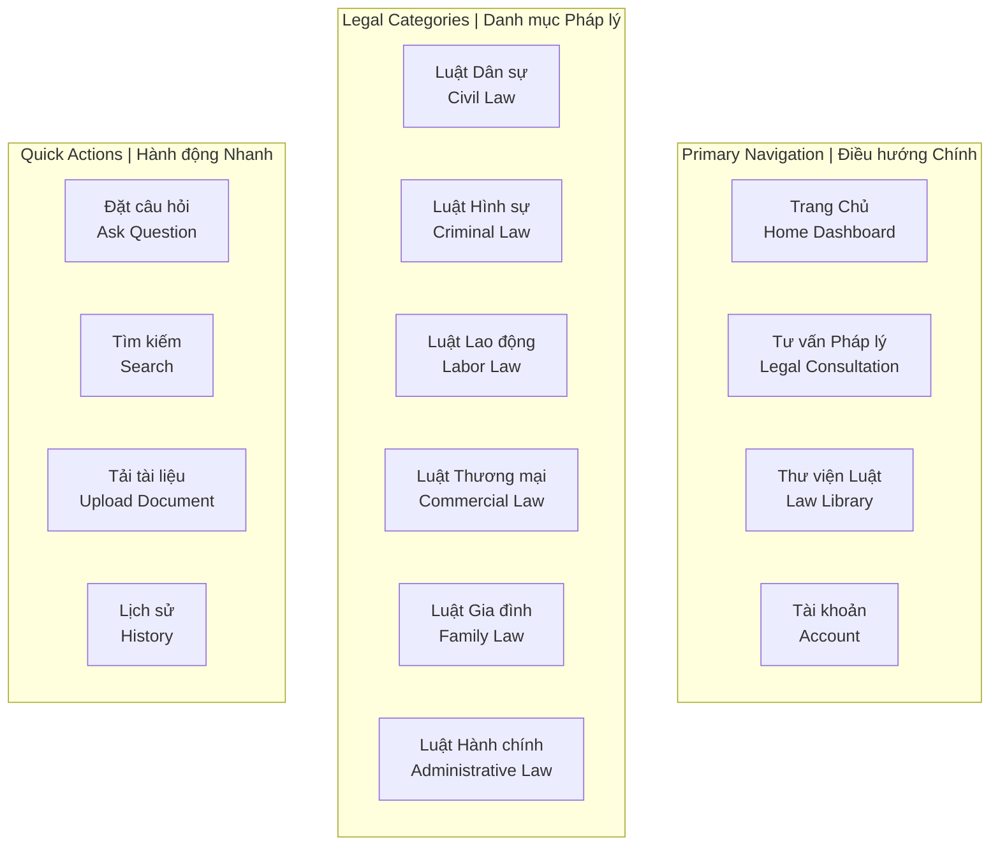

# 🎨 Design Principles & Guidelines - Part 1
# Nguyên tắc & Hướng dẫn Thiết kế - Phần 1

> **Fundamental design principles and visual guidelines for Vietnamese Legal AI Chatbot**  
> *Nguyên tắc thiết kế cơ bản và hướng dẫn thị giác cho Chatbot AI Pháp lý Việt Nam*

## 🎯 Core Design Philosophy | Triết lý Thiết kế Cốt lõi

### Vietnamese-First Design Approach | Tiếp cận Thiết kế Ưu tiên Việt Nam



## 🎨 Visual Identity System | Hệ thống Nhận diện Thị giác

### Primary Color Palette | Bảng màu Chính



### Color Usage Guidelines | Hướng dẫn Sử dụng Màu sắc

| Color | Usage | Vietnamese Context | Accessibility |
|-------|-------|-------------------|---------------|
| **#1E40AF** | Primary actions, headers | Government official blue | WCAG AA+ |
| **#1E3A8A** | Navigation, legal emphasis | Traditional Vietnamese authority | WCAG AA+ |
| **#F59E0B** | Highlights, Vietnamese elements | Golden dragon, prosperity | WCAG AA |
| **#10B981** | Success states, positive feedback | Growth, harmony | WCAG AA+ |
| **#EF4444** | Errors, critical warnings | Traditional warning red | WCAG AA |

### Typography System | Hệ thống Typography

#### Vietnamese Font Hierarchy | Phân cấp Font Tiếng Việt

```css
/* Primary Font Stack - Vietnamese Optimized */
--font-primary: 'Inter', 'Roboto', 'Noto Sans Vietnamese', 
                'SVN-Poppins', 'Arial', sans-serif;

/* Display/Header Fonts */
--font-display: 'Playfair Display', 'SVN-Gilroy', 'Georgia', serif;

/* Monospace for Code/Legal Citations */
--font-mono: 'JetBrains Mono', 'SVN-Source Code Pro', 
             'Consolas', monospace;

/* Vietnamese Specific Fonts */
--font-vietnamese: 'Noto Sans Vietnamese', 'SVN-Poppins', 
                   'Roboto Vietnamese', sans-serif;
```

#### Font Size Scale | Thang Đo Kích thước Font



### Vietnamese Typography Best Practices | Thực hành Tốt nhất Typography Việt Nam

#### 1. Diacritics & Special Characters | Dấu thanh & Ký tự Đặc biệt

```css
/* Ensure proper Vietnamese diacritics rendering */
.vietnamese-text {
    font-feature-settings: "liga" 1, "kern" 1, "calt" 1;
    text-rendering: optimizeLegibility;
    -webkit-font-smoothing: antialiased;
    -moz-osx-font-smoothing: grayscale;
}

/* Special handling for legal Vietnamese terms */
.legal-term {
    font-weight: 600;
    color: var(--color-primary);
    font-variant: small-caps;
}
```

#### 2. Line Length & Readability | Độ dài Dòng & Khả năng Đọc

```css
/* Optimal line length for Vietnamese text */
.content-text {
    max-width: 65ch; /* Optimal for Vietnamese reading */
    line-height: 1.6; /* Increased for Vietnamese diacritics */
    margin-bottom: 1.5rem;
}

/* Legal document formatting */
.legal-document {
    max-width: 70ch;
    line-height: 1.8;
    text-align: justify;
    hyphens: auto;
    hyphenate-limit-chars: 6 3 3;
}
```

## 🎭 Visual Hierarchy System | Hệ thống Phân cấp Thị giác

### Information Architecture | Kiến trúc Thông tin



### Visual Weight Distribution | Phân bố Trọng lượng Thị giác

#### Component Priority Matrix | Ma trận Ưu tiên Component

| Priority | Component | Visual Treatment | Vietnamese Consideration |
|----------|-----------|-----------------|--------------------------|
| **Critical** | Chat Input/Output | High contrast, large fonts | Proper Vietnamese input support |
| **High** | Legal Categories | Bold colors, clear icons | Vietnamese legal domain names |
| **Medium** | Navigation | Moderate emphasis | Formal Vietnamese terminology |
| **Low** | Footer/Credits | Subdued colors, small text | Professional Vietnamese tone |

## 📐 Layout & Grid System | Hệ thống Bố cục & Lưới

### Grid Framework | Khung Lưới

```css
/* Vietnamese Legal AI Chatbot Grid System */
.container {
    display: grid;
    grid-template-columns: 
        [sidebar-start] 280px 
        [content-start] 1fr 
        [aside-start] 320px [aside-end];
    grid-template-rows: 
        [header-start] 64px 
        [main-start] 1fr 
        [footer-start] 48px [footer-end];
    gap: 24px;
    min-height: 100vh;
    padding: 0 24px;
}
```

### Spacing System | Hệ thống Khoảng cách



## 🎪 Component Design Patterns | Mẫu Thiết kế Component

### Button System | Hệ thống Nút

#### Primary Buttons | Nút Chính

```css
/* Primary Action Button - Vietnamese Legal Style */
.btn-primary {
    background: linear-gradient(135deg, #1E40AF, #1E3A8A);
    color: white;
    border: none;
    border-radius: 8px;
    padding: 12px 24px;
    font-size: 16px;
    font-weight: 600;
    min-height: 44px; /* Touch-friendly */
    box-shadow: 0 2px 4px rgba(30, 64, 175, 0.1);
    transition: all 0.2s ease;
}

.btn-primary:hover {
    background: linear-gradient(135deg, #1E3A8A, #1E40AF);
    box-shadow: 0 4px 8px rgba(30, 64, 175, 0.2);
    transform: translateY(-1px);
}

/* Vietnamese text specific adjustments */
.btn-primary.vietnamese {
    letter-spacing: 0.02em;
    line-height: 1.4;
}
```

#### Button Hierarchy | Phân cấp Nút



### Form Design Patterns | Mẫu Thiết kế Form

#### Vietnamese Input Fields | Trường Input Tiếng Việt

```css
/* Vietnamese-optimized input fields */
.form-input {
    border: 2px solid #E2E8F0;
    border-radius: 8px;
    padding: 12px 16px;
    font-size: 16px;
    line-height: 1.5;
    background: white;
    transition: border-color 0.2s ease;
    min-height: 44px;
}

.form-input:focus {
    border-color: #1E40AF;
    outline: none;
    box-shadow: 0 0 0 3px rgba(30, 64, 175, 0.1);
}

/* Vietnamese text area with proper spacing */
.form-textarea {
    min-height: 120px;
    resize: vertical;
    font-family: var(--font-vietnamese);
    line-height: 1.6;
}

/* Legal document input specific styling */
.legal-input {
    font-family: var(--font-mono);
    background: #F8FAFC;
    border-left: 4px solid #F59E0B;
}
```

### Navigation Patterns | Mẫu Điều hướng

#### Vietnamese Legal Navigation | Điều hướng Pháp lý Việt Nam



## ♿ Accessibility Guidelines | Hướng dẫn Khả năng Tiếp cận

### WCAG 2.1 AA Compliance | Tuân thủ WCAG 2.1 AA

#### Color Contrast Requirements | Yêu cầu Tương phản Màu sắc

| Element | Contrast Ratio | Vietnamese Context |
|---------|---------------|-------------------|
| Body text | 4.5:1 minimum | Readable Vietnamese characters |
| Large text (18px+) | 3:1 minimum | Legal headers and titles |
| UI components | 3:1 minimum | Buttons and form elements |
| Focus indicators | 3:1 minimum | Keyboard navigation support |

#### Vietnamese Screen Reader Support | Hỗ trợ Đọc màn hình Tiếng Việt

```html
<!-- Proper Vietnamese language support -->
<html lang="vi">
<head>
    <meta charset="UTF-8">
    <title>Chatbot AI Pháp lý Việt Nam</title>
</head>

<!-- Semantic Vietnamese legal content -->
<main role="main" aria-label="Tư vấn pháp lý chính">
    <section aria-labelledby="chat-heading">
        <h1 id="chat-heading">Đặt câu hỏi pháp lý</h1>
        <div role="log" aria-live="polite" aria-label="Trả lời từ AI">
            <!-- Chat responses -->
        </div>
    </section>
</main>

<!-- Vietnamese form labels -->
<label for="legal-question">
    Nhập câu hỏi pháp lý của bạn
    <span aria-describedby="question-help">(bắt buộc)</span>
</label>
<textarea 
    id="legal-question" 
    aria-describedby="question-help"
    placeholder="Ví dụ: Tôi cần tư vấn về luật lao động..."
></textarea>
<div id="question-help" class="help-text">
    Vui lòng mô tả rõ tình huống pháp lý của bạn
</div>
```

### Keyboard Navigation | Điều hướng Bàn phím

#### Vietnamese Keyboard Shortcuts | Phím tắt Tiếng Việt

| Shortcut | Action | Vietnamese Label |
|----------|--------|------------------|
| `Ctrl + /` | Help menu | Trợ giúp |
| `Ctrl + Enter` | Submit question | Gửi câu hỏi |
| `Ctrl + D` | Toggle document panel | Bật/tắt tài liệu |
| `Ctrl + H` | View history | Xem lịch sử |
| `F1` | Accessibility help | Trợ giúp khả năng tiếp cận |

## 🎯 Design Validation Checklist | Danh sách Kiểm tra Thiết kế

### Vietnamese Legal UI Compliance | Tuân thủ UI Pháp lý Việt Nam

- [ ] **Vietnamese Text Rendering** - Proper diacritics display
- [ ] **Legal Terminology** - Accurate Vietnamese legal terms
- [ ] **Cultural Colors** - Appropriate Vietnamese color psychology
- [ ] **Formal Tone** - Professional Vietnamese communication style
- [ ] **Government Standards** - Compliance with Vietnamese UI standards
- [ ] **Accessibility** - WCAG 2.1 AA compliance for Vietnamese content
- [ ] **Performance** - Fast loading for Vietnamese users

---

*📅 Created: August 2025 | Version: 1.0 | Next: Part 2 - User Interface Layouts*

**Next Document:** [User Interface Layouts](02-user-interface-layouts.md)  
**Related:** [System Architecture](../system-architecture.md) | [User Stories](../user-stories.md)
