# 🖥️ User Interface Layouts - Part 2
# Bố cục Giao diện Người dùng - Phần 2

> **Comprehensive UI layout designs and component structures for Vietnamese Legal AI Chatbot**  
> *Thiết kế bố cục UI toàn diện và cấu trúc components cho Chatbot AI Pháp lý Việt Nam*

## 📐 Main Layout Architecture | Kiến trúc Bố cục Chính

### Primary Layout Structure | Cấu trúc Bố cục Chính

```mermaid
graph TB
    subgraph "Main Application Layout | Bố cục Ứng dụng Chính"
        subgraph "Header Section | Phần Header"
            H1[Logo & Branding<br/>Logo & Thương hiệu]
            H2[Navigation Menu<br/>Menu Điều hướng]
            H3[User Profile<br/>Hồ sơ Người dùng]
            H4[Language Switch<br/>Chuyển đổi Ngôn ngữ]
        end
        
        subgraph "Main Content Area | Khu vực Nội dung Chính"
            subgraph "Left Sidebar | Thanh bên Trái"
                L1[Legal Categories<br/>Danh mục Pháp lý]
                L2[Recent Queries<br/>Truy vấn Gần đây]
                L3[Quick Actions<br/>Hành động Nhanh]
            end
            
            subgraph "Central Content | Nội dung Trung tâm"
                C1[Chat Interface<br/>Giao diện Chat]
                C2[Document Viewer<br/>Trình xem Tài liệu]
                C3[Search Results<br/>Kết quả Tìm kiếm]
            end
            
            subgraph "Right Sidebar | Thanh bên Phải"
                R1[Document Library<br/>Thư viện Tài liệu]
                R2[Legal References<br/>Tham khảo Pháp lý]
                R3[Related Topics<br/>Chủ đề Liên quan]
            end
        end
        
        subgraph "Footer Section | Phần Footer"
            F1[Legal Disclaimers<br/>Tuyên bố Pháp lý]
            F2[Contact Information<br/>Thông tin Liên hệ]
            F3[Privacy Policy<br/>Chính sách Bảo mật]
        end
    end
```



### Grid System | Hệ thống Lưới

```css
/* Main Container Grid - Vietnamese Legal AI Chatbot */
.app-container {
    display: grid;
    grid-template-areas:
        "header header header"
        "sidebar content aside"
        "footer footer footer";
    grid-template-columns: 280px 1fr 320px;
    grid-template-rows: 80px 1fr 60px;
    min-height: 100vh;
    max-width: 1440px;
    margin: 0 auto;
    gap: 0;
}

/* Header Grid */
.app-header {
    grid-area: header;
    display: grid;
    grid-template-columns: 200px 1fr auto auto;
    align-items: center;
    padding: 0 24px;
    background: #FFFFFF;
    border-bottom: 1px solid #E2E8F0;
    box-shadow: 0 1px 3px rgba(0, 0, 0, 0.1);
}

/* Sidebar Grid */
.app-sidebar {
    grid-area: sidebar;
    background: #F8FAFC;
    border-right: 1px solid #E2E8F0;
    overflow-y: auto;
    padding: 24px 16px;
}

/* Main Content Grid */
.app-content {
    grid-area: content;
    background: #FFFFFF;
    overflow-y: auto;
    position: relative;
}

/* Right Aside Grid */
.app-aside {
    grid-area: aside;
    background: #F8FAFC;
    border-left: 1px solid #E2E8F0;
    overflow-y: auto;
    padding: 24px 16px;
}

/* Footer Grid */
.app-footer {
    grid-area: footer;
    background: #1E3A8A;
    color: white;
    display: flex;
    align-items: center;
    justify-content: space-between;
    padding: 0 24px;
    font-size: 14px;
}
```

## 🔧 Header Component Design | Thiết kế Component Header

### Vietnamese Legal Header Layout | Bố cục Header Pháp lý Việt Nam

```html
<!-- Main Application Header -->
<header class="app-header" role="banner">
    
    <!-- Logo and Branding -->
    <div class="header-brand">
        
        <div class="brand-text">
            <h1 class="brand-title">Pháp lý AI</h1>
            <span class="brand-subtitle">Tư vấn pháp lý thông minh</span>
        </div>
    </div>
    
    <!-- Main Navigation -->
    <nav class="header-navigation" role="navigation" aria-label="Điều hướng chính">
        <ul class="nav-menu">
            <li class="nav-item">
                <a href="/dashboard" class="nav-link active" aria-current="page">
                    <i class="icon-home" aria-hidden="true"></i>
                    <span class="nav-text">Trang chủ</span>
                </a>
            </li>
            <li class="nav-item">
                <a href="/consultation" class="nav-link">
                    <i class="icon-message-circle" aria-hidden="true"></i>
                    <span class="nav-text">Tư vấn</span>
                </a>
            </li>
            <li class="nav-item has-dropdown">
                <button class="nav-link dropdown-toggle" 
                        aria-expanded="false" 
                        aria-haspopup="true">
                    <i class="icon-book-open" aria-hidden="true"></i>
                    <span class="nav-text">Thư viện</span>
                    <i class="icon-chevron-down" aria-hidden="true"></i>
                </button>
                <ul class="dropdown-menu" aria-hidden="true">
                    <li><a href="/library/civil">Luật Dân sự</a></li>
                    <li><a href="/library/criminal">Luật Hình sự</a></li>
                    <li><a href="/library/labor">Luật Lao động</a></li>
                    <li><a href="/library/commercial">Luật Thương mại</a></li>
                    <li><a href="/library/family">Luật Gia đình</a></li>
                </ul>
            </li>
            <li class="nav-item">
                <a href="/documents" class="nav-link">
                    <i class="icon-folder" aria-hidden="true"></i>
                    <span class="nav-text">Tài liệu</span>
                </a>
            </li>
        </ul>
    </nav>
    
    <!-- Search and User Actions -->
    <div class="header-actions">
        <!-- Global Search -->
        <div class="search-container">
            <div class="search-input-wrapper">
                <i class="icon-search search-icon" aria-hidden="true"></i>
                <input type="search" 
                       class="search-input" 
                       placeholder="Tìm kiếm luật, điều khoản..."
                       aria-label="Tìm kiếm toàn bộ">
                <button class="search-clear" aria-label="Xóa tìm kiếm" style="display: none;">
                    <i class="icon-x" aria-hidden="true"></i>
                </button>
            </div>
            <div class="search-suggestions" aria-hidden="true">
                <!-- Search suggestions populated dynamically -->
            </div>
        </div>
        
        <!-- User Profile Menu -->
        <div class="user-menu">
            <button class="user-menu-toggle" 
                    aria-expanded="false" 
                    aria-haspopup="true"
                    aria-label="Menu người dùng">
                
                <span class="user-name">Nguyễn Văn A</span>
                <i class="icon-chevron-down" aria-hidden="true"></i>
            </button>
            <div class="user-dropdown" aria-hidden="true">
                <div class="user-info">
                    
                    <div class="user-details">
                        <h3 class="user-display-name">Nguyễn Văn A</h3>
                        <p class="user-email">nguyen.van.a@email.com</p>
                        <span class="user-role">Thành viên</span>
                    </div>
                </div>
                <hr class="dropdown-divider">
                <ul class="dropdown-menu">
                    <li><a href="/profile" class="dropdown-item">
                        <i class="icon-user" aria-hidden="true"></i>
                        Hồ sơ cá nhân
                    </a></li>
                    <li><a href="/settings" class="dropdown-item">
                        <i class="icon-settings" aria-hidden="true"></i>
                        Cài đặt
                    </a></li>
                    <li><a href="/history" class="dropdown-item">
                        <i class="icon-clock" aria-hidden="true"></i>
                        Lịch sử tư vấn
                    </a></li>
                    <li><hr class="dropdown-divider"></li>
                    <li><a href="/help" class="dropdown-item">
                        <i class="icon-help-circle" aria-hidden="true"></i>
                        Trợ giúp
                    </a></li>
                    <li><button class="dropdown-item logout-btn">
                        <i class="icon-log-out" aria-hidden="true"></i>
                        Đăng xuất
                    </button></li>
                </ul>
            </div>
        </div>
    </div>
    
</header>
```

### Header Styling | Styling Header

```css
/* Header Component Styles */
.app-header {
    position: sticky;
    top: 0;
    z-index: 100;
    background: rgba(255, 255, 255, 0.95);
    backdrop-filter: blur(10px);
    transition: all 0.3s ease;
}

.app-header.scrolled {
    background: rgba(255, 255, 255, 0.98);
    box-shadow: 0 2px 12px rgba(0, 0, 0, 0.08);
}

/* Brand Section */
.header-brand {
    display: flex;
    align-items: center;
    gap: 12px;
}

.brand-logo {
    width: 40px;
    height: 40px;
}

.brand-title {
    font-size: 20px;
    font-weight: 700;
    color: #1E40AF;
    margin-bottom: 2px;
}

.brand-subtitle {
    font-size: 12px;
    color: #64748B;
}

/* Navigation Styles */
.header-navigation {
    flex: 1;
    margin-left: 32px;
}

.nav-menu {
    display: flex;
    list-style: none;
    margin: 0;
    padding: 0;
    gap: 8px;
}

.nav-link {
    display: flex;
    align-items: center;
    gap: 8px;
    padding: 8px 16px;
    color: #64748B;
    text-decoration: none;
    border-radius: 6px;
    transition: all 0.2s ease;
    background: none;
    border: none;
    cursor: pointer;
    font-size: 14px;
    font-weight: 500;
}

.nav-link:hover {
    color: #1E40AF;
    background: #F0F9FF;
}

.nav-link.active {
    color: #1E40AF;
    background: #EBF8FF;
    font-weight: 600;
}

/* Search Component */
.search-container {
    position: relative;
    margin-right: 16px;
}

.search-input-wrapper {
    position: relative;
    display: flex;
    align-items: center;
    background: #F8FAFC;
    border: 1px solid #E2E8F0;
    border-radius: 20px;
    padding: 0 16px;
    width: 300px;
    transition: all 0.2s ease;
}

.search-input-wrapper:focus-within {
    background: white;
    border-color: #1E40AF;
    box-shadow: 0 0 0 3px rgba(30, 64, 175, 0.1);
}

.search-icon {
    color: #9CA3AF;
    margin-right: 8px;
}

.search-input {
    flex: 1;
    border: none;
    background: none;
    padding: 10px 0;
    font-size: 14px;
    color: #374151;
}

.search-input::placeholder {
    color: #9CA3AF;
}

/* User Menu */
.user-menu {
    position: relative;
}

.user-menu-toggle {
    display: flex;
    align-items: center;
    gap: 8px;
    padding: 6px 12px;
    background: none;
    border: 1px solid #E2E8F0;
    border-radius: 20px;
    cursor: pointer;
    transition: all 0.2s ease;
}

.user-menu-toggle:hover {
    border-color: #1E40AF;
    background: #F0F9FF;
}

.user-avatar {
    width: 32px;
    height: 32px;
    border-radius: 50%;
    object-fit: cover;
}

.user-name {
    font-size: 14px;
    font-weight: 500;
    color: #374151;
}
```

## 🗂️ Sidebar Component Design | Thiết kế Component Sidebar

### Left Sidebar - Legal Categories | Sidebar Trái - Danh mục Pháp lý

```html
<!-- Left Sidebar - Legal Navigation -->
<aside class="app-sidebar left-sidebar" role="complementary" aria-label="Điều hướng pháp lý">
    
    <!-- Legal Categories Section -->
    <div class="sidebar-section">
        <h2 class="sidebar-title">
            <i class="icon-scale" aria-hidden="true"></i>
            Lĩnh vực Pháp lý
        </h2>
        <nav class="legal-categories" role="navigation">
            <ul class="category-list">
                
                <!-- Civil Law Category -->
                <li class="category-item">
                    <button class="category-toggle active" 
                            aria-expanded="true" 
                            aria-controls="civil-law-menu">
                        <i class="category-icon icon-users" aria-hidden="true"></i>
                        <span class="category-name">Luật Dân sự</span>
                        <i class="category-arrow icon-chevron-down" aria-hidden="true"></i>
                    </button>
                    <ul class="category-submenu" id="civil-law-menu">
                        <li><a href="/civil/property">Quyền sở hữu</a></li>
                        <li><a href="/civil/contracts">Hợp đồng</a></li>
                        <li><a href="/civil/obligations">Nghĩa vụ dân sự</a></li>
                        <li><a href="/civil/inheritance">Thừa kế</a></li>
                    </ul>
                </li>
                
                <!-- Criminal Law Category -->
                <li class="category-item">
                    <button class="category-toggle" 
                            aria-expanded="false" 
                            aria-controls="criminal-law-menu">
                        <i class="category-icon icon-shield" aria-hidden="true"></i>
                        <span class="category-name">Luật Hình sự</span>
                        <i class="category-arrow icon-chevron-down" aria-hidden="true"></i>
                    </button>
                    <ul class="category-submenu" id="criminal-law-menu" aria-hidden="true">
                        <li><a href="/criminal/offenses">Tội phạm</a></li>
                        <li><a href="/criminal/penalties">Hình phạt</a></li>
                        <li><a href="/criminal/procedures">Thủ tục tố tụng</a></li>
                    </ul>
                </li>
                
                <!-- Labor Law Category -->
                <li class="category-item">
                    <button class="category-toggle" 
                            aria-expanded="false" 
                            aria-controls="labor-law-menu">
                        <i class="category-icon icon-briefcase" aria-hidden="true"></i>
                        <span class="category-name">Luật Lao động</span>
                        <i class="category-arrow icon-chevron-down" aria-hidden="true"></i>
                    </button>
                    <ul class="category-submenu" id="labor-law-menu" aria-hidden="true">
                        <li><a href="/labor/contracts">Hợp đồng lao động</a></li>
                        <li><a href="/labor/rights">Quyền lao động</a></li>
                        <li><a href="/labor/disputes">Tranh chấp lao động</a></li>
                        <li><a href="/labor/insurance">Bảo hiểm xã hội</a></li>
                    </ul>
                </li>
                
                <!-- Commercial Law Category -->
                <li class="category-item">
                    <button class="category-toggle" 
                            aria-expanded="false" 
                            aria-controls="commercial-law-menu">
                        <i class="category-icon icon-building" aria-hidden="true"></i>
                        <span class="category-name">Luật Thương mại</span>
                        <i class="category-arrow icon-chevron-down" aria-hidden="true"></i>
                    </button>
                    <ul class="category-submenu" id="commercial-law-menu" aria-hidden="true">
                        <li><a href="/commercial/business">Kinh doanh</a></li>
                        <li><a href="/commercial/trade">Thương mại</a></li>
                        <li><a href="/commercial/competition">Cạnh tranh</a></li>
                    </ul>
                </li>
                
                <!-- Family Law Category -->
                <li class="category-item">
                    <button class="category-toggle" 
                            aria-expanded="false" 
                            aria-controls="family-law-menu">
                        <i class="category-icon icon-heart" aria-hidden="true"></i>
                        <span class="category-name">Luật Gia đình</span>
                        <i class="category-arrow icon-chevron-down" aria-hidden="true"></i>
                    </button>
                    <ul class="category-submenu" id="family-law-menu" aria-hidden="true">
                        <li><a href="/family/marriage">Hôn nhân</a></li>
                        <li><a href="/family/divorce">Ly hôn</a></li>
                        <li><a href="/family/children">Quyền trẻ em</a></li>
                        <li><a href="/family/adoption">Nhận con nuôi</a></li>
                    </ul>
                </li>
                
            </ul>
        </nav>
    </div>
    
    <!-- Recent Queries Section -->
    <div class="sidebar-section">
        <h3 class="sidebar-title">
            <i class="icon-clock" aria-hidden="true"></i>
            Truy vấn gần đây
        </h3>
        <div class="recent-queries">
            <a href="/query/1" class="query-item">
                <div class="query-content">
                    <p class="query-text">Thủ tục ly hôn thuận tình</p>
                    <time class="query-time">2 giờ trước</time>
                </div>
                <i class="icon-chevron-right" aria-hidden="true"></i>
            </a>
            <a href="/query/2" class="query-item">
                <div class="query-content">
                    <p class="query-text">Quyền lợi người lao động</p>
                    <time class="query-time">1 ngày trước</time>
                </div>
                <i class="icon-chevron-right" aria-hidden="true"></i>
            </a>
            <a href="/query/3" class="query-item">
                <div class="query-content">
                    <p class="query-text">Hợp đồng mua bán nhà</p>
                    <time class="query-time">3 ngày trước</time>
                </div>
                <i class="icon-chevron-right" aria-hidden="true"></i>
            </a>
        </div>
        <a href="/history" class="view-all-link">
            Xem tất cả lịch sử
            <i class="icon-arrow-right" aria-hidden="true"></i>
        </a>
    </div>
    
    <!-- Quick Actions Section -->
    <div class="sidebar-section">
        <h3 class="sidebar-title">
            <i class="icon-zap" aria-hidden="true"></i>
            Hành động nhanh
        </h3>
        <div class="quick-actions">
            <button class="quick-action-btn">
                <i class="icon-plus" aria-hidden="true"></i>
                <span>Đặt câu hỏi mới</span>
            </button>
            <button class="quick-action-btn">
                <i class="icon-upload" aria-hidden="true"></i>
                <span>Tải lên tài liệu</span>
            </button>
            <button class="quick-action-btn">
                <i class="icon-bookmark" aria-hidden="true"></i>
                <span>Tìm luật liên quan</span>
            </button>
        </div>
    </div>
    
</aside>
```

## 🎯 Layout Validation Checklist | Danh sách Kiểm tra Bố cục

### Layout Compliance | Tuân thủ Bố cục

- [ ] **Desktop Layout** - Three-column with sticky sidebars
- [ ] **Header Design** - Clear navigation and search
- [ ] **Sidebar Functionality** - Collapsible panels and legal categories
- [ ] **Content Organization** - Fluid layouts and proper overflow handling
- [ ] **Footer Design** - Appropriate content organization

### Vietnamese UI Compliance | Tuân thủ UI Việt Nam

- [ ] **Vietnamese Navigation Labels** - Proper terminology and hierarchy
- [ ] **Legal Category Organization** - Vietnamese legal domain structure
- [ ] **Content Reading Flow** - Left-to-right Vietnamese text flow
- [ ] **Cultural Color Usage** - Appropriate Vietnamese color psychology
- [ ] **Professional Tone** - Formal Vietnamese language throughout
- [ ] **Government Standard Compliance** - Vietnamese UI/UX standards
- [ ] **Accessibility Labels** - Vietnamese screen reader support

---

*📅 Created: August 2025 | Version: 1.0 | Next: Part 3 - Chat Interface Design*

**Next Document:** [Chat Interface Design](03-chat-interface-design.md)  
**Previous Document:** [Design Principles](01-design-principles.md)  
**Related:** [System Architecture](../system-architecture.md) | [User Stories](../user-stories.md)
