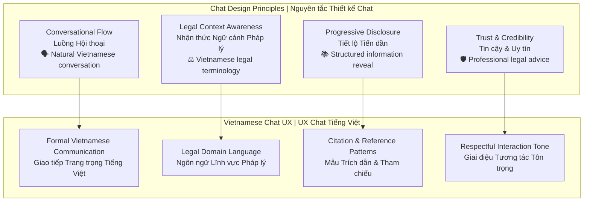
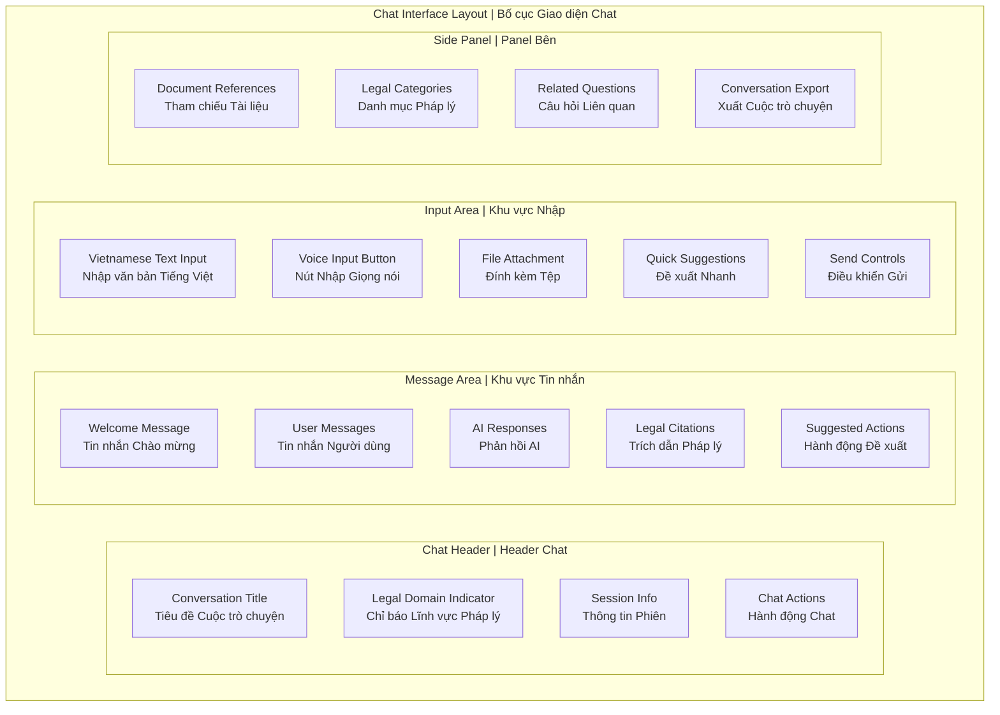

# 💬 Chat Interface Design - Part 3
# Thiết kế Giao diện Chat - Phần 3

> **Comprehensive chat interface design for Vietnamese Legal AI Chatbot with conversation patterns and Vietnamese language optimization**  
> *Thiết kế giao diện chat toàn diện cho Chatbot AI Pháp lý Việt Nam với các mẫu hội thoại và tối ưu hóa tiếng Việt*

## 🎯 Chat Interface Overview | Tổng quan Giao diện Chat

### Chat Design Philosophy | Triết lý Thiết kế Chat



### Chat Layout Structure | Cấu trúc Bố cục Chat



## 🎨 Chat Message Design | Thiết kế Tin nhắn Chat

### Message Bubble Patterns | Mẫu Bong bóng Tin nhắn

```html
<!-- Vietnamese Legal Chat Messages -->
<div class="chat-messages" role="log" aria-live="polite" aria-label="Cuộc trò chuyện tư vấn pháp lý">
    
    <!-- AI Welcome Message -->
    <div class="message-group ai-message">
        <div class="message-avatar">
            
            <div class="avatar-status online" aria-label="Trực tuyến"></div>
        </div>
        <div class="message-content">
            <div class="message-header">
                <span class="sender-name">Trợ lý AI Pháp lý</span>
                <time class="message-time" datetime="2025-08-15T10:30:00">10:30</time>
            </div>
            <div class="message-bubble ai-bubble">
                <div class="message-text">
                    <p>Xin chào! Tôi là trợ lý AI chuyên về pháp luật Việt Nam. Tôi có thể giúp bạn:</p>
                    <ul class="help-options">
                        <li>🏛️ Tư vấn các vấn đề pháp lý</li>
                        <li>📚 Tìm kiếm điều luật và quy định</li>
                        <li>📄 Phân tích tài liệu pháp lý</li>
                        <li>⚖️ Giải thích các thủ tục pháp lý</li>
                    </ul>
                    <p>Vui lòng mô tả tình huống hoặc câu hỏi pháp lý của bạn.</p>
                </div>
                <div class="message-actions">
                    <button class="action-btn" aria-label="Thích tin nhắn này">
                        <i class="icon-thumb-up" aria-hidden="true"></i>
                    </button>
                    <button class="action-btn" aria-label="Sao chép tin nhắn">
                        <i class="icon-copy" aria-hidden="true"></i>
                    </button>
                    <button class="action-btn" aria-label="Chia sẻ tin nhắn">
                        <i class="icon-share" aria-hidden="true"></i>
                    </button>
                </div>
            </div>
        </div>
    </div>
    
    <!-- User Question Message -->
    <div class="message-group user-message">
        <div class="message-content">
            <div class="message-header">
                <span class="sender-name">Bạn</span>
                <time class="message-time" datetime="2025-08-15T10:32:00">10:32</time>
            </div>
            <div class="message-bubble user-bubble">
                <div class="message-text">
                    <p>Tôi đang có tranh chấp với chủ nhà về việc tăng giá thuê nhà. Chủ nhà muốn tăng 50% so với hợp đồng hiện tại mà không có lý do chính đáng. Theo pháp luật Việt Nam, tôi có quyền gì trong trường hợp này?</p>
                </div>
                <div class="message-status">
                    <i class="icon-check-double delivered" aria-hidden="true"></i>
                    <span class="status-text">Đã gửi</span>
                </div>
            </div>
        </div>
        <div class="message-avatar">
            
        </div>
    </div>
    
    <!-- AI Response with Legal Citations -->
    <div class="message-group ai-message">
        <div class="message-avatar">
            
            <div class="avatar-status typing" aria-label="Đang soạn tin nhắn..."></div>
        </div>
        <div class="message-content">
            <div class="message-header">
                <span class="sender-name">Trợ lý AI Pháp lý</span>
                <time class="message-time" datetime="2025-08-15T10:33:00">10:33</time>
                <span class="legal-domain-tag">Luật Nhà ở</span>
            </div>
            <div class="message-bubble ai-bubble">
                <div class="message-text">
                    <p>Dựa trên tình huống bạn mô tả, theo pháp luật Việt Nam, bạn có các quyền sau:</p>
                    
                    <h4>🏠 Quyền được bảo vệ theo hợp đồng thuê nhà:</h4>
                    <ul>
                        <li>Chủ nhà không được đơn phương tăng giá thuê trong thời hạn hợp đồng</li>
                        <li>Mọi thay đổi về giá thuê phải được hai bên thỏa thuận</li>
                        <li>Việc tăng giá phải có cơ sở hợp lý và tuân thủ quy định pháp luật</li>
                    </ul>
                    
                    <h4>⚖️ Cơ sở pháp lý:</h4>
                </div>
                
                <!-- Legal Citation Component -->
                <div class="legal-citations">
                    <div class="citation-item">
                        <div class="citation-header">
                            <i class="icon-law" aria-hidden="true"></i>
                            <span class="citation-title">Luật Nhà ở 2014</span>
                            <span class="citation-article">Điều 51</span>
                        </div>
                        <blockquote class="citation-text">
                            "Trong thời hạn thuê nhà, bên cho thuê không được đơn phương thay đổi giá thuê nhà đã thỏa thuận trong hợp đồng thuê nhà."
                        </blockquote>
                        <div class="citation-actions">
                            <button class="citation-btn" aria-label="Xem toàn văn điều luật">
                                <i class="icon-external-link" aria-hidden="true"></i>
                                Xem toàn văn
                            </button>
                            <button class="citation-btn" aria-label="Lưu trích dẫn">
                                <i class="icon-bookmark" aria-hidden="true"></i>
                                Lưu
                            </button>
                        </div>
                    </div>
                    
                    <div class="citation-item">
                        <div class="citation-header">
                            <i class="icon-law" aria-hidden="true"></i>
                            <span class="citation-title">Bộ luật Dân sự 2015</span>
                            <span class="citation-article">Điều 423</span>
                        </div>
                        <blockquote class="citation-text">
                            "Các bên có quyền thỏa thuận về việc điều chỉnh giá thuê tài sản trong trường hợp có sự thay đổi về điều kiện kinh tế - xã hội ảnh hưởng đến giá thuê tài sản."
                        </blockquote>
                        <div class="citation-actions">
                            <button class="citation-btn" aria-label="Xem toàn văn điều luật">
                                <i class="icon-external-link" aria-hidden="true"></i>
                                Xem toàn văn
                            </button>
                            <button class="citation-btn" aria-label="Lưu trích dẫn">
                                <i class="icon-bookmark" aria-hidden="true"></i>
                                Lưu
                            </button>
                        </div>
                    </div>
                </div>
                
                <div class="message-text">
                    <h4>💡 Khuyến nghị hành động:</h4>
                    <ol>
                        <li>Xem xét lại hợp đồng thuê nhà hiện tại</li>
                        <li>Yêu cầu chủ nhà cung cấp cơ sở pháp lý cho việc tăng giá</li>
                        <li>Thương lượng với chủ nhà dựa trên quy định pháp luật</li>
                        <li>Nếu cần thiết, tìm kiếm hỗ trợ pháp lý chuyên nghiệp</li>
                    </ol>
                    
                    <div class="disclaimer">
                        <p><strong>Lưu ý:</strong> Đây là thông tin tham khảo. Để có lời khuyên cụ thể cho tình huống của bạn, nên tham khảo ý kiến luật sư chuyên nghiệp.</p>
                    </div>
                </div>
                
                <div class="message-actions">
                    <button class="action-btn helpful" aria-label="Tin nhắn hữu ích">
                        <i class="icon-thumb-up" aria-hidden="true"></i>
                        Hữu ích
                    </button>
                    <button class="action-btn" aria-label="Không hữu ích">
                        <i class="icon-thumb-down" aria-hidden="true"></i>
                    </button>
                    <button class="action-btn" aria-label="Sao chép tin nhắn">
                        <i class="icon-copy" aria-hidden="true"></i>
                    </button>
                    <button class="action-btn" aria-label="Chia sẻ tin nhắn">
                        <i class="icon-share" aria-hidden="true"></i>
                    </button>
                    <button class="action-btn" aria-label="Báo cáo vấn đề">
                        <i class="icon-flag" aria-hidden="true"></i>
                    </button>
                </div>
            </div>
            
            <!-- Follow-up Questions -->
            <div class="follow-up-suggestions">
                <p class="suggestions-title">Câu hỏi liên quan bạn có thể quan tâm:</p>
                <div class="suggestion-buttons">
                    <button class="suggestion-btn">
                        Thủ tục chấm dứt hợp đồng thuê nhà như thế nào?
                    </button>
                    <button class="suggestion-btn">
                        Tiền cọc thuê nhà có được hoàn trả không?
                    </button>
                    <button class="suggestion-btn">
                        Quyền của người thuê khi chủ nhà bán nhà?
                    </button>
                </div>
            </div>
        </div>
    </div>
    
    <!-- Typing Indicator -->
    <div class="typing-indicator" aria-hidden="true">
        <div class="message-avatar">
            
        </div>
        <div class="typing-animation">
            <div class="typing-bubble">
                <div class="typing-dots">
                    <span class="dot"></span>
                    <span class="dot"></span>
                    <span class="dot"></span>
                </div>
            </div>
        </div>
    </div>
    
</div>
```

### Message Styling | Styling Tin nhắn

```css
/* Chat Messages Container */
.chat-messages {
    padding: 24px;
    overflow-y: auto;
    scroll-behavior: smooth;
    max-height: calc(100vh - 200px);
}

/* Message Group */
.message-group {
    display: flex;
    gap: 12px;
    margin-bottom: 24px;
    align-items: flex-start;
}

.user-message {
    flex-direction: row-reverse;
}

/* Message Avatar */
.message-avatar {
    position: relative;
    flex-shrink: 0;
}

.avatar-image {
    width: 40px;
    height: 40px;
    border-radius: 50%;
    object-fit: cover;
    border: 2px solid #E2E8F0;
}

.avatar-status {
    position: absolute;
    bottom: -2px;
    right: -2px;
    width: 12px;
    height: 12px;
    border-radius: 50%;
    border: 2px solid white;
}

.avatar-status.online {
    background: #10B981;
}

.avatar-status.typing {
    background: #F59E0B;
    animation: pulse 1.5s infinite;
}

/* Message Content */
.message-content {
    flex: 1;
    max-width: 70%;
}

.user-message .message-content {
    align-items: flex-end;
}

/* Message Header */
.message-header {
    display: flex;
    align-items: center;
    gap: 8px;
    margin-bottom: 4px;
    font-size: 12px;
    color: #64748B;
}

.user-message .message-header {
    flex-direction: row-reverse;
}

.sender-name {
    font-weight: 600;
    color: #1E40AF;
}

.message-time {
    color: #94A3B8;
}

.legal-domain-tag {
    background: #EBF8FF;
    color: #1E40AF;
    padding: 2px 8px;
    border-radius: 12px;
    font-size: 10px;
    font-weight: 500;
}

/* Message Bubbles */
.message-bubble {
    border-radius: 18px;
    padding: 16px 20px;
    position: relative;
    box-shadow: 0 1px 2px rgba(0, 0, 0, 0.1);
    line-height: 1.6;
}

.ai-bubble {
    background: white;
    border: 1px solid #E2E8F0;
    border-bottom-left-radius: 6px;
}

.user-bubble {
    background: linear-gradient(135deg, #1E40AF, #1E3A8A);
    color: white;
    border-bottom-right-radius: 6px;
}

/* Message Text */
.message-text {
    margin-bottom: 12px;
}

.message-text:last-child {
    margin-bottom: 0;
}

.message-text h4 {
    margin: 16px 0 8px 0;
    font-size: 14px;
    font-weight: 600;
    color: #1E40AF;
}

.user-bubble .message-text h4 {
    color: #F1F5F9;
}

.message-text ul,
.message-text ol {
    margin: 8px 0;
    padding-left: 20px;
}

.message-text li {
    margin: 4px 0;
}

.help-options {
    list-style: none;
    padding: 0;
    margin: 12px 0;
}

.help-options li {
    padding: 8px 0;
    border-bottom: 1px solid #F1F5F9;
}

.help-options li:last-child {
    border-bottom: none;
}

/* Legal Citations */
.legal-citations {
    margin: 16px 0;
    border-left: 4px solid #F59E0B;
    background: #FFFBEB;
    border-radius: 0 8px 8px 0;
}

.citation-item {
    padding: 16px;
    border-bottom: 1px solid #FED7AA;
}

.citation-item:last-child {
    border-bottom: none;
}

.citation-header {
    display: flex;
    align-items: center;
    gap: 8px;
    margin-bottom: 8px;
    font-weight: 600;
    color: #92400E;
}

.citation-title {
    font-size: 14px;
}

.citation-article {
    background: #F59E0B;
    color: white;
    padding: 2px 8px;
    border-radius: 4px;
    font-size: 10px;
}

.citation-text {
    font-style: italic;
    margin: 12px 0;
    padding: 12px;
    background: white;
    border-radius: 6px;
    border-left: 3px solid #F59E0B;
    font-size: 14px;
    line-height: 1.6;
}

.citation-actions {
    display: flex;
    gap: 8px;
    margin-top: 12px;
}

.citation-btn {
    display: flex;
    align-items: center;
    gap: 4px;
    padding: 6px 12px;
    background: white;
    border: 1px solid #D97706;
    color: #D97706;
    border-radius: 6px;
    font-size: 12px;
    cursor: pointer;
    transition: all 0.2s ease;
}

.citation-btn:hover {
    background: #F59E0B;
    color: white;
}

/* Disclaimer */
.disclaimer {
    margin-top: 16px;
    padding: 12px;
    background: #FEF3C7;
    border: 1px solid #F59E0B;
    border-radius: 8px;
    font-size: 13px;
}

/* Message Actions */
.message-actions {
    display: flex;
    gap: 8px;
    margin-top: 12px;
    opacity: 0;
    transition: opacity 0.2s ease;
}

.message-group:hover .message-actions {
    opacity: 1;
}

.action-btn {
    display: flex;
    align-items: center;
    gap: 4px;
    padding: 6px 8px;
    background: #F8FAFC;
    border: 1px solid #E2E8F0;
    border-radius: 6px;
    font-size: 12px;
    color: #64748B;
    cursor: pointer;
    transition: all 0.2s ease;
}

.action-btn:hover {
    background: #F1F5F9;
    border-color: #CBD5E1;
    color: #475569;
}

.action-btn.helpful {
    background: #EBF8FF;
    border-color: #1E40AF;
    color: #1E40AF;
}

/* Follow-up Suggestions */
.follow-up-suggestions {
    margin-top: 16px;
    padding: 16px;
    background: #F8FAFC;
    border-radius: 12px;
    border: 1px solid #E2E8F0;
}

.suggestions-title {
    font-size: 14px;
    font-weight: 600;
    color: #374151;
    margin-bottom: 12px;
}

.suggestion-buttons {
    display: flex;
    flex-direction: column;
    gap: 8px;
}

.suggestion-btn {
    text-align: left;
    padding: 12px 16px;
    background: white;
    border: 1px solid #D1D5DB;
    border-radius: 8px;
    color: #374151;
    cursor: pointer;
    transition: all 0.2s ease;
    font-size: 14px;
    line-height: 1.4;
}

.suggestion-btn:hover {
    background: #EBF8FF;
    border-color: #1E40AF;
    color: #1E40AF;
}

/* Message Status */
.message-status {
    display: flex;
    align-items: center;
    gap: 4px;
    justify-content: flex-end;
    margin-top: 8px;
    font-size: 11px;
    color: #94A3B8;
}

.message-status .icon-check-double.delivered {
    color: #10B981;
}

/* Typing Indicator */
.typing-indicator {
    display: flex;
    gap: 12px;
    align-items: flex-start;
    margin-bottom: 24px;
    animation: fadeIn 0.3s ease;
}

.typing-animation {
    display: flex;
    align-items: center;
}

.typing-bubble {
    background: white;
    border: 1px solid #E2E8F0;
    border-radius: 18px;
    border-bottom-left-radius: 6px;
    padding: 16px 20px;
    box-shadow: 0 1px 2px rgba(0, 0, 0, 0.1);
}

.typing-dots {
    display: flex;
    gap: 4px;
}

.typing-dots .dot {
    width: 8px;
    height: 8px;
    background: #CBD5E1;
    border-radius: 50%;
    animation: typingDots 1.4s infinite ease-in-out;
}

.typing-dots .dot:nth-child(1) {
    animation-delay: -0.32s;
}

.typing-dots .dot:nth-child(2) {
    animation-delay: -0.16s;
}

@keyframes typingDots {
    0%, 80%, 100% {
        transform: scale(0.8);
        opacity: 0.5;
    }
    40% {
        transform: scale(1);
        opacity: 1;
    }
}

@keyframes pulse {
    0%, 100% {
        opacity: 1;
    }
    50% {
        opacity: 0.5;
    }
}

@keyframes fadeIn {
    from {
        opacity: 0;
        transform: translateY(10px);
    }
    to {
        opacity: 1;
        transform: translateY(0);
    }
}
```

## 📝 Chat Input Design | Thiết kế Input Chat

### Vietnamese Input Area | Khu vực Input Tiếng Việt

```html
<!-- Chat Input Area -->
<div class="chat-input-area">
    
    <!-- Quick Legal Categories -->
    <div class="quick-categories" role="toolbar" aria-label="Danh mục pháp lý nhanh">
        <button class="category-quick-btn active" data-category="civil">
            <i class="icon-civil-law" aria-hidden="true"></i>
            <span>Dân sự</span>
        </button>
        <button class="category-quick-btn" data-category="criminal">
            <i class="icon-criminal-law" aria-hidden="true"></i>
            <span>Hình sự</span>
        </button>
        <button class="category-quick-btn" data-category="labor">
            <i class="icon-labor-law" aria-hidden="true"></i>
            <span>Lao động</span>
        </button>
        <button class="category-quick-btn" data-category="commercial">
            <i class="icon-commercial-law" aria-hidden="true"></i>
            <span>Thương mại</span>
        </button>
        <button class="category-quick-btn" data-category="family">
            <i class="icon-family-law" aria-hidden="true"></i>
            <span>Gia đình</span>
        </button>
    </div>
    
    <!-- Main Input Container -->
    <div class="input-container">
        
        <!-- Input Tools -->
        <div class="input-tools">
            <button class="tool-btn" aria-label="Đính kèm tài liệu" title="Đính kèm tài liệu">
                <i class="icon-paperclip" aria-hidden="true"></i>
            </button>
            <button class="tool-btn" aria-label="Ghi âm giọng nói" title="Ghi âm giọng nói">
                <i class="icon-microphone" aria-hidden="true"></i>
            </button>
            <button class="tool-btn" aria-label="Chụp ảnh tài liệu" title="Chụp ảnh tài liệu">
                <i class="icon-camera" aria-hidden="true"></i>
            </button>
        </div>
        
        <!-- Text Input Area -->
        <div class="text-input-wrapper">
            <div class="input-field-container">
                <textarea 
                    class="chat-input" 
                    placeholder="Nhập câu hỏi pháp lý của bạn... (Ví dụ: Tôi cần tư vấn về quyền lợi người lao động)"
                    aria-label="Nhập câu hỏi pháp lý"
                    rows="1"
                    maxlength="2000"
                    data-vietnamese-input="true"></textarea>
                <div class="input-indicators">
                    <span class="char-counter">0/2000</span>
                    <div class="vietnamese-input-indicator" title="Hỗ trợ gõ tiếng Việt">
                        <i class="icon-vietnamese-flag" aria-hidden="true"></i>
                    </div>
                </div>
            </div>
            
            <!-- Vietnamese Input Method Selector -->
            <div class="vietnamese-input-methods">
                <button class="input-method-btn active" data-method="telex" title="Kiểu gõ Telex">
                    Telex
                </button>
                <button class="input-method-btn" data-method="vni" title="Kiểu gõ VNI">
                    VNI
                </button>
                <button class="input-method-btn" data-method="simple" title="Kiểu gõ Simple">
                    Simple
                </button>
            </div>
        </div>
        
        <!-- Send Button -->
        <div class="send-controls">
            <button class="send-btn" aria-label="Gửi câu hỏi" disabled>
                <i class="icon-send" aria-hidden="true"></i>
                <span class="btn-text">Gửi</span>
            </button>
        </div>
        
    </div>
    
    <!-- Quick Suggestions -->
    <div class="quick-suggestions" role="region" aria-label="Câu hỏi gợi ý">
        <p class="suggestions-label">Câu hỏi gợi ý:</p>
        <div class="suggestions-list">
            <button class="suggestion-pill">
                Quyền của người lao động khi bị sa thải
            </button>
            <button class="suggestion-pill">
                Thủ tục ly hôn thuận tình
            </button>
            <button class="suggestion-pill">
                Hợp đồng mua bán nhà đất cần những gì?
            </button>
            <button class="suggestion-pill">
                Xử lý tranh chấp hàng xóm
            </button>
            <button class="suggestion-pill">
                Thủ tục thành lập doanh nghiệp
            </button>
        </div>
    </div>
    
    <!-- File Upload Area (Hidden by default) -->
    <div class="file-upload-area" aria-hidden="true">
        <div class="upload-zone">
            <div class="upload-icon">
                <i class="icon-cloud-upload" aria-hidden="true"></i>
            </div>
            <p class="upload-text">
                <strong>Kéo thả tài liệu vào đây</strong> hoặc <button class="upload-link">chọn tệp</button>
            </p>
            <p class="upload-formats">
                Hỗ trợ: PDF, DOC, DOCX, TXT (tối đa 10MB)
            </p>
            <input type="file" class="file-input" accept=".pdf,.doc,.docx,.txt" multiple hidden>
        </div>
        <div class="uploaded-files">
            <!-- Uploaded files will be shown here -->
        </div>
    </div>
    
    <!-- Voice Recording Interface (Hidden by default) -->
    <div class="voice-recording" aria-hidden="true">
        <div class="recording-interface">
            <div class="recording-visual">
                <div class="recording-wave">
                    <span class="wave-bar"></span>
                    <span class="wave-bar"></span>
                    <span class="wave-bar"></span>
                    <span class="wave-bar"></span>
                    <span class="wave-bar"></span>
                </div>
            </div>
            <div class="recording-info">
                <p class="recording-text">Đang ghi âm câu hỏi của bạn...</p>
                <span class="recording-time">00:15</span>
            </div>
            <div class="recording-controls">
                <button class="control-btn cancel" aria-label="Hủy ghi âm">
                    <i class="icon-x" aria-hidden="true"></i>
                </button>
                <button class="control-btn stop" aria-label="Dừng ghi âm">
                    <i class="icon-square" aria-hidden="true"></i>
                </button>
                <button class="control-btn send" aria-label="Gửi ghi âm">
                    <i class="icon-send" aria-hidden="true"></i>
                </button>
            </div>
        </div>
    </div>
    
</div>
```

### Input Area Styling | Styling Khu vực Input

```css
/* Chat Input Area */
.chat-input-area {
    background: white;
    border-top: 1px solid #E2E8F0;
    padding: 16px 24px 24px;
    position: sticky;
    bottom: 0;
    z-index: 10;
}

/* Quick Categories */
.quick-categories {
    display: flex;
    gap: 8px;
    margin-bottom: 16px;
    overflow-x: auto;
    padding-bottom: 4px;
}

.category-quick-btn {
    display: flex;
    align-items: center;
    gap: 6px;
    padding: 8px 12px;
    background: #F8FAFC;
    border: 1px solid #E2E8F0;
    border-radius: 20px;
    color: #64748B;
    font-size: 12px;
    font-weight: 500;
    cursor: pointer;
    transition: all 0.2s ease;
    white-space: nowrap;
    flex-shrink: 0;
}

.category-quick-btn:hover {
    background: #F1F5F9;
    border-color: #CBD5E1;
}

.category-quick-btn.active {
    background: #EBF8FF;
    border-color: #1E40AF;
    color: #1E40AF;
}

/* Input Container */
.input-container {
    display: flex;
    align-items: flex-end;
    gap: 12px;
    background: #F8FAFC;
    border: 2px solid #E2E8F0;
    border-radius: 24px;
    padding: 12px 16px;
    transition: border-color 0.2s ease;
}

.input-container:focus-within {
    border-color: #1E40AF;
    background: white;
}

/* Input Tools */
.input-tools {
    display: flex;
    gap: 4px;
}

.tool-btn {
    display: flex;
    align-items: center;
    justify-content: center;
    width: 36px;
    height: 36px;
    background: none;
    border: none;
    border-radius: 8px;
    color: #64748B;
    cursor: pointer;
    transition: all 0.2s ease;
}

.tool-btn:hover {
    background: #F1F5F9;
    color: #1E40AF;
}

/* Text Input Wrapper */
.text-input-wrapper {
    flex: 1;
    position: relative;
}

.input-field-container {
    position: relative;
}

.chat-input {
    width: 100%;
    border: none;
    background: transparent;
    resize: none;
    font-size: 16px;
    line-height: 1.5;
    color: #1F2937;
    placeholder-color: #9CA3AF;
    min-height: 24px;
    max-height: 120px;
    padding: 0;
    font-family: var(--font-vietnamese);
    outline: none;
}

.chat-input::-webkit-scrollbar {
    width: 4px;
}

.chat-input::-webkit-scrollbar-track {
    background: transparent;
}

.chat-input::-webkit-scrollbar-thumb {
    background: #CBD5E1;
    border-radius: 2px;
}

/* Input Indicators */
.input-indicators {
    position: absolute;
    bottom: -20px;
    right: 0;
    display: flex;
    align-items: center;
    gap: 8px;
    font-size: 11px;
    color: #9CA3AF;
}

.char-counter.warning {
    color: #F59E0B;
}

.char-counter.error {
    color: #EF4444;
}

.vietnamese-input-indicator {
    display: flex;
    align-items: center;
    color: #10B981;
}

/* Vietnamese Input Methods */
.vietnamese-input-methods {
    display: flex;
    gap: 4px;
    margin-top: 8px;
}

.input-method-btn {
    padding: 4px 8px;
    font-size: 10px;
    background: #F1F5F9;
    border: 1px solid #E2E8F0;
    border-radius: 4px;
    color: #64748B;
    cursor: pointer;
    transition: all 0.2s ease;
}

.input-method-btn.active {
    background: #1E40AF;
    border-color: #1E40AF;
    color: white;
}

/* Send Controls */
.send-controls {
    display: flex;
    align-items: center;
}

.send-btn {
    display: flex;
    align-items: center;
    gap: 6px;
    padding: 10px 16px;
    background: linear-gradient(135deg, #1E40AF, #1E3A8A);
    color: white;
    border: none;
    border-radius: 18px;
    font-size: 14px;
    font-weight: 600;
    cursor: pointer;
    transition: all 0.2s ease;
    min-width: 80px;
}

.send-btn:disabled {
    background: #E2E8F0;
    color: #9CA3AF;
    cursor: not-allowed;
}

.send-btn:not(:disabled):hover {
    background: linear-gradient(135deg, #1E3A8A, #1E40AF);
    transform: translateY(-1px);
    box-shadow: 0 4px 8px rgba(30, 64, 175, 0.2);
}

/* Quick Suggestions */
.quick-suggestions {
    margin-top: 16px;
}

.suggestions-label {
    font-size: 12px;
    font-weight: 500;
    color: #64748B;
    margin-bottom: 8px;
}

.suggestions-list {
    display: flex;
    gap: 8px;
    overflow-x: auto;
    padding-bottom: 4px;
}

.suggestion-pill {
    background: white;
    border: 1px solid #D1D5DB;
    border-radius: 16px;
    padding: 8px 14px;
    font-size: 13px;
    color: #374151;
    cursor: pointer;
    transition: all 0.2s ease;
    white-space: nowrap;
    flex-shrink: 0;
}

.suggestion-pill:hover {
    background: #EBF8FF;
    border-color: #1E40AF;
    color: #1E40AF;
}

/* File Upload Area */
.file-upload-area {
    margin-top: 16px;
    padding: 20px;
    border: 2px dashed #D1D5DB;
    border-radius: 12px;
    text-align: center;
    background: #F9FAFB;
    transition: all 0.2s ease;
}

.file-upload-area.dragover {
    border-color: #1E40AF;
    background: #EBF8FF;
}

.upload-zone {
    position: relative;
}

.upload-icon {
    font-size: 24px;
    color: #9CA3AF;
    margin-bottom: 8px;
}

.upload-text {
    font-size: 14px;
    color: #6B7280;
    margin-bottom: 4px;
}

.upload-link {
    color: #1E40AF;
    text-decoration: underline;
    background: none;
    border: none;
    cursor: pointer;
}

.upload-formats {
    font-size: 12px;
    color: #9CA3AF;
}

/* Voice Recording Interface */
.voice-recording {
    margin-top: 16px;
    padding: 20px;
    background: #FEF3C7;
    border: 1px solid #F59E0B;
    border-radius: 12px;
}

.recording-interface {
    display: flex;
    align-items: center;
    gap: 16px;
}

.recording-visual {
    flex-shrink: 0;
}

.recording-wave {
    display: flex;
    gap: 2px;
    align-items: end;
    height: 32px;
}

.wave-bar {
    width: 3px;
    background: #F59E0B;
    border-radius: 2px;
    animation: waveAnimation 1s infinite ease-in-out;
}

.wave-bar:nth-child(1) { animation-delay: -0.8s; }
.wave-bar:nth-child(2) { animation-delay: -0.6s; }
.wave-bar:nth-child(3) { animation-delay: -0.4s; }
.wave-bar:nth-child(4) { animation-delay: -0.2s; }
.wave-bar:nth-child(5) { animation-delay: 0s; }

@keyframes waveAnimation {
    0%, 40%, 100% {
        height: 8px;
    }
    20% {
        height: 32px;
    }
}

.recording-info {
    flex: 1;
}

.recording-text {
    font-size: 14px;
    font-weight: 500;
    color: #92400E;
    margin-bottom: 4px;
}

.recording-time {
    font-size: 12px;
    color: #D97706;
    font-family: monospace;
}

.recording-controls {
    display: flex;
    gap: 8px;
}

.control-btn {
    display: flex;
    align-items: center;
    justify-content: center;
    width: 36px;
    height: 36px;
    border: none;
    border-radius: 50%;
    cursor: pointer;
    transition: all 0.2s ease;
}

.control-btn.cancel {
    background: #FEE2E2;
    color: #DC2626;
}

.control-btn.stop {
    background: #F3F4F6;
    color: #6B7280;
}

.control-btn.send {
    background: #1E40AF;
    color: white;
}

.control-btn:hover {
    transform: scale(1.1);
}
```

---

## 🎯 Chat Interface Validation | Kiểm tra Giao diện Chat

### Vietnamese Legal Chat Compliance | Tuân thủ Chat Pháp lý Việt Nam

- [ ] **Vietnamese Language Support** - Proper diacritics and input methods
- [ ] **Legal Terminology Accuracy** - Correct Vietnamese legal terms
- [ ] **Citation Format** - Proper Vietnamese legal citation style
- [ ] **Professional Tone** - Formal Vietnamese communication
- [ ] **Accessibility** - Screen reader support for Vietnamese content
- [ ] **Performance** - Fast message rendering and Vietnamese text processing
- [ ] **Legal Disclaimer** - Proper legal advice disclaimers in Vietnamese

---

*📅 Created: August 2025 | Version: 1.0 | Next: Part 4 - Document Management UI*

**Next Document:** [Document Management UI](04-document-management-ui.md)  
**Previous Document:** [User Interface Layouts](02-user-interface-layouts.md)  
**Related:** [System Architecture](../system-architecture.md) | [User Stories](../user-stories.md)
