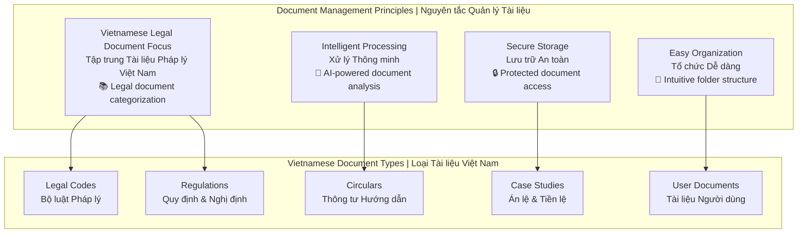
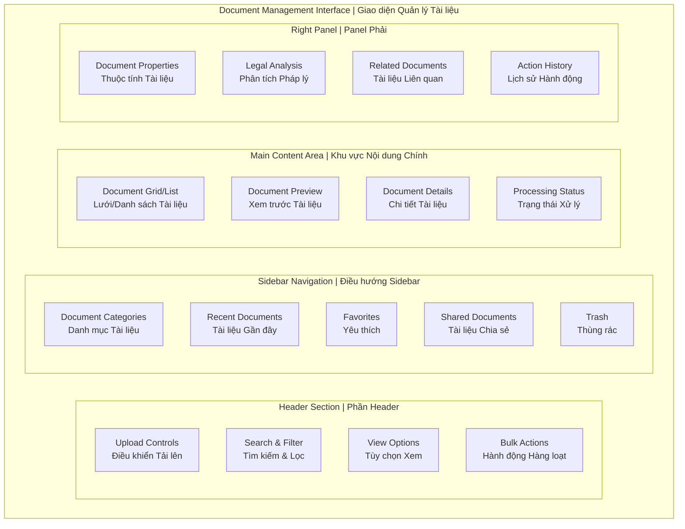

# 📄 Document Management UI - Part 4
# Giao diện Quản lý Tài liệu - Phần 4

> **Comprehensive document management interface design for Vietnamese Legal AI Chatbot with document upload, processing, and organization features**  
> *Thiết kế giao diện quản lý tài liệu toàn diện cho Chatbot AI Pháp lý Việt Nam với tính năng tải lên, xử lý và tổ chức tài liệu*

## 🎯 Document Management Overview | Tổng quan Quản lý Tài liệu

### Document Management Philosophy | Triết lý Quản lý Tài liệu



### Document Management Layout | Bố cục Quản lý Tài liệu



## 📤 Document Upload Interface | Giao diện Tải lên Tài liệu

### Upload Area Design | Thiết kế Khu vực Tải lên

```html
<!-- Document Upload Interface -->
<div class="document-upload-section">
    
    <!-- Upload Header -->
    <div class="upload-header">
        <h2 class="section-title">
            <i class="icon-cloud-upload" aria-hidden="true"></i>
            Tải lên Tài liệu Pháp lý
        </h2>
        <p class="section-description">
            Tải lên các tài liệu pháp lý để phân tích và tham khảo. Hệ thống hỗ trợ các định dạng phổ biến.
        </p>
    </div>
    
    <!-- Upload Methods -->
    <div class="upload-methods">
        
        <!-- Drag & Drop Zone -->
        <div class="upload-zone" 
             id="dropZone"
             role="button" 
             tabindex="0"
             aria-label="Kéo thả tài liệu vào đây hoặc nhấp để chọn tệp">
            <div class="upload-zone-content">
                <div class="upload-icon">
                    <i class="icon-file-plus" aria-hidden="true"></i>
                </div>
                <h3 class="upload-title">Kéo thả tài liệu vào đây</h3>
                <p class="upload-subtitle">hoặc <button class="upload-browse-btn">chọn tệp từ máy tính</button></p>
                <div class="upload-formats">
                    <span class="format-tag">PDF</span>
                    <span class="format-tag">DOC</span>
                    <span class="format-tag">DOCX</span>
                    <span class="format-tag">TXT</span>
                    <span class="format-tag">RTF</span>
                </div>
                <p class="upload-limits">Tối đa 10MB mỗi tệp • Tối đa 5 tệp cùng lúc</p>
            </div>
            <input type="file" 
                   class="file-input" 
                   id="fileInput"
                   multiple 
                   accept=".pdf,.doc,.docx,.txt,.rtf"
                   aria-describedby="uploadDescription">
        </div>
        
        <!-- Alternative Upload Methods -->
        <div class="upload-alternatives">
            <div class="upload-method">
                <button class="method-btn" data-method="url">
                    <i class="icon-link" aria-hidden="true"></i>
                    <span class="method-title">Từ URL</span>
                    <span class="method-desc">Tải từ liên kết web</span>
                </button>
            </div>
            <div class="upload-method">
                <button class="method-btn" data-method="scan">
                    <i class="icon-camera" aria-hidden="true"></i>
                    <span class="method-title">Quét tài liệu</span>
                    <span class="method-desc">Chụp ảnh tài liệu</span>
                </button>
            </div>
            <div class="upload-method">
                <button class="method-btn" data-method="template">
                    <i class="icon-template" aria-hidden="true"></i>
                    <span class="method-title">Mẫu có sẵn</span>
                    <span class="method-desc">Sử dụng mẫu pháp lý</span>
                </button>
            </div>
        </div>
        
    </div>
    
    <!-- Upload Progress Area -->
    <div class="upload-progress-area" aria-hidden="true">
        <h3 class="progress-title">Đang tải lên tài liệu</h3>
        <div class="upload-queue">
            <!-- Upload items will be dynamically added here -->
        </div>
    </div>
    
    <!-- Document Categorization -->
    <div class="document-categorization">
        <h3 class="categorization-title">
            <i class="icon-tag" aria-hidden="true"></i>
            Phân loại Tài liệu
        </h3>
        <div class="category-options">
            <div class="category-group">
                <label class="category-label">
                    <input type="radio" name="docCategory" value="civil" class="category-radio">
                    <span class="category-option">
                        <i class="icon-civil-law" aria-hidden="true"></i>
                        <span class="category-name">Luật Dân sự</span>
                        <span class="category-desc">Hợp đồng, quyền sở hữu, tranh chấp dân sự</span>
                    </span>
                </label>
            </div>
            <div class="category-group">
                <label class="category-label">
                    <input type="radio" name="docCategory" value="criminal" class="category-radio">
                    <span class="category-option">
                        <i class="icon-criminal-law" aria-hidden="true"></i>
                        <span class="category-name">Luật Hình sự</span>
                        <span class="category-desc">Tội phạm, hình phạt, tố tụng hình sự</span>
                    </span>
                </label>
            </div>
            <div class="category-group">
                <label class="category-label">
                    <input type="radio" name="docCategory" value="labor" class="category-radio">
                    <span class="category-option">
                        <i class="icon-labor-law" aria-hidden="true"></i>
                        <span class="category-name">Luật Lao động</span>
                        <span class="category-desc">Hợp đồng lao động, bảo hiểm, tranh chấp</span>
                    </span>
                </label>
            </div>
            <div class="category-group">
                <label class="category-label">
                    <input type="radio" name="docCategory" value="commercial" class="category-radio">
                    <span class="category-option">
                        <i class="icon-commercial-law" aria-hidden="true"></i>
                        <span class="category-name">Luật Thương mại</span>
                        <span class="category-desc">Doanh nghiệp, hợp đồng thương mại</span>
                    </span>
                </label>
            </div>
            <div class="category-group">
                <label class="category-label">
                    <input type="radio" name="docCategory" value="family" class="category-radio">
                    <span class="category-option">
                        <i class="icon-family-law" aria-hidden="true"></i>
                        <span class="category-name">Luật Gia đình</span>
                        <span class="category-desc">Hôn nhân, ly hôn, quyền nuôi con</span>
                    </span>
                </label>
            </div>
            <div class="category-group">
                <label class="category-label">
                    <input type="radio" name="docCategory" value="other" class="category-radio">
                    <span class="category-option">
                        <i class="icon-other-law" aria-hidden="true"></i>
                        <span class="category-name">Khác</span>
                        <span class="category-desc">Các lĩnh vực pháp luật khác</span>
                    </span>
                </label>
            </div>
        </div>
    </div>
    
    <!-- Processing Options -->
    <div class="processing-options">
        <h3 class="options-title">
            <i class="icon-settings" aria-hidden="true"></i>
            Tùy chọn Xử lý
        </h3>
        <div class="options-grid">
            <label class="option-item">
                <input type="checkbox" class="option-checkbox" checked>
                <span class="option-content">
                    <span class="option-name">Phân tích tự động</span>
                    <span class="option-desc">Tự động phân tích nội dung và trích xuất thông tin pháp lý</span>
                </span>
            </label>
            <label class="option-item">
                <input type="checkbox" class="option-checkbox" checked>
                <span class="option-content">
                    <span class="option-name">Tạo chỉ mục</span>
                    <span class="option-desc">Tạo chỉ mục để tìm kiếm nhanh trong tài liệu</span>
                </span>
            </label>
            <label class="option-item">
                <input type="checkbox" class="option-checkbox">
                <span class="option-content">
                    <span class="option-name">OCR cho ảnh</span>
                    <span class="option-desc">Nhận dạng văn bản từ ảnh và tài liệu quét</span>
                </span>
            </label>
            <label class="option-item">
                <input type="checkbox" class="option-checkbox">
                <span class="option-content">
                    <span class="option-name">Chia sẻ công khai</span>
                    <span class="option-desc">Cho phép người dùng khác xem và tham khảo tài liệu</span>
                </span>
            </label>
        </div>
    </div>
    
    <!-- Upload Actions -->
    <div class="upload-actions">
        <button class="btn btn-secondary" type="button">
            <i class="icon-x" aria-hidden="true"></i>
            Hủy bỏ
        </button>
        <button class="btn btn-primary" type="button" disabled>
            <i class="icon-upload" aria-hidden="true"></i>
            Bắt đầu tải lên
        </button>
    </div>
    
</div>

<!-- Upload Progress Item Template -->
<template id="uploadProgressTemplate">
    <div class="upload-item">
        <div class="item-info">
            <div class="item-icon">
                <i class="icon-file" aria-hidden="true"></i>
            </div>
            <div class="item-details">
                <h4 class="item-name">document-name.pdf</h4>
                <p class="item-meta">2.3 MB • Luật Dân sự</p>
            </div>
        </div>
        <div class="item-progress">
            <div class="progress-bar">
                <div class="progress-fill" style="width: 45%"></div>
            </div>
            <span class="progress-text">45%</span>
        </div>
        <div class="item-actions">
            <button class="item-action-btn cancel" aria-label="Hủy tải lên">
                <i class="icon-x" aria-hidden="true"></i>
            </button>
        </div>
    </div>
</template>
```

### Upload Styling | Styling Tải lên

```css
/* Document Upload Section */
.document-upload-section {
    padding: 32px;
    max-width: 800px;
    margin: 0 auto;
}

.upload-header {
    text-align: center;
    margin-bottom: 32px;
}

.section-title {
    display: flex;
    align-items: center;
    justify-content: center;
    gap: 12px;
    font-size: 24px;
    font-weight: 700;
    color: #1E40AF;
    margin-bottom: 8px;
}

.section-description {
    font-size: 16px;
    color: #64748B;
    line-height: 1.6;
}

/* Upload Methods */
.upload-methods {
    margin-bottom: 32px;
}

/* Drag & Drop Zone */
.upload-zone {
    position: relative;
    border: 2px dashed #D1D5DB;
    border-radius: 16px;
    padding: 48px 32px;
    text-align: center;
    background: #F9FAFB;
    transition: all 0.3s ease;
    cursor: pointer;
    margin-bottom: 24px;
}

.upload-zone:hover,
.upload-zone:focus {
    border-color: #1E40AF;
    background: #EBF8FF;
    outline: none;
}

.upload-zone.dragover {
    border-color: #10B981;
    background: #ECFDF5;
    transform: scale(1.02);
}

.upload-zone-content {
    pointer-events: none;
}

.upload-icon {
    font-size: 48px;
    color: #9CA3AF;
    margin-bottom: 16px;
}

.upload-zone:hover .upload-icon {
    color: #1E40AF;
}

.upload-title {
    font-size: 20px;
    font-weight: 600;
    color: #374151;
    margin-bottom: 8px;
}

.upload-subtitle {
    font-size: 16px;
    color: #6B7280;
    margin-bottom: 16px;
}

.upload-browse-btn {
    color: #1E40AF;
    text-decoration: underline;
    background: none;
    border: none;
    cursor: pointer;
    font-weight: 500;
    pointer-events: auto;
}

.upload-browse-btn:hover {
    color: #1E3A8A;
}

.upload-formats {
    display: flex;
    justify-content: center;
    gap: 8px;
    margin-bottom: 12px;
}

.format-tag {
    background: #E5E7EB;
    color: #374151;
    padding: 4px 8px;
    border-radius: 6px;
    font-size: 12px;
    font-weight: 500;
}

.upload-limits {
    font-size: 14px;
    color: #9CA3AF;
}

.file-input {
    position: absolute;
    opacity: 0;
    pointer-events: none;
}

/* Alternative Upload Methods */
.upload-alternatives {
    display: grid;
    grid-template-columns: repeat(auto-fit, minmax(200px, 1fr));
    gap: 16px;
}

.upload-method {
    background: white;
    border: 1px solid #E5E7EB;
    border-radius: 12px;
    overflow: hidden;
}

.method-btn {
    width: 100%;
    padding: 20px;
    background: none;
    border: none;
    text-align: center;
    cursor: pointer;
    transition: all 0.2s ease;
    display: flex;
    flex-direction: column;
    align-items: center;
    gap: 8px;
}

.method-btn:hover {
    background: #F9FAFB;
    border-color: #1E40AF;
}

.method-btn i {
    font-size: 24px;
    color: #6B7280;
}

.method-btn:hover i {
    color: #1E40AF;
}

.method-title {
    font-size: 14px;
    font-weight: 600;
    color: #374151;
}

.method-desc {
    font-size: 12px;
    color: #6B7280;
}

/* Upload Progress Area */
.upload-progress-area {
    background: #F8FAFC;
    border: 1px solid #E2E8F0;
    border-radius: 12px;
    padding: 24px;
    margin-bottom: 32px;
}

.progress-title {
    font-size: 16px;
    font-weight: 600;
    color: #374151;
    margin-bottom: 16px;
    display: flex;
    align-items: center;
    gap: 8px;
}

.progress-title::before {
    content: '';
    width: 16px;
    height: 16px;
    background: #10B981;
    border-radius: 50%;
    animation: pulse 1.5s infinite;
}

.upload-queue {
    display: flex;
    flex-direction: column;
    gap: 12px;
}

.upload-item {
    display: flex;
    align-items: center;
    gap: 16px;
    background: white;
    padding: 16px;
    border-radius: 8px;
    border: 1px solid #E5E7EB;
}

.item-info {
    display: flex;
    align-items: center;
    gap: 12px;
    flex: 1;
}

.item-icon {
    width: 32px;
    height: 32px;
    background: #EBF8FF;
    border-radius: 6px;
    display: flex;
    align-items: center;
    justify-content: center;
    color: #1E40AF;
}

.item-details {
    flex: 1;
}

.item-name {
    font-size: 14px;
    font-weight: 600;
    color: #374151;
    margin-bottom: 4px;
}

.item-meta {
    font-size: 12px;
    color: #6B7280;
}

.item-progress {
    display: flex;
    align-items: center;
    gap: 12px;
    min-width: 120px;
}

.progress-bar {
    flex: 1;
    height: 6px;
    background: #E5E7EB;
    border-radius: 3px;
    overflow: hidden;
}

.progress-fill {
    height: 100%;
    background: linear-gradient(90deg, #10B981, #059669);
    border-radius: 3px;
    transition: width 0.3s ease;
}

.progress-text {
    font-size: 12px;
    font-weight: 500;
    color: #374151;
    min-width: 32px;
    text-align: right;
}

.item-actions {
    display: flex;
    gap: 4px;
}

.item-action-btn {
    width: 28px;
    height: 28px;
    border: none;
    background: #F3F4F6;
    border-radius: 6px;
    color: #6B7280;
    cursor: pointer;
    transition: all 0.2s ease;
    display: flex;
    align-items: center;
    justify-content: center;
}

.item-action-btn:hover {
    background: #E5E7EB;
    color: #374151;
}

.item-action-btn.cancel:hover {
    background: #FEE2E2;
    color: #DC2626;
}

/* Document Categorization */
.document-categorization {
    margin-bottom: 32px;
}

.categorization-title {
    display: flex;
    align-items: center;
    gap: 8px;
    font-size: 18px;
    font-weight: 600;
    color: #374151;
    margin-bottom: 16px;
}

.category-options {
    display: grid;
    grid-template-columns: repeat(auto-fit, minmax(300px, 1fr));
    gap: 12px;
}

.category-group {
    background: white;
    border: 1px solid #E5E7EB;
    border-radius: 8px;
    overflow: hidden;
}

.category-label {
    display: block;
    cursor: pointer;
}

.category-radio {
    position: absolute;
    opacity: 0;
    pointer-events: none;
}

.category-option {
    display: flex;
    align-items: center;
    gap: 12px;
    padding: 16px;
    transition: all 0.2s ease;
}

.category-option:hover {
    background: #F9FAFB;
}

.category-radio:checked + .category-option {
    background: #EBF8FF;
    border-color: #1E40AF;
    color: #1E40AF;
}

.category-option i {
    font-size: 20px;
    color: #6B7280;
    width: 24px;
    flex-shrink: 0;
}

.category-radio:checked + .category-option i {
    color: #1E40AF;
}

.category-option .category-name {
    font-weight: 600;
    margin-bottom: 2px;
}

.category-option .category-desc {
    font-size: 12px;
    color: #6B7280;
}

/* Processing Options */
.processing-options {
    margin-bottom: 32px;
}

.options-title {
    display: flex;
    align-items: center;
    gap: 8px;
    font-size: 18px;
    font-weight: 600;
    color: #374151;
    margin-bottom: 16px;
}

.options-grid {
    display: grid;
    grid-template-columns: repeat(auto-fit, minmax(250px, 1fr));
    gap: 12px;
}

.option-item {
    display: flex;
    align-items: flex-start;
    gap: 12px;
    padding: 16px;
    background: white;
    border: 1px solid #E5E7EB;
    border-radius: 8px;
    cursor: pointer;
    transition: all 0.2s ease;
}

.option-item:hover {
    background: #F9FAFB;
    border-color: #D1D5DB;
}

.option-checkbox {
    margin-top: 2px;
    accent-color: #1E40AF;
}

.option-content {
    flex: 1;
}

.option-name {
    display: block;
    font-weight: 600;
    color: #374151;
    margin-bottom: 4px;
}

.option-desc {
    font-size: 13px;
    color: #6B7280;
    line-height: 1.4;
}

/* Upload Actions */
.upload-actions {
    display: flex;
    justify-content: flex-end;
    gap: 12px;
    padding-top: 24px;
    border-top: 1px solid #E5E7EB;
}

.btn {
    display: flex;
    align-items: center;
    gap: 8px;
    padding: 12px 24px;
    border-radius: 8px;
    font-size: 14px;
    font-weight: 600;
    cursor: pointer;
    transition: all 0.2s ease;
    min-width: 120px;
    justify-content: center;
}

.btn-secondary {
    background: white;
    border: 1px solid #D1D5DB;
    color: #374151;
}

.btn-secondary:hover {
    background: #F9FAFB;
    border-color: #9CA3AF;
}

.btn-primary {
    background: linear-gradient(135deg, #1E40AF, #1E3A8A);
    border: none;
    color: white;
}

.btn-primary:not(:disabled):hover {
    background: linear-gradient(135deg, #1E3A8A, #1E40AF);
    transform: translateY(-1px);
    box-shadow: 0 4px 8px rgba(30, 64, 175, 0.2);
}

.btn-primary:disabled {
    background: #E5E7EB;
    color: #9CA3AF;
    cursor: not-allowed;
}

/* Responsive Design */
@media (max-width: 768px) {
    .document-upload-section {
        padding: 16px;
    }
    
    .upload-zone {
        padding: 32px 16px;
    }
    
    .upload-alternatives {
        grid-template-columns: 1fr;
    }
    
    .category-options {
        grid-template-columns: 1fr;
    }
    
    .options-grid {
        grid-template-columns: 1fr;
    }
    
    .upload-actions {
        flex-direction: column;
    }
    
    .btn {
        width: 100%;
    }
}
```

## 📚 Document Library Interface | Giao diện Thư viện Tài liệu

### Document Grid/List View | View Lưới/Danh sách Tài liệu

```html
<!-- Document Library Interface -->
<div class="document-library">
    
    <!-- Library Header -->
    <div class="library-header">
        <div class="header-left">
            <h1 class="library-title">
                <i class="icon-library" aria-hidden="true"></i>
                Thư viện Tài liệu Pháp lý
            </h1>
            <p class="library-subtitle">Quản lý và tổ chức tài liệu pháp lý của bạn</p>
        </div>
        <div class="header-actions">
            <button class="btn btn-primary" data-action="upload">
                <i class="icon-plus" aria-hidden="true"></i>
                Tải lên tài liệu
            </button>
        </div>
    </div>
    
    <!-- Search and Filter Bar -->
    <div class="search-filter-bar">
        <div class="search-section">
            <div class="search-input-group">
                <i class="icon-search search-icon" aria-hidden="true"></i>
                <input type="search" 
                       class="search-input" 
                       placeholder="Tìm kiếm tài liệu, luật, điều khoản..."
                       aria-label="Tìm kiếm tài liệu">
                <button class="search-clear" aria-label="Xóa tìm kiếm">
                    <i class="icon-x" aria-hidden="true"></i>
                </button>
            </div>
        </div>
        
        <div class="filter-section">
            <!-- Document Type Filter -->
            <div class="filter-group">
                <button class="filter-btn" aria-expanded="false" aria-haspopup="true">
                    <i class="icon-filter" aria-hidden="true"></i>
                    <span>Loại tài liệu</span>
                    <i class="icon-chevron-down" aria-hidden="true"></i>
                </button>
                <div class="filter-dropdown" aria-hidden="true">
                    <label class="filter-option">
                        <input type="checkbox" checked> Tất cả loại
                    </label>
                    <label class="filter-option">
                        <input type="checkbox"> Bộ luật
                    </label>
                    <label class="filter-option">
                        <input type="checkbox"> Nghị định
                    </label>
                    <label class="filter-option">
                        <input type="checkbox"> Thông tư
                    </label>
                    <label class="filter-option">
                        <input type="checkbox"> Tài liệu cá nhân
                    </label>
                </div>
            </div>
            
            <!-- Legal Domain Filter -->
            <div class="filter-group">
                <button class="filter-btn" aria-expanded="false" aria-haspopup="true">
                    <i class="icon-tag" aria-hidden="true"></i>
                    <span>Lĩnh vực pháp lý</span>
                    <i class="icon-chevron-down" aria-hidden="true"></i>
                </button>
                <div class="filter-dropdown" aria-hidden="true">
                    <label class="filter-option">
                        <input type="checkbox" checked> Tất cả lĩnh vực
                    </label>
                    <label class="filter-option">
                        <input type="checkbox"> Luật Dân sự
                    </label>
                    <label class="filter-option">
                        <input type="checkbox"> Luật Hình sự
                    </label>
                    <label class="filter-option">
                        <input type="checkbox"> Luật Lao động
                    </label>
                    <label class="filter-option">
                        <input type="checkbox"> Luật Thương mại
                    </label>
                    <label class="filter-option">
                        <input type="checkbox"> Luật Gia đình
                    </label>
                </div>
            </div>
            
            <!-- Date Filter -->
            <div class="filter-group">
                <button class="filter-btn" aria-expanded="false" aria-haspopup="true">
                    <i class="icon-calendar" aria-hidden="true"></i>
                    <span>Thời gian</span>
                    <i class="icon-chevron-down" aria-hidden="true"></i>
                </button>
                <div class="filter-dropdown" aria-hidden="true">
                    <label class="filter-option">
                        <input type="radio" name="dateFilter" checked> Tất cả thời gian
                    </label>
                    <label class="filter-option">
                        <input type="radio" name="dateFilter"> 7 ngày qua
                    </label>
                    <label class="filter-option">
                        <input type="radio" name="dateFilter"> 30 ngày qua
                    </label>
                    <label class="filter-option">
                        <input type="radio" name="dateFilter"> 3 tháng qua
                    </label>
                    <label class="filter-option">
                        <input type="radio" name="dateFilter"> Tùy chỉnh
                    </label>
                </div>
            </div>
        </div>
        
        <div class="view-controls">
            <div class="sort-section">
                <select class="sort-select" aria-label="Sắp xếp tài liệu">
                    <option value="name-asc">Tên A-Z</option>
                    <option value="name-desc">Tên Z-A</option>
                    <option value="date-desc" selected>Mới nhất</option>
                    <option value="date-asc">Cũ nhất</option>
                    <option value="size-desc">Kích thước lớn</option>
                    <option value="size-asc">Kích thước nhỏ</option>
                </select>
            </div>
            
            <div class="view-toggle">
                <button class="view-btn active" data-view="grid" aria-label="Xem dạng lưới">
                    <i class="icon-grid" aria-hidden="true"></i>
                </button>
                <button class="view-btn" data-view="list" aria-label="Xem dạng danh sách">
                    <i class="icon-list" aria-hidden="true"></i>
                </button>
            </div>
        </div>
    </div>
    
    <!-- Document Grid View -->
    <div class="document-grid" data-view="grid">
        
        <!-- Document Item -->
        <div class="document-item" data-document-id="doc-001">
            <div class="document-card">
                <div class="document-preview">
                    <div class="preview-thumbnail">
                        
                        <div class="document-type-badge">PDF</div>
                    </div>
                    <div class="preview-overlay">
                        <button class="preview-btn" aria-label="Xem trước tài liệu">
                            <i class="icon-eye" aria-hidden="true"></i>
                        </button>
                        <button class="download-btn" aria-label="Tải xuống tài liệu">
                            <i class="icon-download" aria-hidden="true"></i>
                        </button>
                    </div>
                </div>
                
                <div class="document-info">
                    <div class="document-header">
                        <h3 class="document-title">Bộ luật Dân sự 2015</h3>
                        <div class="document-actions">
                            <button class="action-btn favorite" aria-label="Thêm vào yêu thích">
                                <i class="icon-heart" aria-hidden="true"></i>
                            </button>
                            <div class="dropdown">
                                <button class="action-btn more" aria-label="Thêm tùy chọn" aria-expanded="false">
                                    <i class="icon-more-horizontal" aria-hidden="true"></i>
                                </button>
                                <div class="dropdown-menu" aria-hidden="true">
                                    <button class="dropdown-item">
                                        <i class="icon-edit" aria-hidden="true"></i>
                                        Chỉnh sửa
                                    </button>
                                    <button class="dropdown-item">
                                        <i class="icon-share" aria-hidden="true"></i>
                                        Chia sẻ
                                    </button>
                                    <button class="dropdown-item">
                                        <i class="icon-copy" aria-hidden="true"></i>
                                        Sao chép liên kết
                                    </button>
                                    <hr class="dropdown-divider">
                                    <button class="dropdown-item danger">
                                        <i class="icon-trash" aria-hidden="true"></i>
                                        Xóa
                                    </button>
                                </div>
                            </div>
                        </div>
                    </div>
                    
                    <div class="document-meta">
                        <div class="meta-item">
                            <i class="icon-tag" aria-hidden="true"></i>
                            <span class="legal-domain">Luật Dân sự</span>
                        </div>
                        <div class="meta-item">
                            <i class="icon-file-size" aria-hidden="true"></i>
                            <span>2.3 MB</span>
                        </div>
                        <div class="meta-item">
                            <i class="icon-calendar" aria-hidden="true"></i>
                            <span>15/08/2025</span>
                        </div>
                    </div>
                    
                    <div class="document-description">
                        <p>Bộ luật Dân sự năm 2015 quy định về các quan hệ dân sự, bao gồm quan hệ tài sản và quan hệ nhân thân không thuộc về quan hệ gia đình...</p>
                    </div>
                    
                    <div class="document-tags">
                        <span class="doc-tag">Bộ luật</span>
                        <span class="doc-tag">Dân sự</span>
                        <span class="doc-tag">2015</span>
                        <span class="doc-tag">Chính thức</span>
                    </div>
                    
                    <div class="document-status">
                        <div class="status-indicator processed">
                            <i class="icon-check-circle" aria-hidden="true"></i>
                            <span>Đã xử lý</span>
                        </div>
                        <div class="analysis-progress">
                            <span class="progress-label">Phân tích: 100%</span>
                            <div class="progress-bar">
                                <div class="progress-fill" style="width: 100%"></div>
                            </div>
                        </div>
                    </div>
                </div>
            </div>
        </div>
        
        <!-- More document items... -->
        
    </div>
    
    <!-- Document List View -->
    <div class="document-list" data-view="list" style="display: none;">
        <div class="list-header">
            <div class="list-column name">Tên tài liệu</div>
            <div class="list-column type">Loại</div>
            <div class="list-column domain">Lĩnh vực</div>
            <div class="list-column size">Kích thước</div>
            <div class="list-column date">Ngày tải</div>
            <div class="list-column status">Trạng thái</div>
            <div class="list-column actions">Hành động</div>
        </div>
        
        <div class="list-body">
            <!-- List items will be populated here -->
        </div>
    </div>
    
    <!-- Pagination -->
    <div class="pagination-section">
        <div class="pagination-info">
            Hiển thị 1-12 trong tổng số 156 tài liệu
        </div>
        <nav class="pagination" aria-label="Phân trang tài liệu">
            <button class="pagination-btn" disabled aria-label="Trang trước">
                <i class="icon-chevron-left" aria-hidden="true"></i>
            </button>
            <button class="pagination-btn active" aria-current="page">1</button>
            <button class="pagination-btn">2</button>
            <button class="pagination-btn">3</button>
            <span class="pagination-ellipsis">...</span>
            <button class="pagination-btn">13</button>
            <button class="pagination-btn" aria-label="Trang sau">
                <i class="icon-chevron-right" aria-hidden="true"></i>
            </button>
        </nav>
    </div>
    
</div>
```

---

## 🎯 Document Management Validation | Kiểm tra Quản lý Tài liệu

### Vietnamese Legal Document Compliance | Tuân thủ Tài liệu Pháp lý Việt Nam

- [ ] **Vietnamese Document Support** - Proper handling of Vietnamese legal documents
- [ ] **Legal Domain Classification** - Accurate Vietnamese legal category system
- [ ] **Document Processing** - Intelligent analysis of Vietnamese legal content
- [ ] **Search Functionality** - Vietnamese text search with diacritics support
- [ ] **Security & Privacy** - Protected document access and sharing
- [ ] **Performance** - Fast document loading and processing
- [ ] **Accessibility** - Screen reader support for document library

---

*📅 Created: August 2025 | Version: 1.0 | Next: Part 5 - Admin Dashboard Design*

**Next Document:** [Admin Dashboard Design](05-admin-dashboard-design.md)  
**Previous Document:** [Chat Interface Design](03-chat-interface-design.md)  
**Related:** [System Architecture](../system-architecture.md) | [User Stories](../user-stories.md)
