# 👥 Admin Dashboard Design - Part 5
# Thiết kế Dashboard Quản trị - Phần 5

> **Comprehensive admin dashboard interface design for Vietnamese Legal AI Chatbot with system monitoring, user management, and analytics features**  
> *Thiết kế giao diện dashboard quản trị toàn diện cho Chatbot AI Pháp lý Việt Nam với tính năng giám sát hệ thống, quản lý người dùng và phân tích*

## 🎯 Admin Dashboard Overview | Tổng quan Dashboard Quản trị

### Admin Dashboard Philosophy | Triết lý Dashboard Quản trị

```mermaid
graph TB
    subgraph "Admin Dashboard Principles | Nguyên tắc Dashboard Quản trị"
        P1[Data-Driven Insights<br/>Thông tin Dựa trên Dữ liệu<br/>📊 Real-time analytics & metrics]
        P2[System Health Monitoring<br/>Giám sát Sức khỏe Hệ thống<br/>🏥 Performance & uptime tracking]
        P3[User Management Control<br/>Kiểm soát Quản lý Người dùng<br/>👥 User roles & permissions]
        P4[Content Quality Assurance<br/>Đảm bảo Chất lượng Nội dung<br/>✅ Legal accuracy & compliance]
    end
    
    subgraph "Vietnamese Admin Features | Tính năng Quản trị Việt Nam"
        V1[Vietnamese Legal Content Management<br/>Quản lý Nội dung Pháp lý Việt Nam]
        V2[Vietnamese User Support<br/>Hỗ trợ Người dùng Việt Nam]
        V3[Legal Compliance Monitoring<br/>Giám sát Tuân thủ Pháp lý]
        V4[Vietnamese Analytics Reporting<br/>Báo cáo Phân tích Tiếng Việt]
    end
    
    P1 --> V4
    P2 --> V3
    P3 --> V2
    P4 --> V1
```



### Admin Dashboard Layout | Bố cục Dashboard Quản trị

```mermaid
graph TB
    subgraph "Admin Dashboard Interface | Giao diện Dashboard Quản trị"
        subgraph "Top Navigation | Điều hướng Trên"
            TN1[System Status Indicators<br/>Chỉ báo Trạng thái Hệ thống]
            TN2[Quick Actions Menu<br/>Menu Hành động Nhanh]
            TN3[Admin Profile<br/>Hồ sơ Quản trị viên]
            TN4[Notification Center<br/>Trung tâm Thông báo]
        end
        
        subgraph "Left Sidebar | Thanh bên Trái"
            LS1[Dashboard Overview<br/>Tổng quan Dashboard]
            LS2[User Management<br/>Quản lý Người dùng]
            LS3[Content Management<br/>Quản lý Nội dung]
            LS4[System Analytics<br/>Phân tích Hệ thống]
            LS5[Legal Compliance<br/>Tuân thủ Pháp lý]
            LS6[Settings & Config<br/>Cài đặt & Cấu hình]
        end
        
        subgraph "Main Content Area | Khu vực Nội dung Chính"
            MC1[Real-time Metrics<br/>Số liệu Thời gian Thực]
            MC2[Interactive Charts<br/>Biểu đồ Tương tác]
            MC3[Data Tables<br/>Bảng Dữ liệu]
            MC4[Management Forms<br/>Form Quản lý]
        end
        
        subgraph "Right Panel | Panel Phải"
            RP1[Recent Activities<br/>Hoạt động Gần đây]
            RP2[System Alerts<br/>Cảnh báo Hệ thống]
            RP3[Quick Stats<br/>Thống kê Nhanh]
            RP4[Help & Support<br/>Trợ giúp & Hỗ trợ]
        end
    end
```



## 📊 Dashboard Overview Page | Trang Tổng quan Dashboard

### Main Dashboard Layout | Bố cục Dashboard Chính

```html
<!-- Admin Dashboard Overview -->
<div class="admin-dashboard">
    
    <!-- Dashboard Header -->
    <div class="dashboard-header">
        <div class="header-content">
            <div class="header-info">
                <h1 class="dashboard-title">
                    <i class="icon-dashboard" aria-hidden="true"></i>
                    Dashboard Quản trị - Legal AI Vietnam
                </h1>
                <p class="dashboard-subtitle">
                    Tổng quan hệ thống và quản lý Chatbot AI Pháp lý Việt Nam
                </p>
            </div>
            <div class="header-actions">
                <button class="btn btn-secondary" data-action="export-report">
                    <i class="icon-download" aria-hidden="true"></i>
                    Xuất báo cáo
                </button>
                <button class="btn btn-primary" data-action="system-backup">
                    <i class="icon-shield" aria-hidden="true"></i>
                    Sao lưu hệ thống
                </button>
            </div>
        </div>
        
        <!-- System Status Bar -->
        <div class="system-status-bar">
            <div class="status-indicators">
                <div class="status-item healthy">
                    <i class="icon-server" aria-hidden="true"></i>
                    <span class="status-label">Hệ thống</span>
                    <span class="status-value">Hoạt động bình thường</span>
                </div>
                <div class="status-item healthy">
                    <i class="icon-database" aria-hidden="true"></i>
                    <span class="status-label">Cơ sở dữ liệu</span>
                    <span class="status-value">Kết nối ổn định</span>
                </div>
                <div class="status-item warning">
                    <i class="icon-brain" aria-hidden="true"></i>
                    <span class="status-label">AI Service</span>
                    <span class="status-value">Tải cao</span>
                </div>
                <div class="status-item healthy">
                    <i class="icon-shield-check" aria-hidden="true"></i>
                    <span class="status-label">Bảo mật</span>
                    <span class="status-value">An toàn</span>
                </div>
            </div>
            <div class="uptime-info">
                <span class="uptime-label">Thời gian hoạt động:</span>
                <span class="uptime-value">99.98% (30 ngày)</span>
            </div>
        </div>
    </div>
    
    <!-- Metrics Overview -->
    <div class="metrics-overview">
        <div class="metrics-grid">
            
            <!-- Total Users Metric -->
            <div class="metric-card">
                <div class="metric-header">
                    <h3 class="metric-title">Tổng số Người dùng</h3>
                    <div class="metric-icon users">
                        <i class="icon-users" aria-hidden="true"></i>
                    </div>
                </div>
                <div class="metric-content">
                    <div class="metric-value">12,456</div>
                    <div class="metric-change positive">
                        <i class="icon-trending-up" aria-hidden="true"></i>
                        <span>+8.2% so với tháng trước</span>
                    </div>
                </div>
                <div class="metric-chart">
                    <canvas id="usersChart" aria-label="Biểu đồ người dùng theo thời gian"></canvas>
                </div>
            </div>
            
            <!-- Legal Queries Metric -->
            <div class="metric-card">
                <div class="metric-header">
                    <h3 class="metric-title">Câu hỏi Pháp lý</h3>
                    <div class="metric-icon queries">
                        <i class="icon-message-circle" aria-hidden="true"></i>
                    </div>
                </div>
                <div class="metric-content">
                    <div class="metric-value">45,789</div>
                    <div class="metric-change positive">
                        <i class="icon-trending-up" aria-hidden="true"></i>
                        <span>+15.7% so với tháng trước</span>
                    </div>
                </div>
                <div class="metric-chart">
                    <canvas id="queriesChart" aria-label="Biểu đồ câu hỏi theo thời gian"></canvas>
                </div>
            </div>
            
            <!-- Document Processing Metric -->
            <div class="metric-card">
                <div class="metric-header">
                    <h3 class="metric-title">Tài liệu Xử lý</h3>
                    <div class="metric-icon documents">
                        <i class="icon-file-text" aria-hidden="true"></i>
                    </div>
                </div>
                <div class="metric-content">
                    <div class="metric-value">8,912</div>
                    <div class="metric-change positive">
                        <i class="icon-trending-up" aria-hidden="true"></i>
                        <span>+12.3% so với tháng trước</span>
                    </div>
                </div>
                <div class="metric-chart">
                    <canvas id="documentsChart" aria-label="Biểu đồ tài liệu theo thời gian"></canvas>
                </div>
            </div>
            
            <!-- AI Accuracy Metric -->
            <div class="metric-card">
                <div class="metric-header">
                    <h3 class="metric-title">Độ chính xác AI</h3>
                    <div class="metric-icon accuracy">
                        <i class="icon-target" aria-hidden="true"></i>
                    </div>
                </div>
                <div class="metric-content">
                    <div class="metric-value">94.2%</div>
                    <div class="metric-change positive">
                        <i class="icon-trending-up" aria-hidden="true"></i>
                        <span>+2.1% so với tháng trước</span>
                    </div>
                </div>
                <div class="metric-chart">
                    <canvas id="accuracyChart" aria-label="Biểu đồ độ chính xác theo thời gian"></canvas>
                </div>
            </div>
            
        </div>
    </div>
    
    <!-- Main Dashboard Content -->
    <div class="dashboard-content">
        <div class="content-grid">
            
            <!-- Left Column -->
            <div class="content-column-left">
                
                <!-- Legal Domain Analytics -->
                <div class="analytics-card">
                    <div class="card-header">
                        <h3 class="card-title">
                            <i class="icon-pie-chart" aria-hidden="true"></i>
                            Phân tích Lĩnh vực Pháp lý
                        </h3>
                        <div class="card-actions">
                            <button class="card-action-btn" aria-label="Làm mới dữ liệu">
                                <i class="icon-refresh" aria-hidden="true"></i>
                            </button>
                            <button class="card-action-btn" aria-label="Xuất dữ liệu">
                                <i class="icon-download" aria-hidden="true"></i>
                            </button>
                        </div>
                    </div>
                    <div class="card-content">
                        <div class="legal-domains-chart">
                            <canvas id="legalDomainsChart" aria-label="Biểu đồ phân bố lĩnh vực pháp lý"></canvas>
                        </div>
                        <div class="domains-legend">
                            <div class="legend-item">
                                <span class="legend-color civil"></span>
                                <span class="legend-label">Luật Dân sự</span>
                                <span class="legend-value">32.5%</span>
                            </div>
                            <div class="legend-item">
                                <span class="legend-color labor"></span>
                                <span class="legend-label">Luật Lao động</span>
                                <span class="legend-value">24.8%</span>
                            </div>
                            <div class="legend-item">
                                <span class="legend-color commercial"></span>
                                <span class="legend-label">Luật Thương mại</span>
                                <span class="legend-value">18.7%</span>
                            </div>
                            <div class="legend-item">
                                <span class="legend-color family"></span>
                                <span class="legend-label">Luật Gia đình</span>
                                <span class="legend-value">13.2%</span>
                            </div>
                            <div class="legend-item">
                                <span class="legend-color criminal"></span>
                                <span class="legend-label">Luật Hình sự</span>
                                <span class="legend-value">10.8%</span>
                            </div>
                        </div>
                    </div>
                </div>
                
                <!-- User Activity Trends -->
                <div class="analytics-card">
                    <div class="card-header">
                        <h3 class="card-title">
                            <i class="icon-activity" aria-hidden="true"></i>
                            Xu hướng Hoạt động Người dùng
                        </h3>
                        <div class="time-range-selector">
                            <select class="time-range-select" aria-label="Chọn khoảng thời gian">
                                <option value="7d">7 ngày qua</option>
                                <option value="30d" selected>30 ngày qua</option>
                                <option value="90d">90 ngày qua</option>
                                <option value="1y">1 năm qua</option>
                            </select>
                        </div>
                    </div>
                    <div class="card-content">
                        <div class="activity-chart">
                            <canvas id="activityChart" aria-label="Biểu đồ hoạt động người dùng theo thời gian"></canvas>
                        </div>
                        <div class="activity-stats">
                            <div class="stat-item">
                                <span class="stat-label">Trung bình/ngày</span>
                                <span class="stat-value">1,523 truy vấn</span>
                            </div>
                            <div class="stat-item">
                                <span class="stat-label">Giờ cao điểm</span>
                                <span class="stat-value">9:00 - 11:00</span>
                            </div>
                            <div class="stat-item">
                                <span class="stat-label">Tỷ lệ thành công</span>
                                <span class="stat-value">96.8%</span>
                            </div>
                        </div>
                    </div>
                </div>
                
            </div>
            
            <!-- Right Column -->
            <div class="content-column-right">
                
                <!-- Recent Activities -->
                <div class="activities-card">
                    <div class="card-header">
                        <h3 class="card-title">
                            <i class="icon-clock" aria-hidden="true"></i>
                            Hoạt động Gần đây
                        </h3>
                        <button class="view-all-btn">Xem tất cả</button>
                    </div>
                    <div class="card-content">
                        <div class="activities-list">
                            
                            <div class="activity-item">
                                <div class="activity-icon user-action">
                                    <i class="icon-user-plus" aria-hidden="true"></i>
                                </div>
                                <div class="activity-content">
                                    <p class="activity-text">
                                        <strong>Nguyễn Văn A</strong> đã đăng ký tài khoản mới
                                    </p>
                                    <time class="activity-time">5 phút trước</time>
                                </div>
                            </div>
                            
                            <div class="activity-item">
                                <div class="activity-icon document-action">
                                    <i class="icon-file-plus" aria-hidden="true"></i>
                                </div>
                                <div class="activity-content">
                                    <p class="activity-text">
                                        Tài liệu <strong>"Nghị định 15/2024"</strong> đã được tải lên
                                    </p>
                                    <time class="activity-time">12 phút trước</time>
                                </div>
                            </div>
                            
                            <div class="activity-item">
                                <div class="activity-icon system-action">
                                    <i class="icon-shield-check" aria-hidden="true"></i>
                                </div>
                                <div class="activity-content">
                                    <p class="activity-text">
                                        Hệ thống đã hoàn thành kiểm tra bảo mật định kỳ
                                    </p>
                                    <time class="activity-time">1 giờ trước</time>
                                </div>
                            </div>
                            
                            <div class="activity-item">
                                <div class="activity-icon warning-action">
                                    <i class="icon-alert-triangle" aria-hidden="true"></i>
                                </div>
                                <div class="activity-content">
                                    <p class="activity-text">
                                        Cảnh báo: Tài nguyên AI đang hoạt động với tải cao
                                    </p>
                                    <time class="activity-time">2 giờ trước</time>
                                </div>
                            </div>
                            
                            <div class="activity-item">
                                <div class="activity-icon success-action">
                                    <i class="icon-check-circle" aria-hidden="true"></i>
                                </div>
                                <div class="activity-content">
                                    <p class="activity-text">
                                        Backup dữ liệu đã hoàn thành thành công
                                    </p>
                                    <time class="activity-time">3 giờ trước</time>
                                </div>
                            </div>
                            
                        </div>
                    </div>
                </div>
                
                <!-- System Health -->
                <div class="health-card">
                    <div class="card-header">
                        <h3 class="card-title">
                            <i class="icon-heart" aria-hidden="true"></i>
                            Sức khỏe Hệ thống
                        </h3>
                        <div class="health-status healthy">
                            <i class="icon-check-circle" aria-hidden="true"></i>
                            <span>Khỏe mạnh</span>
                        </div>
                    </div>
                    <div class="card-content">
                        <div class="health-metrics">
                            
                            <div class="health-metric">
                                <div class="metric-info">
                                    <span class="metric-name">CPU Usage</span>
                                    <span class="metric-value">34%</span>
                                </div>
                                <div class="metric-bar">
                                    <div class="bar-fill" style="width: 34%"></div>
                                </div>
                            </div>
                            
                            <div class="health-metric">
                                <div class="metric-info">
                                    <span class="metric-name">Memory Usage</span>
                                    <span class="metric-value">67%</span>
                                </div>
                                <div class="metric-bar">
                                    <div class="bar-fill" style="width: 67%"></div>
                                </div>
                            </div>
                            
                            <div class="health-metric">
                                <div class="metric-info">
                                    <span class="metric-name">Disk Space</span>
                                    <span class="metric-value">45%</span>
                                </div>
                                <div class="metric-bar">
                                    <div class="bar-fill" style="width: 45%"></div>
                                </div>
                            </div>
                            
                            <div class="health-metric">
                                <div class="metric-info">
                                    <span class="metric-name">Network I/O</span>
                                    <span class="metric-value">23%</span>
                                </div>
                                <div class="metric-bar">
                                    <div class="bar-fill" style="width: 23%"></div>
                                </div>
                            </div>
                            
                        </div>
                        
                        <div class="health-alerts">
                            <div class="alert-item warning">
                                <i class="icon-alert-triangle" aria-hidden="true"></i>
                                <span>Memory usage đang cao hơn bình thường</span>
                            </div>
                        </div>
                    </div>
                </div>
                
                <!-- Quick Actions -->
                <div class="quick-actions-card">
                    <div class="card-header">
                        <h3 class="card-title">
                            <i class="icon-zap" aria-hidden="true"></i>
                            Hành động Nhanh
                        </h3>
                    </div>
                    <div class="card-content">
                        <div class="quick-actions-grid">
                            <button class="quick-action-btn">
                                <i class="icon-users" aria-hidden="true"></i>
                                <span>Quản lý Người dùng</span>
                            </button>
                            <button class="quick-action-btn">
                                <i class="icon-file-text" aria-hidden="true"></i>
                                <span>Tài liệu Mới</span>
                            </button>
                            <button class="quick-action-btn">
                                <i class="icon-settings" aria-hidden="true"></i>
                                <span>Cấu hình</span>
                            </button>
                            <button class="quick-action-btn">
                                <i class="icon-database" aria-hidden="true"></i>
                                <span>Sao lưu</span>
                            </button>
                            <button class="quick-action-btn">
                                <i class="icon-shield" aria-hidden="true"></i>
                                <span>Bảo mật</span>
                            </button>
                            <button class="quick-action-btn">
                                <i class="icon-bar-chart" aria-hidden="true"></i>
                                <span>Báo cáo</span>
                            </button>
                        </div>
                    </div>
                </div>
                
            </div>
            
        </div>
    </div>
    
</div>
```

### Dashboard Styling | Styling Dashboard

```css
/* Admin Dashboard Styles */
.admin-dashboard {
    padding: 24px;
    background: #F8FAFC;
    min-height: 100vh;
}

/* Dashboard Header */
.dashboard-header {
    background: white;
    border-radius: 12px;
    padding: 24px;
    margin-bottom: 24px;
    box-shadow: 0 1px 3px rgba(0, 0, 0, 0.1);
}

.header-content {
    display: flex;
    justify-content: space-between;
    align-items: flex-start;
    margin-bottom: 20px;
}

.dashboard-title {
    display: flex;
    align-items: center;
    gap: 12px;
    font-size: 28px;
    font-weight: 700;
    color: #1E40AF;
    margin-bottom: 8px;
}

.dashboard-subtitle {
    font-size: 16px;
    color: #64748B;
    line-height: 1.6;
}

.header-actions {
    display: flex;
    gap: 12px;
}

/* System Status Bar */
.system-status-bar {
    display: flex;
    justify-content: space-between;
    align-items: center;
    padding: 16px 20px;
    background: #F1F5F9;
    border-radius: 8px;
    border: 1px solid #E2E8F0;
}

.status-indicators {
    display: flex;
    gap: 24px;
}

.status-item {
    display: flex;
    align-items: center;
    gap: 8px;
    font-size: 14px;
}

.status-item i {
    font-size: 16px;
}

.status-item.healthy {
    color: #059669;
}

.status-item.warning {
    color: #D97706;
}

.status-item.error {
    color: #DC2626;
}

.status-label {
    font-weight: 500;
}

.status-value {
    color: #64748B;
}

.uptime-info {
    font-size: 14px;
    color: #64748B;
}

.uptime-label {
    margin-right: 8px;
}

.uptime-value {
    font-weight: 600;
    color: #059669;
}

/* Metrics Overview */
.metrics-overview {
    margin-bottom: 24px;
}

.metrics-grid {
    display: grid;
    grid-template-columns: repeat(auto-fit, minmax(280px, 1fr));
    gap: 24px;
}

.metric-card {
    background: white;
    border-radius: 12px;
    padding: 24px;
    box-shadow: 0 1px 3px rgba(0, 0, 0, 0.1);
    border: 1px solid #E2E8F0;
    transition: all 0.2s ease;
}

.metric-card:hover {
    box-shadow: 0 4px 6px rgba(0, 0, 0, 0.1);
    transform: translateY(-2px);
}

.metric-header {
    display: flex;
    justify-content: space-between;
    align-items: center;
    margin-bottom: 16px;
}

.metric-title {
    font-size: 14px;
    font-weight: 600;
    color: #64748B;
    text-transform: uppercase;
    letter-spacing: 0.05em;
}

.metric-icon {
    width: 48px;
    height: 48px;
    border-radius: 12px;
    display: flex;
    align-items: center;
    justify-content: center;
    font-size: 24px;
}

.metric-icon.users {
    background: linear-gradient(135deg, #EBF8FF, #DBEAFE);
    color: #1E40AF;
}

.metric-icon.queries {
    background: linear-gradient(135deg, #ECFDF5, #D1FAE5);
    color: #059669;
}

.metric-icon.documents {
    background: linear-gradient(135deg, #FEF3C7, #FDE68A);
    color: #D97706;
}

.metric-icon.accuracy {
    background: linear-gradient(135deg, #F3E8FF, #E9D5FF);
    color: #7C3AED;
}

.metric-content {
    margin-bottom: 16px;
}

.metric-value {
    font-size: 32px;
    font-weight: 700;
    color: #1F2937;
    margin-bottom: 8px;
}

.metric-change {
    display: flex;
    align-items: center;
    gap: 4px;
    font-size: 14px;
}

.metric-change.positive {
    color: #059669;
}

.metric-change.negative {
    color: #DC2626;
}

.metric-chart {
    height: 60px;
}

/* Dashboard Content */
.dashboard-content {
    margin-bottom: 24px;
}

.content-grid {
    display: grid;
    grid-template-columns: 2fr 1fr;
    gap: 24px;
}

.content-column-left,
.content-column-right {
    display: flex;
    flex-direction: column;
    gap: 24px;
}

/* Analytics Cards */
.analytics-card,
.activities-card,
.health-card,
.quick-actions-card {
    background: white;
    border-radius: 12px;
    box-shadow: 0 1px 3px rgba(0, 0, 0, 0.1);
    border: 1px solid #E2E8F0;
}

.card-header {
    display: flex;
    justify-content: space-between;
    align-items: center;
    padding: 20px 24px 0;
    margin-bottom: 20px;
}

.card-title {
    display: flex;
    align-items: center;
    gap: 8px;
    font-size: 18px;
    font-weight: 600;
    color: #374151;
}

.card-actions {
    display: flex;
    gap: 8px;
}

.card-action-btn {
    width: 32px;
    height: 32px;
    border: none;
    background: #F3F4F6;
    border-radius: 6px;
    color: #6B7280;
    cursor: pointer;
    transition: all 0.2s ease;
    display: flex;
    align-items: center;
    justify-content: center;
}

.card-action-btn:hover {
    background: #E5E7EB;
    color: #374151;
}

.card-content {
    padding: 0 24px 24px;
}

/* Legal Domains Chart */
.legal-domains-chart {
    height: 200px;
    margin-bottom: 20px;
}

.domains-legend {
    display: flex;
    flex-direction: column;
    gap: 8px;
}

.legend-item {
    display: flex;
    align-items: center;
    gap: 12px;
    font-size: 14px;
}

.legend-color {
    width: 16px;
    height: 16px;
    border-radius: 4px;
}

.legend-color.civil { background: #3B82F6; }
.legend-color.labor { background: #10B981; }
.legend-color.commercial { background: #F59E0B; }
.legend-color.family { background: #EF4444; }
.legend-color.criminal { background: #8B5CF6; }

.legend-label {
    flex: 1;
    color: #374151;
}

.legend-value {
    font-weight: 600;
    color: #1F2937;
}

/* Activity Chart */
.activity-chart {
    height: 200px;
    margin-bottom: 20px;
}

.activity-stats {
    display: grid;
    grid-template-columns: repeat(3, 1fr);
    gap: 16px;
    text-align: center;
}

.stat-item {
    padding: 12px;
    background: #F8FAFC;
    border-radius: 8px;
}

.stat-label {
    display: block;
    font-size: 12px;
    color: #64748B;
    margin-bottom: 4px;
}

.stat-value {
    font-size: 14px;
    font-weight: 600;
    color: #1F2937;
}

/* Activities List */
.activities-list {
    display: flex;
    flex-direction: column;
    gap: 16px;
}

.activity-item {
    display: flex;
    gap: 12px;
    align-items: flex-start;
}

.activity-icon {
    width: 32px;
    height: 32px;
    border-radius: 50%;
    display: flex;
    align-items: center;
    justify-content: center;
    font-size: 14px;
    flex-shrink: 0;
}

.activity-icon.user-action {
    background: #EBF8FF;
    color: #1E40AF;
}

.activity-icon.document-action {
    background: #F0FDF4;
    color: #059669;
}

.activity-icon.system-action {
    background: #F3E8FF;
    color: #7C3AED;
}

.activity-icon.warning-action {
    background: #FEF3C7;
    color: #D97706;
}

.activity-icon.success-action {
    background: #ECFDF5;
    color: #059669;
}

.activity-content {
    flex: 1;
}

.activity-text {
    font-size: 14px;
    color: #374151;
    margin-bottom: 4px;
    line-height: 1.4;
}

.activity-time {
    font-size: 12px;
    color: #9CA3AF;
}

/* Health Metrics */
.health-status {
    display: flex;
    align-items: center;
    gap: 6px;
    padding: 6px 12px;
    border-radius: 20px;
    font-size: 12px;
    font-weight: 500;
}

.health-status.healthy {
    background: #ECFDF5;
    color: #059669;
}

.health-metrics {
    display: flex;
    flex-direction: column;
    gap: 16px;
    margin-bottom: 16px;
}

.health-metric {
    display: flex;
    flex-direction: column;
    gap: 8px;
}

.metric-info {
    display: flex;
    justify-content: space-between;
    align-items: center;
    font-size: 14px;
}

.metric-name {
    color: #64748B;
}

.metric-value {
    font-weight: 600;
    color: #1F2937;
}

.metric-bar {
    height: 6px;
    background: #E5E7EB;
    border-radius: 3px;
    overflow: hidden;
}

.bar-fill {
    height: 100%;
    background: linear-gradient(90deg, #10B981, #059669);
    border-radius: 3px;
    transition: width 0.3s ease;
}

.health-alerts {
    display: flex;
    flex-direction: column;
    gap: 8px;
}

.alert-item {
    display: flex;
    align-items: center;
    gap: 8px;
    padding: 8px 12px;
    border-radius: 6px;
    font-size: 12px;
}

.alert-item.warning {
    background: #FEF3C7;
    color: #92400E;
}

/* Quick Actions */
.quick-actions-grid {
    display: grid;
    grid-template-columns: repeat(2, 1fr);
    gap: 12px;
}

.quick-action-btn {
    display: flex;
    flex-direction: column;
    align-items: center;
    gap: 8px;
    padding: 16px 12px;
    background: #F8FAFC;
    border: 1px solid #E2E8F0;
    border-radius: 8px;
    color: #64748B;
    cursor: pointer;
    transition: all 0.2s ease;
    text-align: center;
}

.quick-action-btn:hover {
    background: #F1F5F9;
    border-color: #1E40AF;
    color: #1E40AF;
}

.quick-action-btn i {
    font-size: 20px;
}

.quick-action-btn span {
    font-size: 12px;
    font-weight: 500;
}

/* Time Range Selector */
.time-range-selector {
    display: flex;
    align-items: center;
}

.time-range-select {
    padding: 6px 12px;
    border: 1px solid #D1D5DB;
    border-radius: 6px;
    font-size: 12px;
    background: white;
    color: #374151;
    cursor: pointer;
}

/* View All Button */
.view-all-btn {
    background: none;
    border: none;
    color: #1E40AF;
    font-size: 14px;
    font-weight: 500;
    cursor: pointer;
    text-decoration: underline;
}

.view-all-btn:hover {
    color: #1E3A8A;
}

/* Responsive Design */
@media (max-width: 1024px) {
    .content-grid {
        grid-template-columns: 1fr;
    }
    
    .metrics-grid {
        grid-template-columns: repeat(auto-fit, minmax(250px, 1fr));
    }
    
    .quick-actions-grid {
        grid-template-columns: repeat(3, 1fr);
    }
}

@media (max-width: 768px) {
    .admin-dashboard {
        padding: 16px;
    }
    
    .header-content {
        flex-direction: column;
        gap: 16px;
        align-items: stretch;
    }
    
    .system-status-bar {
        flex-direction: column;
        gap: 12px;
    }
    
    .status-indicators {
        flex-wrap: wrap;
        gap: 12px;
    }
    
    .metrics-grid {
        grid-template-columns: 1fr;
    }
    
    .dashboard-title {
        font-size: 24px;
    }
    
    .activity-stats {
        grid-template-columns: 1fr;
    }
    
    .quick-actions-grid {
        grid-template-columns: repeat(2, 1fr);
    }
}
```

## 👥 User Management Interface | Giao diện Quản lý Người dùng

### User Management Table | Bảng Quản lý Người dùng

```html
<!-- User Management Interface -->
<div class="user-management-section">
    
    <!-- Section Header -->
    <div class="section-header">
        <div class="header-info">
            <h2 class="section-title">
                <i class="icon-users" aria-hidden="true"></i>
                Quản lý Người dùng
            </h2>
            <p class="section-description">
                Quản lý tài khoản người dùng, phân quyền và theo dõi hoạt động
            </p>
        </div>
        <div class="header-actions">
            <button class="btn btn-secondary" data-action="export-users">
                <i class="icon-download" aria-hidden="true"></i>
                Xuất danh sách
            </button>
            <button class="btn btn-primary" data-action="add-user">
                <i class="icon-user-plus" aria-hidden="true"></i>
                Thêm người dùng
            </button>
        </div>
    </div>
    
    <!-- User Statistics -->
    <div class="user-stats-grid">
        <div class="stat-card">
            <div class="stat-icon users-total">
                <i class="icon-users" aria-hidden="true"></i>
            </div>
            <div class="stat-content">
                <h3 class="stat-value">12,456</h3>
                <p class="stat-label">Tổng người dùng</p>
                <span class="stat-change positive">+8.2%</span>
            </div>
        </div>
        
        <div class="stat-card">
            <div class="stat-icon users-active">
                <i class="icon-user-check" aria-hidden="true"></i>
            </div>
            <div class="stat-content">
                <h3 class="stat-value">8,932</h3>
                <p class="stat-label">Hoạt động (30 ngày)</p>
                <span class="stat-change positive">+12.5%</span>
            </div>
        </div>
        
        <div class="stat-card">
            <div class="stat-icon users-new">
                <i class="icon-user-plus" aria-hidden="true"></i>
            </div>
            <div class="stat-content">
                <h3 class="stat-value">234</h3>
                <p class="stat-label">Mới (7 ngày)</p>
                <span class="stat-change positive">+18.9%</span>
            </div>
        </div>
        
        <div class="stat-card">
            <div class="stat-icon users-legal">
                <i class="icon-scale" aria-hidden="true"></i>
            </div>
            <div class="stat-content">
                <h3 class="stat-value">1,123</h3>
                <p class="stat-label">Chuyên gia pháp lý</p>
                <span class="stat-change neutral">-</span>
            </div>
        </div>
    </div>
    
    <!-- User Filters and Search -->
    <div class="user-controls">
        <div class="search-section">
            <div class="search-input-group">
                <i class="icon-search" aria-hidden="true"></i>
                <input type="search" 
                       class="search-input" 
                       placeholder="Tìm kiếm theo tên, email, ID..."
                       aria-label="Tìm kiếm người dùng">
            </div>
        </div>
        
        <div class="filter-section">
            <select class="filter-select" aria-label="Lọc theo vai trò">
                <option value="">Tất cả vai trò</option>
                <option value="admin">Quản trị viên</option>
                <option value="expert">Chuyên gia pháp lý</option>
                <option value="user">Người dùng</option>
                <option value="guest">Khách</option>
            </select>
            
            <select class="filter-select" aria-label="Lọc theo trạng thái">
                <option value="">Tất cả trạng thái</option>
                <option value="active">Hoạt động</option>
                <option value="inactive">Không hoạt động</option>
                <option value="suspended">Tạm khóa</option>
                <option value="banned">Bị cấm</option>
            </select>
            
            <select class="filter-select" aria-label="Lọc theo thời gian đăng ký">
                <option value="">Tất cả thời gian</option>
                <option value="7d">7 ngày qua</option>
                <option value="30d">30 ngày qua</option>
                <option value="90d">90 ngày qua</option>
            </select>
        </div>
        
        <div class="bulk-actions">
            <select class="bulk-select" disabled aria-label="Hành động hàng loạt">
                <option value="">Hành động hàng loạt</option>
                <option value="activate">Kích hoạt</option>
                <option value="deactivate">Vô hiệu hóa</option>
                <option value="suspend">Tạm khóa</option>
                <option value="delete">Xóa</option>
            </select>
            <button class="btn btn-secondary bulk-apply" disabled>
                Áp dụng
            </button>
        </div>
    </div>
    
    <!-- User Table -->
    <div class="user-table-container">
        <table class="user-table" role="table" aria-label="Bảng danh sách người dùng">
            <thead>
                <tr>
                    <th>
                        <input type="checkbox" class="select-all-checkbox" aria-label="Chọn tất cả">
                    </th>
                    <th class="sortable" data-sort="name">
                        Người dùng
                        <i class="icon-chevron-up-down" aria-hidden="true"></i>
                    </th>
                    <th class="sortable" data-sort="role">
                        Vai trò
                        <i class="icon-chevron-up-down" aria-hidden="true"></i>
                    </th>
                    <th class="sortable" data-sort="status">
                        Trạng thái
                        <i class="icon-chevron-up-down" aria-hidden="true"></i>
                    </th>
                    <th class="sortable" data-sort="lastActive">
                        Hoạt động cuối
                        <i class="icon-chevron-up-down" aria-hidden="true"></i>
                    </th>
                    <th class="sortable" data-sort="joinDate">
                        Ngày tham gia
                        <i class="icon-chevron-up-down" aria-hidden="true"></i>
                    </th>
                    <th>Hành động</th>
                </tr>
            </thead>
            <tbody>
                
                <!-- User Row 1 -->
                <tr class="user-row">
                    <td>
                        <input type="checkbox" class="row-checkbox" value="user-001" aria-label="Chọn người dùng">
                    </td>
                    <td class="user-info">
                        <div class="user-profile">
                            
                            <div class="user-details">
                                <h4 class="user-name">Nguyễn Văn A</h4>
                                <p class="user-email">nguyen.van.a@email.com</p>
                                <span class="user-id">#USR-001</span>
                            </div>
                        </div>
                    </td>
                    <td>
                        <span class="role-badge admin">
                            <i class="icon-shield" aria-hidden="true"></i>
                            Quản trị viên
                        </span>
                    </td>
                    <td>
                        <span class="status-badge active">
                            <i class="icon-circle" aria-hidden="true"></i>
                            Hoạt động
                        </span>
                    </td>
                    <td class="last-active">
                        <time datetime="2025-08-15T14:30:00">5 phút trước</time>
                    </td>
                    <td class="join-date">
                        <time datetime="2024-01-15">15/01/2024</time>
                    </td>
                    <td class="action-buttons">
                        <button class="action-btn view" aria-label="Xem chi tiết người dùng" title="Xem chi tiết">
                            <i class="icon-eye" aria-hidden="true"></i>
                        </button>
                        <button class="action-btn edit" aria-label="Chỉnh sửa người dùng" title="Chỉnh sửa">
                            <i class="icon-edit" aria-hidden="true"></i>
                        </button>
                        <div class="dropdown">
                            <button class="action-btn more" aria-label="Thêm hành động" aria-expanded="false">
                                <i class="icon-more-horizontal" aria-hidden="true"></i>
                            </button>
                            <div class="dropdown-menu" aria-hidden="true">
                                <button class="dropdown-item">
                                    <i class="icon-message-square" aria-hidden="true"></i>
                                    Gửi tin nhắn
                                </button>
                                <button class="dropdown-item">
                                    <i class="icon-user-x" aria-hidden="true"></i>
                                    Tạm khóa tài khoản
                                </button>
                                <hr class="dropdown-divider">
                                <button class="dropdown-item danger">
                                    <i class="icon-trash" aria-hidden="true"></i>
                                    Xóa người dùng
                                </button>
                            </div>
                        </div>
                    </td>
                </tr>
                
                <!-- User Row 2 -->
                <tr class="user-row">
                    <td>
                        <input type="checkbox" class="row-checkbox" value="user-002" aria-label="Chọn người dùng">
                    </td>
                    <td class="user-info">
                        <div class="user-profile">
                            
                            <div class="user-details">
                                <h4 class="user-name">Trần Thị B</h4>
                                <p class="user-email">tran.thi.b@email.com</p>
                                <span class="user-id">#USR-002</span>
                            </div>
                        </div>
                    </td>
                    <td>
                        <span class="role-badge expert">
                            <i class="icon-scale" aria-hidden="true"></i>
                            Chuyên gia pháp lý
                        </span>
                    </td>
                    <td>
                        <span class="status-badge active">
                            <i class="icon-circle" aria-hidden="true"></i>
                            Hoạt động
                        </span>
                    </td>
                    <td class="last-active">
                        <time datetime="2025-08-15T10:15:00">2 giờ trước</time>
                    </td>
                    <td class="join-date">
                        <time datetime="2024-03-20">20/03/2024</time>
                    </td>
                    <td class="action-buttons">
                        <button class="action-btn view" aria-label="Xem chi tiết người dùng" title="Xem chi tiết">
                            <i class="icon-eye" aria-hidden="true"></i>
                        </button>
                        <button class="action-btn edit" aria-label="Chỉnh sửa người dùng" title="Chỉnh sửa">
                            <i class="icon-edit" aria-hidden="true"></i>
                        </button>
                        <div class="dropdown">
                            <button class="action-btn more" aria-label="Thêm hành động" aria-expanded="false">
                                <i class="icon-more-horizontal" aria-hidden="true"></i>
                            </button>
                            <div class="dropdown-menu" aria-hidden="true">
                                <button class="dropdown-item">
                                    <i class="icon-message-square" aria-hidden="true"></i>
                                    Gửi tin nhắn
                                </button>
                                <button class="dropdown-item">
                                    <i class="icon-user-x" aria-hidden="true"></i>
                                    Tạm khóa tài khoản
                                </button>
                                <hr class="dropdown-divider">
                                <button class="dropdown-item danger">
                                    <i class="icon-trash" aria-hidden="true"></i>
                                    Xóa người dùng
                                </button>
                            </div>
                        </div>
                    </td>
                </tr>
                
                <!-- More user rows... -->
                
            </tbody>
        </table>
    </div>
    
    <!-- Table Pagination -->
    <div class="table-pagination">
        <div class="pagination-info">
            Hiển thị 1-20 trong tổng số 12,456 người dùng
        </div>
        <div class="pagination-controls">
            <select class="per-page-select" aria-label="Số lượng hiển thị mỗi trang">
                <option value="20" selected>20 / trang</option>
                <option value="50">50 / trang</option>
                <option value="100">100 / trang</option>
            </select>
            <nav class="pagination" aria-label="Phân trang người dùng">
                <button class="pagination-btn" disabled aria-label="Trang trước">
                    <i class="icon-chevron-left" aria-hidden="true"></i>
                </button>
                <button class="pagination-btn active" aria-current="page">1</button>
                <button class="pagination-btn">2</button>
                <button class="pagination-btn">3</button>
                <span class="pagination-ellipsis">...</span>
                <button class="pagination-btn">623</button>
                <button class="pagination-btn" aria-label="Trang sau">
                    <i class="icon-chevron-right" aria-hidden="true"></i>
                </button>
            </nav>
        </div>
    </div>
    
</div>
```

---

## 🎯 Admin Dashboard Validation | Kiểm tra Dashboard Quản trị

### Vietnamese Admin Interface Compliance | Tuân thủ Giao diện Quản trị Việt Nam

- [ ] **Vietnamese Admin Terminology** - Proper Vietnamese administrative terms
- [ ] **Legal Domain Analytics** - Vietnamese legal category analysis
- [ ] **User Management Localization** - Vietnamese user role and status terms
- [ ] **System Monitoring Labels** - Vietnamese system health indicators
- [ ] **Report Generation** - Vietnamese report formats and exports
- [ ] **Accessibility Compliance** - Screen reader support for admin functions
- [ ] **Security Standards** - Vietnamese data protection compliance

---

*📅 Created: August 2025 | Version: 1.0 | Next: Part 6 - Vietnamese Localization*

**Next Document:** [Vietnamese Localization](06-vietnamese-localization.md)  
**Previous Document:** [Document Management UI](04-document-management-ui.md)  
**Related:** [System Architecture](../system-architecture.md) | [User Stories](../user-stories.md)
