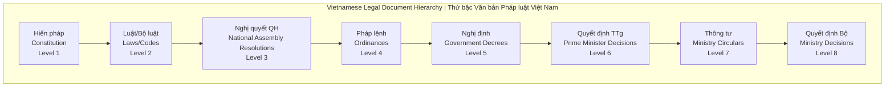

# 🇻🇳 Vietnamese Localization - Part 6
# Bản địa hóa Việt Nam - Phần 6

> **Cultural design patterns, government compliance, and Vietnamese legal system integration**  
> *Mẫu thiết kế văn hóa, tuân thủ chính phủ và tích hợp hệ thống pháp luật Việt Nam*

## 🏛️ Vietnamese Legal System Integration | Tích hợp Hệ thống Pháp luật Việt Nam

### Legal Document Hierarchy | Thứ bậc Văn bản Pháp luật



### Legal Reference Format | Định dạng Tham chiếu Pháp lý

```html
<!-- Vietnamese Legal Citation Component -->
<div class="legal-citation vietnamese-format">
    
    <!-- Primary Legal Document -->
    <div class="citation-primary">
        <div class="document-type">
            <span class="doc-level">Luật</span>
            <span class="doc-number">số 91/2015/QH13</span>
        </div>
        <h3 class="document-title">Luật An toàn, vệ sinh lao động</h3>
        <div class="document-meta">
            <span class="issuing-authority">Quốc hội</span>
            <time class="issue-date">ngày 19 tháng 6 năm 2015</time>
            <span class="effective-date">có hiệu lực từ ngày 01 tháng 7 năm 2016</span>
        </div>
    </div>
    
    <!-- Specific Article Reference -->
    <div class="citation-article">
        <div class="article-structure">
            <span class="chapter">Chương III</span>
            <span class="article">Điều 25</span>
            <span class="clause">Khoản 2</span>
            <span class="point">Điểm a</span>
        </div>
        <div class="article-content">
            <p class="article-text">
                "Người sử dụng lao động có trách nhiệm đảm bảo an toàn, 
                vệ sinh lao động trong phạm vi quản lý của mình..."
            </p>
        </div>
    </div>
    
    <!-- Amendment Information -->
    <div class="citation-amendments">
        <h4 class="amendments-title">Sửa đổi, bổ sung:</h4>
        <ul class="amendments-list">
            <li class="amendment-item">
                <span class="amendment-doc">Luật số 06/2020/QH14</span>
                <time class="amendment-date">ngày 17 tháng 6 năm 2020</time>
            </li>
        </ul>
    </div>
    
    <!-- Related Documents -->
    <div class="citation-related">
        <h4 class="related-title">Văn bản hướng dẫn:</h4>
        <ul class="related-documents">
            <li class="related-item">
                <a href="/document/decree-44-2016" class="related-link">
                    Nghị định số 44/2016/NĐ-CP
                </a>
                <span class="related-desc">quy định chi tiết thi hành</span>
            </li>
            <li class="related-item">
                <a href="/document/circular-15-2016" class="related-link">
                    Thông tư số 15/2016/TT-BLĐTBXH
                </a>
                <span class="related-desc">hướng dẫn thực hiện</span>
            </li>
        </ul>
    </div>
    
</div>
```

## 🎨 Vietnamese Cultural Design Patterns | Mẫu Thiết kế Văn hóa Việt Nam

### Color Psychology for Vietnamese Users | Tâm lý Màu sắc cho Người dùng Việt Nam

```css
/* Vietnamese Cultural Color Palette */
:root {
    /* Traditional Vietnamese Colors */
    --vn-red-primary: #DA020E;        /* Traditional red - authority, power */
    --vn-yellow-gold: #FFDF00;        /* Imperial yellow - prosperity */
    --vn-blue-government: #004B87;    /* Government blue - official, trust */
    --vn-green-nature: #228B22;       /* Natural green - harmony, growth */
    
    /* Cultural Context Colors */
    --vn-lotus-pink: #FDB5C8;         /* Lotus symbol - purity, enlightenment */
    --vn-bamboo-green: #9CAF88;       /* Bamboo - flexibility, strength */
    --vn-heritage-brown: #8B4513;     /* Cultural heritage - tradition */
    --vn-peace-white: #FFFEF7;        /* Pure white - peace, clarity */
    
    /* Legal Professional Colors */
    --vn-legal-navy: #1E3A8A;         /* Professional navy - expertise */
    --vn-justice-gold: #D4AF37;       /* Justice scales - fairness */
    --vn-wisdom-purple: #6B46C1;      /* Wisdom - knowledge, insight */
    --vn-trust-blue: #3B82F6;         /* Trust - reliability */
}

/* Vietnamese Government Compliant Palette */
.vietnamese-government-theme {
    --primary-color: var(--vn-blue-government);
    --secondary-color: var(--vn-red-primary);
    --accent-color: var(--vn-yellow-gold);
    --success-color: var(--vn-green-nature);
    --background-color: var(--vn-peace-white);
    --text-primary: #1F2937;
    --text-secondary: #4B5563;
}

/* Cultural Hierarchy Indication */
.document-importance-high {
    border-left: 4px solid var(--vn-red-primary);
    background: linear-gradient(90deg, 
        rgba(218, 2, 14, 0.05) 0%, 
        rgba(255, 255, 255, 0) 100%);
}

.document-importance-medium {
    border-left: 4px solid var(--vn-blue-government);
    background: linear-gradient(90deg, 
        rgba(0, 75, 135, 0.05) 0%, 
        rgba(255, 255, 255, 0) 100%);
}

.document-importance-standard {
    border-left: 4px solid var(--vn-green-nature);
    background: linear-gradient(90deg, 
        rgba(34, 139, 34, 0.05) 0%, 
        rgba(255, 255, 255, 0) 100%);
}
```

### Vietnamese Typography Patterns | Mẫu Typography Việt Nam

```css
/* Vietnamese Font Stack */
@import url('https://fonts.googleapis.com/css2?family=Inter:wght@300;400;500;600;700&display=swap');

.vietnamese-typography {
    /* Primary Font Stack - Optimized for Vietnamese */
    font-family: 
        'Inter', 
        'Segoe UI', 
        'Roboto', 
        'Helvetica Neue', 
        'Arial', 
        'Noto Sans', 
        'Liberation Sans', 
        'Apple Color Emoji', 
        'Segoe UI Emoji', 
        'Segoe UI Symbol', 
        'Noto Color Emoji', 
        sans-serif;
    
    /* Vietnamese Diacritic Support */
    font-feature-settings: 
        "kern" 1,      /* Kerning */
        "liga" 1,      /* Ligatures */
        "calt" 1,      /* Contextual alternates */
        "ccmp" 1;      /* Glyph composition */
    
    /* Text Rendering Optimization */
    text-rendering: optimizeLegibility;
    -webkit-font-smoothing: antialiased;
    -moz-osx-font-smoothing: grayscale;
}

/* Vietnamese Legal Document Typography */
.legal-document-text {
    font-size: 16px;
    line-height: 1.7;
    letter-spacing: 0.01em;
    word-spacing: 0.02em;
    
    /* Vietnamese text flow optimization */
    text-align: justify;
    hyphens: auto;
    hyphenate-limit-chars: 6 3 2;
    hyphenate-limit-lines: 2;
    hyphenate-limit-zone: 8%;
}

/* Vietnamese Title Hierarchy */
.vn-title-level-1 {
    font-size: 28px;
    font-weight: 700;
    line-height: 1.3;
    color: var(--vn-blue-government);
    margin-bottom: 24px;
    text-transform: uppercase;
    letter-spacing: 0.05em;
}

.vn-title-level-2 {
    font-size: 24px;
    font-weight: 600;
    line-height: 1.4;
    color: var(--vn-legal-navy);
    margin-bottom: 20px;
    position: relative;
}

.vn-title-level-2::before {
    content: '';
    position: absolute;
    left: -16px;
    top: 50%;
    transform: translateY(-50%);
    width: 4px;
    height: 24px;
    background: var(--vn-red-primary);
    border-radius: 2px;
}

.vn-title-level-3 {
    font-size: 20px;
    font-weight: 600;
    line-height: 1.5;
    color: var(--vn-legal-navy);
    margin-bottom: 16px;
}

/* Vietnamese Legal Article Formatting */
.legal-article-number {
    display: inline-block;
    min-width: 80px;
    font-weight: 700;
    color: var(--vn-red-primary);
    margin-right: 12px;
}

.legal-clause-marker {
    display: inline-block;
    min-width: 40px;
    font-weight: 600;
    color: var(--vn-blue-government);
    margin-right: 8px;
}
```

## 🏢 Government Compliance Interface | Giao diện Tuân thủ Chính phủ

### Vietnamese Government Standard Layout | Bố cục Tiêu chuẩn Chính phủ Việt Nam

```html
<!-- Government Compliant Header -->
<header class="government-header" role="banner">
    
    <!-- National Emblem Section -->
    <div class="national-identity">
        
        <div class="national-text">
            <h1 class="country-name">CỘNG HÒA XÃ HỘI CHỦ NGHĨA VIỆT NAM</h1>
            <p class="national-motto">Độc lập - Tự do - Hạnh phúc</p>
        </div>
    </div>
    
    <!-- Government Authority -->
    <div class="authority-section">
        <div class="ministry-info">
            <h2 class="ministry-name">BỘ TƯ PHÁP</h2>
            <p class="department-name">Cục Pháp chế</p>
        </div>
        <div class="system-info">
            <h3 class="system-name">Hệ thống Tư vấn Pháp lý AI</h3>
            <p class="system-version">Phiên bản 2.0 - 2025</p>
        </div>
    </div>
    
</header>

<!-- Government Compliance Notice -->
<div class="compliance-notice" role="region" aria-label="Thông báo tuân thủ">
    <div class="notice-content">
        <i class="icon-shield-check notice-icon" aria-hidden="true"></i>
        <div class="notice-text">
            <h4 class="notice-title">Hệ thống tuân thủ tiêu chuẩn Chính phủ</h4>
            <p class="notice-description">
                Được chứng nhận bởi Bộ TT&TT theo Thông tư 20/2018/TT-BTTTT 
                về an toàn thông tin mạng quốc gia.
            </p>
        </div>
        <div class="compliance-badges">
            
            
        </div>
    </div>
</div>
```

### Legal Disclaimer Component | Component Tuyên bố Pháp lý

```html
<!-- Vietnamese Legal Disclaimer -->
<div class="legal-disclaimer vietnamese-standard" role="region" aria-label="Tuyên bố pháp lý">
    
    <!-- Disclaimer Header -->
    <div class="disclaimer-header">
        <i class="icon-alert-triangle disclaimer-icon" aria-hidden="true"></i>
        <h3 class="disclaimer-title">TUYÊN BỐ PHÁP LÝ VÀ MIỄN TRÁCH NHIỆM</h3>
    </div>
    
    <!-- Main Disclaimer Content -->
    <div class="disclaimer-content">
        
        <!-- AI Advisory Notice -->
        <div class="disclaimer-section">
            <h4 class="section-title">1. Về tính chất tư vấn của AI</h4>
            <p class="section-text">
                Hệ thống này chỉ cung cấp thông tin pháp luật tham khảo dựa trên 
                các văn bản pháp luật hiện hành. <strong>Thông tin từ AI không thay thế 
                cho lời khuyên pháp lý chuyên nghiệp</strong> từ luật sư hoặc chuyên gia pháp lý.
            </p>
        </div>
        
        <!-- Legal Accuracy Notice -->
        <div class="disclaimer-section">
            <h4 class="section-title">2. Về tính chính xác của thông tin</h4>
            <p class="section-text">
                Mặc dù chúng tôi nỗ lực cập nhật thông tin thường xuyên, pháp luật 
                có thể thay đổi liên tục. <strong>Người sử dụng cần xác minh thông tin 
                với các văn bản pháp luật chính thức</strong> trước khi áp dụng.
            </p>
        </div>
        
        <!-- Professional Consultation -->
        <div class="disclaimer-section">
            <h4 class="section-title">3. Khuyến nghị tư vấn chuyên nghiệp</h4>
            <p class="section-text">
                Đối với các vấn đề pháp lý phức tạp hoặc có tính chất tranh chấp cao, 
                <strong>khuyến khích tham khảo ý kiến từ luật sư hoặc cơ quan pháp lý 
                có thẩm quyền</strong>.
            </p>
        </div>
        
        <!-- Data Privacy -->
        <div class="disclaimer-section">
            <h4 class="section-title">4. Về bảo mật thông tin</h4>
            <p class="section-text">
                Hệ thống tuân thủ <a href="/privacy-policy" class="legal-link">
                Luật An toàn thông tin mạng 2018</a> và 
                <a href="/data-protection" class="legal-link">
                Nghị định 15/2020/NĐ-CP về bảo vệ dữ liệu cá nhân</a>.
            </p>
        </div>
        
    </div>
    
    <!-- Acknowledgment Button -->
    <div class="disclaimer-actions">
        <button class="acknowledge-btn" id="legal-disclaimer-acknowledge">
            <i class="icon-check" aria-hidden="true"></i>
            Tôi đã đọc và hiểu các tuyên bố trên
        </button>
    </div>
    
</div>
```

## 📊 Vietnamese Legal Workflow Patterns | Mẫu Quy trình Pháp lý Việt Nam

### Legal Process Visualization | Trực quan hóa Quy trình Pháp lý

```html
<!-- Vietnamese Legal Process Flow -->
<div class="legal-process-flow vietnamese-workflow">
    
    <!-- Process Header -->
    <div class="process-header">
        <h3 class="process-title">Quy trình Tư vấn Pháp lý</h3>
        <p class="process-subtitle">Theo tiêu chuẩn tư vấn pháp lý Việt Nam</p>
    </div>
    
    <!-- Process Steps -->
    <div class="process-steps">
        
        <!-- Step 1: Initial Assessment -->
        <div class="process-step active" data-step="1">
            <div class="step-indicator">
                <div class="step-number">1</div>
                <div class="step-connector"></div>
            </div>
            <div class="step-content">
                <h4 class="step-title">Tiếp nhận và Phân loại</h4>
                <p class="step-description">
                    Hệ thống phân tích câu hỏi và xác định lĩnh vực pháp lý liên quan
                </p>
                <div class="step-details">
                    <ul class="step-checklist">
                        <li>✓ Phân loại theo ngành luật</li>
                        <li>✓ Xác định mức độ phức tạp</li>
                        <li>✓ Đánh giá tính khả thi tư vấn</li>
                    </ul>
                </div>
            </div>
        </div>
        
        <!-- Step 2: Legal Research -->
        <div class="process-step" data-step="2">
            <div class="step-indicator">
                <div class="step-number">2</div>
                <div class="step-connector"></div>
            </div>
            <div class="step-content">
                <h4 class="step-title">Tra cứu và Nghiên cứu</h4>
                <p class="step-description">
                    Tìm kiếm các văn bản pháp luật liên quan theo thứ bậc hiệu lực
                </p>
                <div class="step-details">
                    <ul class="step-checklist">
                        <li>Luật/Bộ luật cơ bản</li>
                        <li>Nghị định hướng dẫn</li>
                        <li>Thông tư thực hiện</li>
                        <li>Án lệ liên quan</li>
                    </ul>
                </div>
            </div>
        </div>
        
        <!-- Step 3: Analysis -->
        <div class="process-step" data-step="3">
            <div class="step-indicator">
                <div class="step-number">3</div>
                <div class="step-connector"></div>
            </div>
            <div class="step-content">
                <h4 class="step-title">Phân tích và Đánh giá</h4>
                <p class="step-description">
                    AI phân tích các điều khoản pháp luật áp dụng cho tình huống cụ thể
                </p>
                <div class="step-details">
                    <ul class="step-checklist">
                        <li>Xác định điều khoản áp dụng</li>
                        <li>Phân tích mối quan hệ pháp lý</li>
                        <li>Đánh giá rủi ro pháp lý</li>
                    </ul>
                </div>
            </div>
        </div>
        
        <!-- Step 4: Response Generation -->
        <div class="process-step" data-step="4">
            <div class="step-indicator">
                <div class="step-number">4</div>
                <div class="step-connector"></div>
            </div>
            <div class="step-content">
                <h4 class="step-title">Tạo Lời Tư vấn</h4>
                <p class="step-description">
                    Hệ thống tạo ra lời tư vấn có cấu trúc và dễ hiểu
                </p>
                <div class="step-details">
                    <ul class="step-checklist">
                        <li>Trình bày cơ sở pháp lý</li>
                        <li>Đưa ra lời khuyên cụ thể</li>
                        <li>Cảnh báo rủi ro pháp lý</li>
                        <li>Đề xuất bước tiếp theo</li>
                    </ul>
                </div>
            </div>
        </div>
        
        <!-- Step 5: Review and Delivery -->
        <div class="process-step" data-step="5">
            <div class="step-indicator">
                <div class="step-number">5</div>
            </div>
            <div class="step-content">
                <h4 class="step-title">Kiểm tra và Trả lời</h4>
                <p class="step-description">
                    Hệ thống kiểm tra chất lượng và cung cấp đáp án cuối cùng
                </p>
                <div class="step-details">
                    <ul class="step-checklist">
                        <li>✓ Kiểm tra tính nhất quán</li>
                        <li>✓ Xác minh tham chiếu pháp lý</li>
                        <li>✓ Đánh giá độ tin cậy</li>
                        <li>✓ Cung cấp tài liệu tham khảo</li>
                    </ul>
                </div>
            </div>
        </div>
        
    </div>
    
    <!-- Process Controls -->
    <div class="process-controls">
        <button class="process-control-btn" id="restart-process">
            <i class="icon-refresh-cw" aria-hidden="true"></i>
            Bắt đầu lại quy trình
        </button>
        <button class="process-control-btn" id="view-details">
            <i class="icon-info" aria-hidden="true"></i>
            Xem chi tiết quy trình
        </button>
    </div>
    
</div>
```

## 🌏 Regional Customization | Tùy chỉnh theo Vùng miền

### Vietnamese Regional Legal Variations | Biến thể Pháp lý theo Vùng miền Việt Nam

```html
<!-- Regional Legal Context Selector -->
<div class="regional-context-selector">
    
    <div class="selector-header">
        <h4 class="selector-title">
            <i class="icon-map" aria-hidden="true"></i>
            Bối cảnh Pháp lý theo Vùng miền
        </h4>
        <p class="selector-description">
            Chọn khu vực để nhận thông tin pháp lý phù hợp với đặc thù địa phương
        </p>
    </div>
    
    <div class="regional-options">
        
        <!-- Northern Region -->
        <label class="regional-option" for="region-north">
            <input type="radio" 
                   id="region-north" 
                   name="legal-region" 
                   value="north"
                   class="region-input">
            <div class="region-card">
                <div class="region-flag">🏔️</div>
                <h5 class="region-name">Miền Bắc</h5>
                <p class="region-description">
                    Bao gồm Hà Nội và các tỉnh phía Bắc. 
                    Áp dụng các quy định đặc thù về đất đai nông nghiệp và di sản văn hóa.
                </p>
                <div class="region-specialties">
                    <span class="specialty-tag">Đất nông nghiệp</span>
                    <span class="specialty-tag">Di sản văn hóa</span>
                    <span class="specialty-tag">Thương mại biên giới</span>
                </div>
            </div>
        </label>
        
        <!-- Central Region -->
        <label class="regional-option" for="region-central">
            <input type="radio" 
                   id="region-central" 
                   name="legal-region" 
                   value="central"
                   class="region-input">
            <div class="region-card">
                <div class="region-flag">🏖️</div>
                <h5 class="region-name">Miền Trung</h5>
                <p class="region-description">
                    Từ Thanh Hóa đến Bình Thuận. 
                    Tập trung vào pháp luật du lịch, thủy sản và phòng chống thiên tai.
                </p>
                <div class="region-specialties">
                    <span class="specialty-tag">Du lịch</span>
                    <span class="specialty-tag">Thủy sản</span>
                    <span class="specialty-tag">Thiên tai</span>
                </div>
            </div>
        </label>
        
        <!-- Southern Region -->
        <label class="regional-option" for="region-south">
            <input type="radio" 
                   id="region-south" 
                   name="legal-region" 
                   value="south"
                   class="region-input" 
                   checked>
            <div class="region-card">
                <div class="region-flag">🌾</div>
                <h5 class="region-name">Miền Nam</h5>
                <p class="region-description">
                    Bao gồm TP.HCM và đồng bằng sông Cửu Long. 
                    Chuyên về thương mại, xuất nhập khẩu và nông nghiệp.
                </p>
                <div class="region-specialties">
                    <span class="specialty-tag">Thương mại</span>
                    <span class="specialty-tag">Xuất nhập khẩu</span>
                    <span class="specialty-tag">Nông nghiệp</span>
                </div>
            </div>
        </label>
        
        <!-- Special Economic Zones -->
        <label class="regional-option" for="region-sez">
            <input type="radio" 
                   id="region-sez" 
                   name="legal-region" 
                   value="special-zones"
                   class="region-input">
            <div class="region-card">
                <div class="region-flag">🏭</div>
                <h5 class="region-name">Khu Kinh tế Đặc biệt</h5>
                <p class="region-description">
                    Các khu vực có chế độ pháp lý đặc biệt về đầu tư, 
                    thuế và thương mại quốc tế.
                </p>
                <div class="region-specialties">
                    <span class="specialty-tag">Đầu tư FDI</span>
                    <span class="specialty-tag">Thuế ưu đãi</span>
                    <span class="specialty-tag">Hải quan</span>
                </div>
            </div>
        </label>
        
    </div>
    
</div>
```

## 📱 Accessibility for Vietnamese Users | Khả năng Tiếp cận cho Người dùng Việt Nam

### Vietnamese Accessibility Standards | Tiêu chuẩn Tiếp cận Việt Nam

```css
/* Vietnamese Screen Reader Optimization */
.vietnamese-screen-reader {
    /* Screen reader friendly Vietnamese text */
    speak: normal;
    speak-punctuation: code;
    speak-numeral: digits;
}

/* High Contrast Mode for Vietnamese Text */
@media (prefers-contrast: high) {
    .vietnamese-high-contrast {
        --text-primary: #000000;
        --text-secondary: #1F2937;
        --background-primary: #FFFFFF;
        --border-color: #000000;
        --link-color: #0000EE;
        --visited-link: #551A8B;
    }
    
    .legal-citation {
        border: 2px solid var(--border-color);
        background: var(--background-primary);
        color: var(--text-primary);
    }
}

/* Large Text Support for Vietnamese */
@media (prefers-reduced-motion: no-preference) {
    .vietnamese-large-text {
        font-size: 120%;
        line-height: 1.8;
        letter-spacing: 0.05em;
        word-spacing: 0.1em;
    }
}

/* Reduced Motion for Vietnamese Content */
@media (prefers-reduced-motion: reduce) {
    .vietnamese-content * {
        animation-duration: 0.01ms !important;
        animation-iteration-count: 1 !important;
        transition-duration: 0.01ms !important;
        scroll-behavior: auto !important;
    }
}
```

### Vietnamese Keyboard Navigation | Điều hướng Bàn phím Việt Nam

```javascript
// Vietnamese Keyboard Navigation Support
class VietnameseKeyboardNavigation {
    
    constructor() {
        this.setupVietnameseShortcuts();
        this.initializeAccessibility();
    }
    
    setupVietnameseShortcuts() {
        // Vietnamese-specific keyboard shortcuts
        const shortcuts = {
            'Alt+T': this.openLegalSearch.bind(this),      // "Tìm kiếm"
            'Alt+H': this.showHelp.bind(this),             // "Hỗ trợ"
            'Alt+L': this.openLegalCategories.bind(this),  // "Luật"
            'Alt+C': this.startNewConsultation.bind(this), // "Chăm sóc"
            'Alt+S': this.saveCurrentSession.bind(this),   // "Sao lưu"
            'Ctrl+Shift+V': this.toggleVietnameseInput.bind(this) // Vietnamese input
        };
        
        document.addEventListener('keydown', (event) => {
            const key = this.getShortcutKey(event);
            if (shortcuts[key]) {
                event.preventDefault();
                shortcuts[key]();
                this.announceAction(key);
            }
        });
    }
    
    announceAction(shortcut) {
        const announcements = {
            'Alt+T': 'Đã mở tìm kiếm pháp lý',
            'Alt+H': 'Đã mở trợ giúp',
            'Alt+L': 'Đã mở danh mục luật',
            'Alt+C': 'Đã bắt đầu tư vấn mới',
            'Alt+S': 'Đã lưu phiên làm việc'
        };
        
        this.announceToScreenReader(announcements[shortcut]);
    }
    
    announceToScreenReader(message) {
        const announcement = document.createElement('div');
        announcement.setAttribute('aria-live', 'polite');
        announcement.setAttribute('aria-atomic', 'true');
        announcement.className = 'sr-only vietnamese-announcement';
        announcement.textContent = message;
        
        document.body.appendChild(announcement);
        
        setTimeout(() => {
            document.body.removeChild(announcement);
        }, 1000);
    }
    
}

// Initialize Vietnamese accessibility
document.addEventListener('DOMContentLoaded', () => {
    new VietnameseKeyboardNavigation();
});
```

## 🎯 Localization Validation Checklist | Danh sách Kiểm tra Bản địa hóa

### Vietnamese Cultural Compliance | Tuân thủ Văn hóa Việt Nam

- [ ] **Legal Document Hierarchy** - Proper Vietnamese legal document structure
- [ ] **Cultural Colors** - Traditional Vietnamese color meanings and government standards
- [ ] **Typography** - Vietnamese diacritic support and legal text formatting
- [ ] **Regional Customization** - North/Central/South regional legal variations
- [ ] **Government Compliance** - Ministry standards and official formatting
- [ ] **Professional Terminology** - Correct Vietnamese legal terminology
- [ ] **Workflow Patterns** - Vietnamese legal consultation process flow

### Accessibility Standards | Tiêu chuẩn Tiếp cận

- [ ] **Vietnamese Screen Readers** - Proper Vietnamese pronunciation and flow
- [ ] **Keyboard Navigation** - Vietnamese-specific shortcuts and navigation
- [ ] **High Contrast** - Vietnamese text readability in high contrast mode
- [ ] **Large Text Support** - Vietnamese diacritic scaling and spacing
- [ ] **Government Accessibility** - Compliance with Vietnamese web accessibility standards

### Legal System Integration | Tích hợp Hệ thống Pháp lý

- [ ] **Citation Format** - Standard Vietnamese legal citation structure
- [ ] **Amendment Tracking** - Legal document version and update management
- [ ] **Authority Recognition** - Proper government authority display
- [ ] **Disclaimer Compliance** - Vietnamese legal disclaimer requirements
- [ ] **Data Protection** - Vietnamese personal data protection law compliance

---

*🇻🇳 Created: August 2025 | Version: 1.0 | Final Part of Interface Mockup Series*

**Series Complete:** [Design Principles](01-design-principles.md) → [UI Layouts](02-user-interface-layouts.md) → [Chat Interface](03-chat-interface-design.md) → [Document Management](04-document-management-ui.md) → [Admin Dashboard](05-admin-dashboard-design.md) → **Vietnamese Localization**

**Related:** [System Architecture](../system-architecture.md) | [User Stories](../user-stories.md) | [Implementation Guide](../implementation-guide.md)
