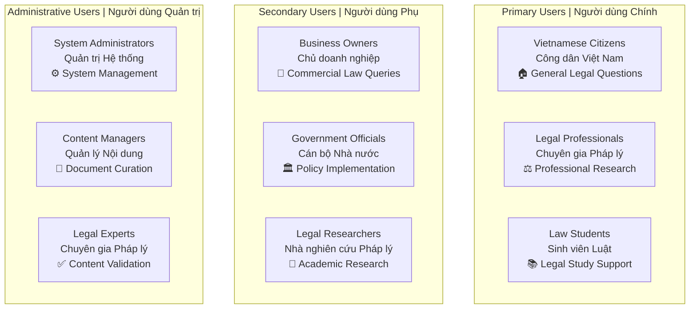
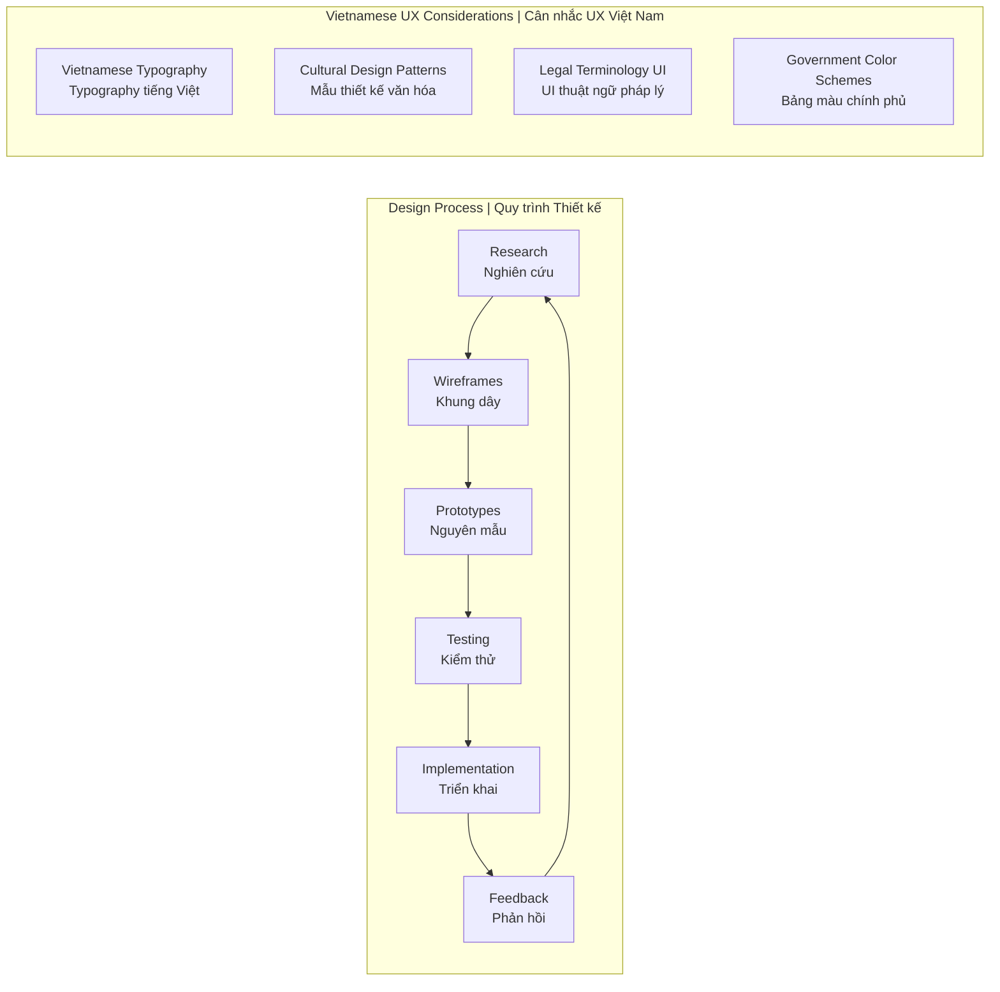

# 🎨 Interface Mockups - Vietnamese Legal AI Chatbot
# Mô hình Giao diện - Chatbot AI Pháp lý Việt Nam

> **Comprehensive UI/UX design documentation for Vietnamese Legal AI Chatbot interface**  
> *Tài liệu thiết kế UI/UX toàn diện cho giao diện Chatbot AI Pháp lý Việt Nam*

## 📋 Mockup Documentation Structure | Cấu trúc Tài liệu Mockup

### 📁 Documentation Organization | Tổ chức Tài liệu

```
interface-mockups/
├── README.md                           # This overview document
├── 01-design-principles.md             # Design principles & guidelines
├── 02-user-interface-layouts.md        # Main UI layouts & components
├── 03-chat-interface-design.md         # Chat interface detailed design
├── 04-document-management-ui.md        # Document upload & management
├── 05-admin-dashboard-design.md        # Admin panel & analytics
├── 06-vietnamese-localization.md       # Vietnamese UI/UX considerations
└── assets/                             # Design assets & wireframes
    ├── wireframes/                     # Low-fidelity wireframes
    ├── mockups/                        # High-fidelity mockups
    ├── icons/                          # Vietnamese legal icons
    └── color-schemes/                  # Color palettes & themes
```

## 🎯 Design Overview | Tổng quan Thiết kế

### Core Design Objectives | Mục tiêu Thiết kế Cốt lõi

1. **🇻🇳 Vietnamese-First Design** - Thiết kế ưu tiên tiếng Việt
2. **⚡ Intuitive Legal Consultation** - Tư vấn pháp lý trực quan
3. ** Professional & Trustworthy** - Chuyên nghiệp & đáng tin cậy
4. **♿ Accessibility Compliant** - Tuân thủ khả năng tiếp cận
5. **🚀 Performance Optimized** - Tối ưu hiệu suất

### Target User Groups | Nhóm Người dùng Mục tiêu



### Design Methodology | Phương pháp Thiết kế



## 📚 Document Breakdown by Sections | Phân chia Tài liệu theo Phần

### 🎨 Part 1: Design Principles & Guidelines
**File:** `01-design-principles.md`
- Vietnamese design language standards
- Color schemes for legal applications  
- Typography guidelines for Vietnamese text
- Accessibility standards & compliance
- Brand identity & visual hierarchy

### 🖥️ Part 2: User Interface Layouts
**File:** `02-user-interface-layouts.md`
- Main dashboard layout structure
- Navigation menu & breadcrumb design
- Header/footer components
- Sidebar layouts & behavior
- Grid systems & spacing standards

### 💬 Part 3: Chat Interface Design
**File:** `03-chat-interface-design.md`
- Conversational UI patterns
- Vietnamese input methods & keyboards
- Message bubbles & threading
- Legal citation display formats
- Real-time typing indicators

### 📄 Part 4: Document Management UI
**File:** `04-document-management-ui.md`
- Document upload interfaces
- File type validation & progress
- Document preview & annotation
- Search & filtering mechanisms
- Vietnamese document categorization

### 👥 Part 5: Admin Dashboard Design
**File:** `05-admin-dashboard-design.md`
- Analytics & reporting dashboards
- User management interfaces
- Content moderation tools
- System monitoring views
- Vietnamese administrative workflows

### 🇻🇳 Part 6: Vietnamese Localization
**File:** `06-vietnamese-localization.md`
- Vietnamese language UI patterns
- Cultural design considerations
- Legal system specific workflows
- Government compliance interfaces
- Vietnamese legal document formats

## 🛠️ Implementation Strategy | Chiến lược Triển khai

### Phase 1: Core Interface Design | Thiết kế Giao diện Cốt lõi
- [ ] Design principles establishment
- [ ] Main layout wireframes
- [ ] Chat interface prototypes
- [ ] Vietnamese typography testing

### Phase 2: Advanced Features | Tính năng Nâng cao
- [ ] Document management UI
- [ ] Admin dashboard design
- [ ] Accessibility enhancements

### Phase 3: Localization & Testing | Bản địa hóa & Kiểm thử
- [ ] Vietnamese cultural adaptation
- [ ] User testing with Vietnamese users
- [ ] Legal expert validation
- [ ] Performance optimization

## 🎯 Next Steps | Bước tiếp theo

1. **Start with Part 1** - `01-design-principles.md`
2. **Progressive Development** - Build each section incrementally
3. **Iterative Review** - Review and refine each part
4. **Integration Testing** - Ensure cohesive design system

---

*📅 Created: August 2025 | Version: 1.0 | Next Review: September 2025*

**Related Documents:**
- [User Stories](../user-stories.md)
- [Use Cases](../use-cases.md)  
- [System Architecture](../system-architecture.md)
- [Technical Specifications](../technical-specs.md)
