# 🏗️ System Architecture Diagrams - Vietnamese Legal AI Chatbot
# Sơ đồ Kiến trúc Hệ thống - Chatbot AI Pháp lý Việt Nam

> **Comprehensive system architecture documentation with detailed diagrams for the Vietnamese Legal AI Chatbot**  
> *Tài liệu kiến trúc hệ thống toàn diện với các sơ đồ chi tiết cho Chatbot AI Pháp lý Việt Nam*

## 📋 Table of Contents | Mục lục

1. [Architecture Overview](#-architecture-overview--tổng-quan-kiến-trúc)
2. [High-Level Architecture](#-high-level-architecture--kiến-trúc-tổng-thể)
3. [Component Architecture](#-component-architecture--kiến-trúc-component)
4. [Data Flow Diagrams](#-data-flow-diagrams--sơ-đồ-luồng-dữ-liệu)
5. [Deployment Architecture](#-deployment-architecture--kiến-trúc-triển-khai)
6. [Security Architecture](#-security-architecture--kiến-trúc-bảo-mật)
7. [Integration Architecture](#-integration-architecture--kiến-trúc-tích-hợp)
8. [Scalability Architecture](#-scalability-architecture--kiến-trúc-mở-rộng)

---

## 🎯 Architecture Overview | Tổng quan Kiến trúc

### Architecture Principles | Nguyên tắc Kiến trúc

1. **Microservices Architecture** - Kiến trúc microservices
2. **Cloud-Native Design** - Thiết kế cloud-native
3. **API-First Approach** - Tiếp cận API-first
4. **Scalable & Resilient** - Có khả năng mở rộng và phục hồi
5. **Vietnamese Language Optimized** - Tối ưu hóa cho tiếng Việt
6. **Security by Design** - Bảo mật theo thiết kế

### Technology Stack | Ngăn xếp Công nghệ

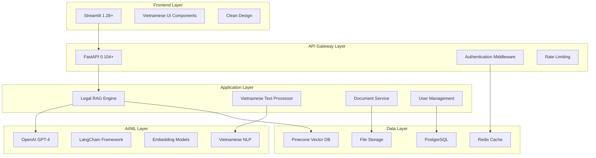

---

## 🏛️ High-Level Architecture | Kiến trúc Tổng thể

### System Context Diagram | Sơ đồ Ngữ cảnh Hệ thống

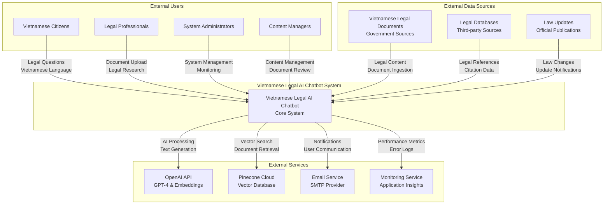

### Container Diagram | Sơ đồ Container

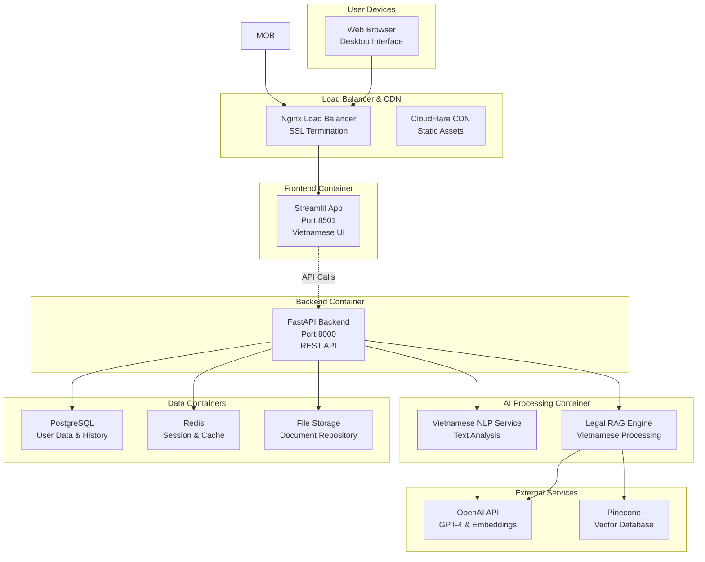

---

## 🔧 Component Architecture | Kiến trúc Component

### Backend Component Diagram | Sơ đồ Component Backend

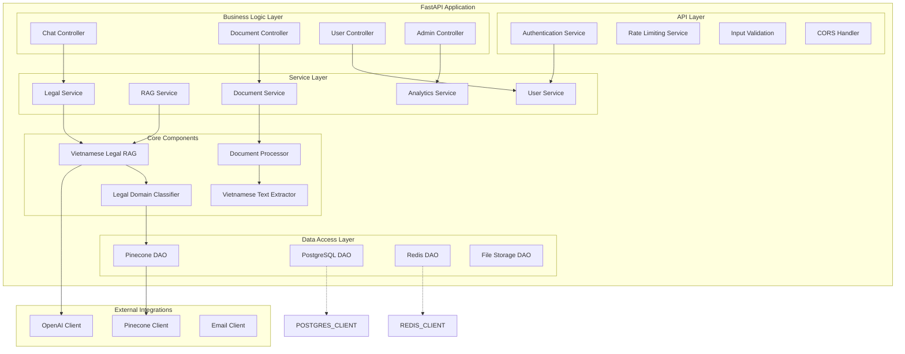

### Frontend Component Diagram | Sơ đồ Component Frontend

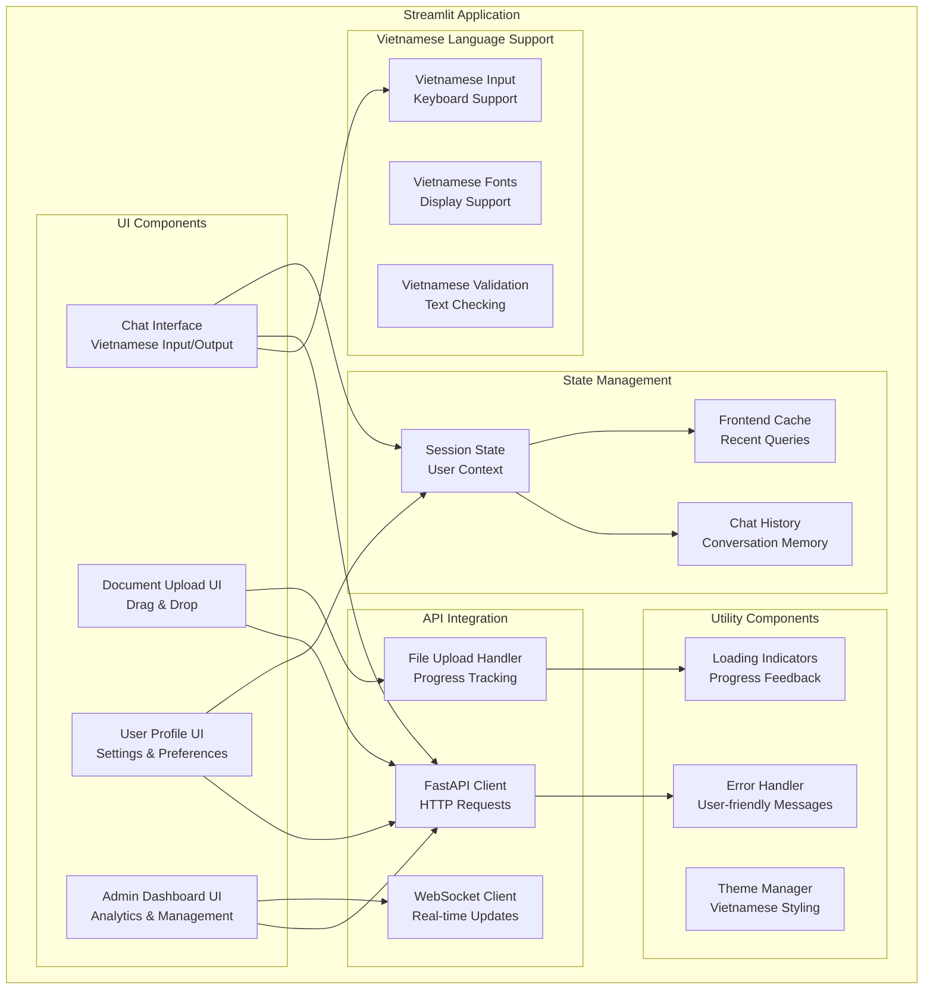

---

## 🌊 Data Flow Diagrams | Sơ đồ Luồng Dữ liệu

### Legal Query Processing Flow | Luồng Xử lý Câu hỏi Pháp lý

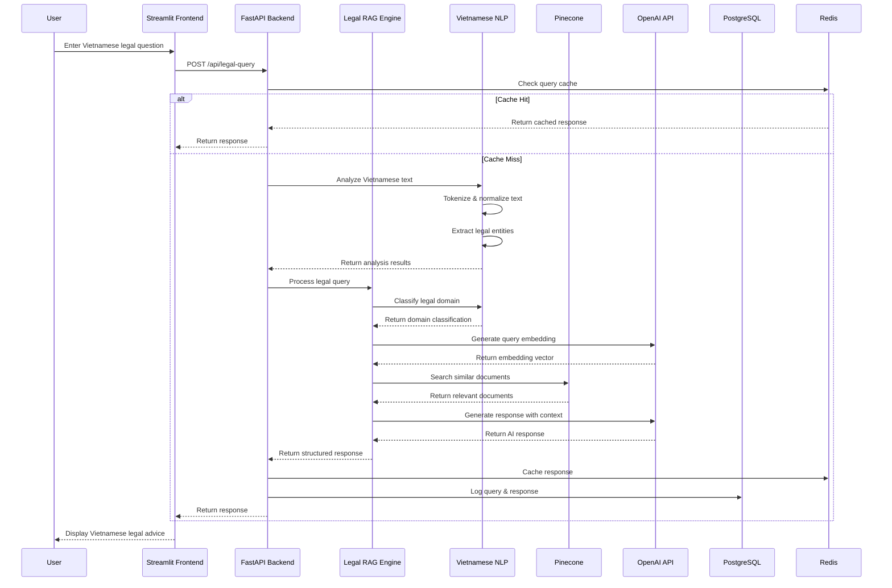

### Document Upload Processing Flow | Luồng Xử lý Tải lên Tài liệu

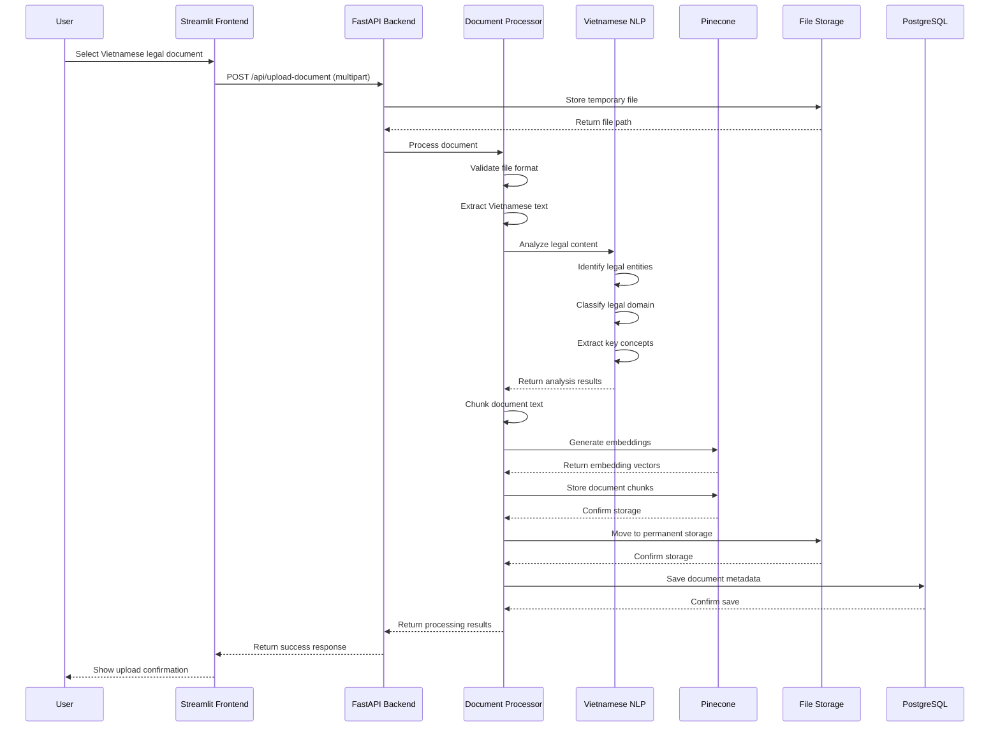

### User Authentication Flow | Luồng Xác thực Người dùng

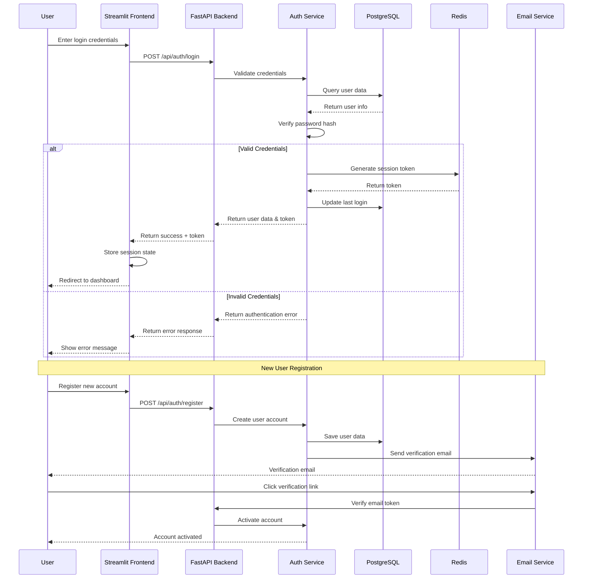

---

## 🚀 Deployment Architecture | Kiến trúc Triển khai

### Container Deployment Diagram | Sơ đồ Triển khai Container

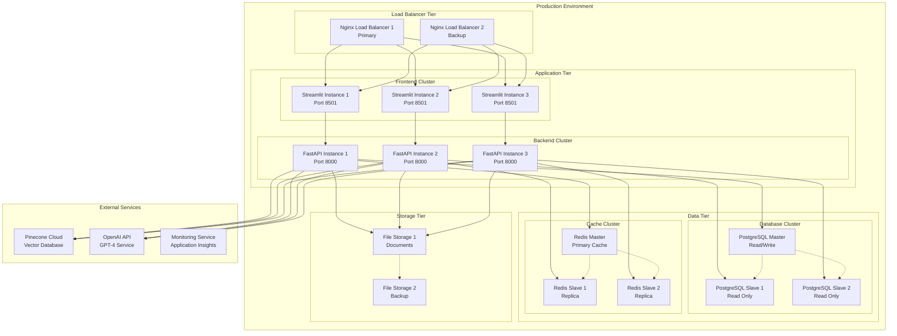

### Docker Compose Architecture | Kiến trúc Docker Compose

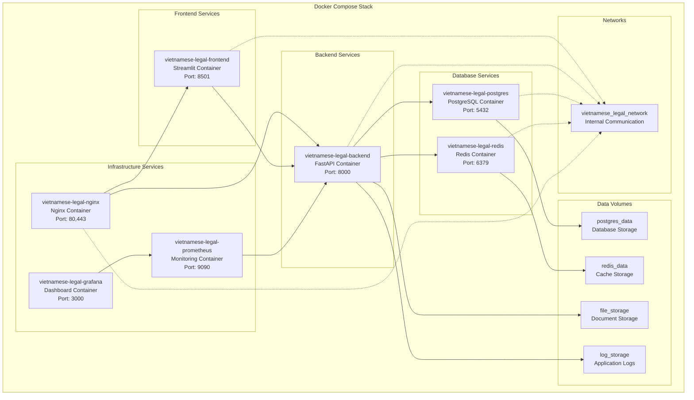

---

## 🔐 Security Architecture | Kiến trúc Bảo mật

### Security Layers Diagram | Sơ đồ Lớp Bảo mật

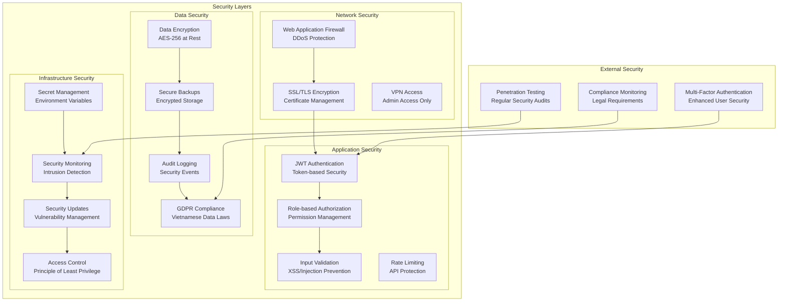

### Authentication & Authorization Flow | Luồng Xác thực & Phân quyền

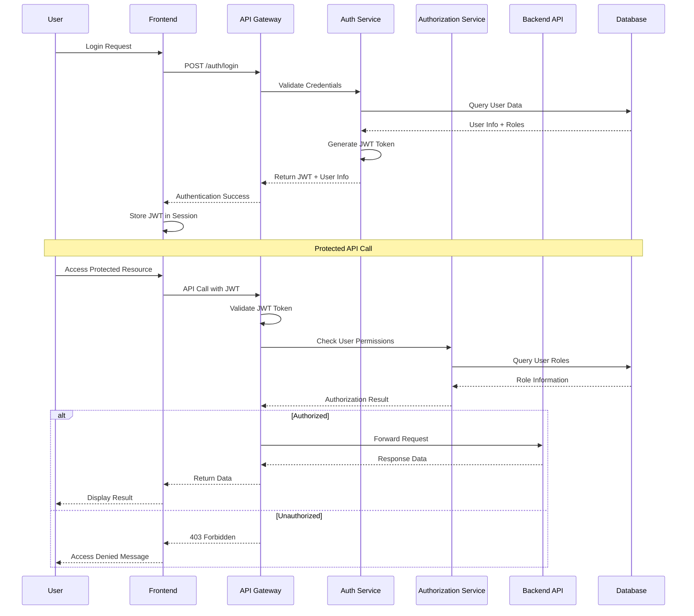

---

## 🔗 Integration Architecture | Kiến trúc Tích hợp

### External Service Integration | Tích hợp Dịch vụ Bên ngoài

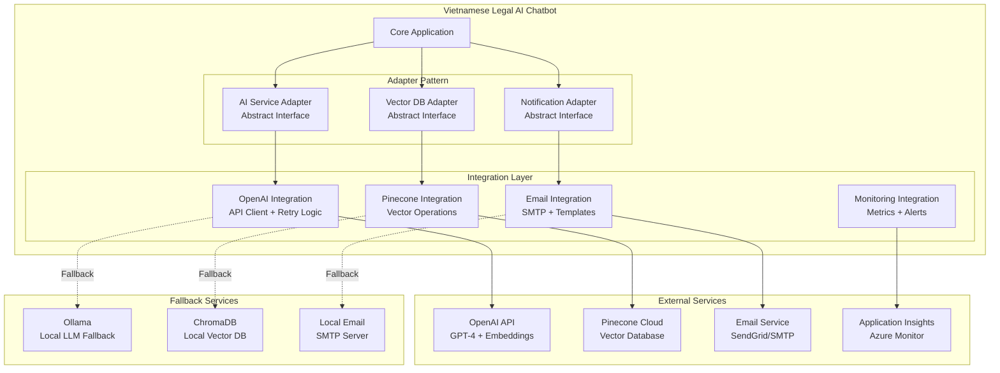

### API Integration Patterns | Mẫu Tích hợp API

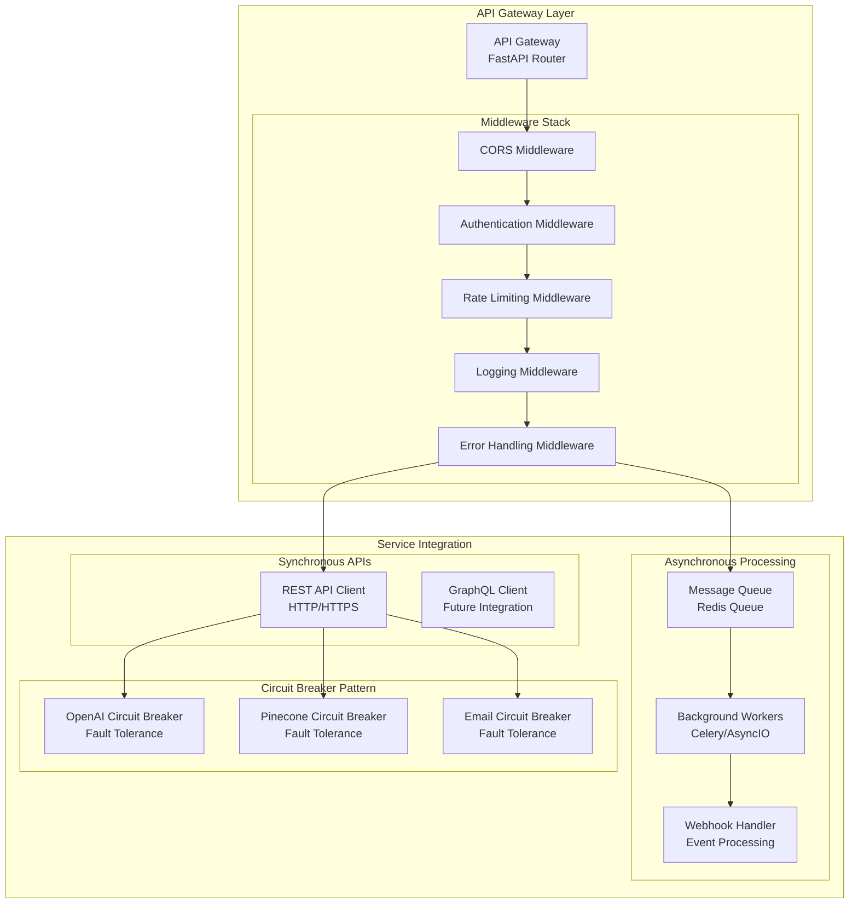

---

## 📈 Scalability Architecture | Kiến trúc Mở rộng

### Horizontal Scaling Strategy | Chiến lược Mở rộng Ngang

```mermaid
graph TB
    subgraph "Auto-Scaling Groups"
        subgraph "Frontend Scaling"
            ST_LB[Streamlit Load Balancer]
            ST_ASG[Streamlit Auto Scaling Group<br/>Min: 2, Max: 10]
            ST1[Streamlit Instance 1]
            ST2[Streamlit Instance 2]
            STN[Streamlit Instance N]
        end
        
        subgraph "Backend Scaling"
            API_LB[API Load Balancer]
            API_ASG[FastAPI Auto Scaling Group<br/>Min: 3, Max: 20]
            API1[FastAPI Instance 1]
            API2[FastAPI Instance 2]
            APIN[FastAPI Instance N]
        end
        
        subgraph "Worker Scaling"
            WORKER_ASG[Worker Auto Scaling Group<br/>Min: 2, Max: 15]
            W1[Document Processor 1]
            W2[Document Processor 2]
            WN[Document Processor N]
        end
    end
    
    subgraph "Database Scaling"
        PG_CLUSTER[PostgreSQL Cluster<br/>Read Replicas]
        RD_CLUSTER[Redis Cluster<br/>Sharded Cache]
        PC_SHARDS[Pinecone Shards<br/>Multi-Region]
    end
    
    subgraph "Scaling Triggers"
        CPU_METRIC[CPU Usage > 70%]
        MEM_METRIC[Memory Usage > 80%]
        REQ_METRIC[Request Rate > 1000/min]
        QUEUE_METRIC[Queue Length > 100]
    end
    
    ST_LB --> ST_ASG
    ST_ASG --> ST1
    ST_ASG --> ST2
    ST_ASG --> STN
    
    API_LB --> API_ASG
    API_ASG --> API1
    API_ASG --> API2
    API_ASG --> APIN
    
    WORKER_ASG --> W1
    WORKER_ASG --> W2
    WORKER_ASG --> WN
    
    CPU_METRIC --> ST_ASG
    MEM_METRIC --> API_ASG
    REQ_METRIC --> API_ASG
    QUEUE_METRIC --> WORKER_ASG
    
    API1 --> PG_CLUSTER
    API2 --> PG_CLUSTER
    APIN --> PG_CLUSTER
    
    API1 --> RD_CLUSTER
    API2 --> RD_CLUSTER
    APIN --> RD_CLUSTER
    
    API1 --> PC_SHARDS
    API2 --> PC_SHARDS
    APIN --> PC_SHARDS
```

### Performance Optimization Architecture | Kiến trúc Tối ưu Hiệu suất

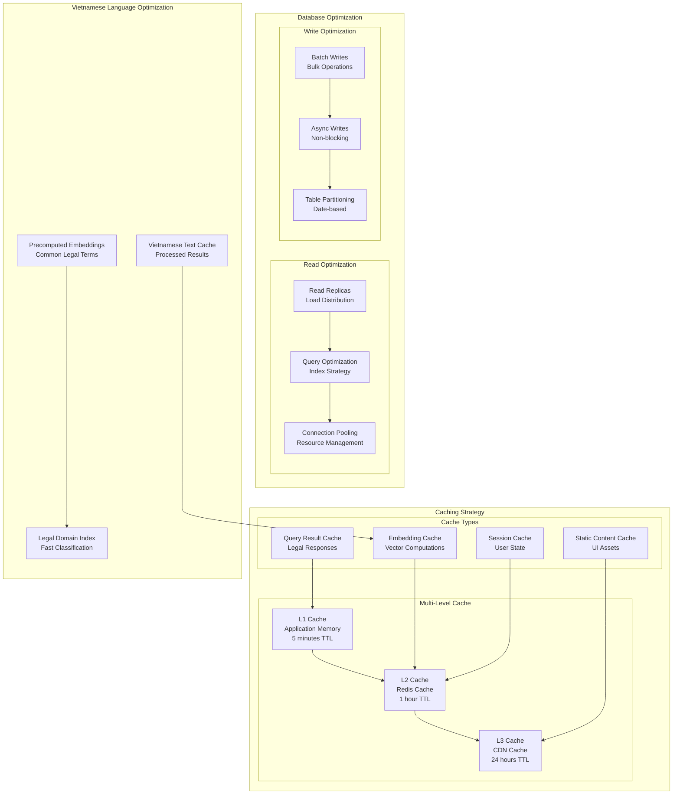

---

## 📊 Monitoring & Observability Architecture | Kiến trúc Giám sát & Quan sát

### Observability Stack | Ngăn xếp Quan sát

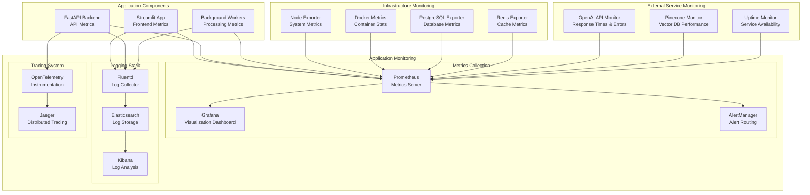

---

## 📝 Architecture Decision Records | Bản ghi Quyết định Kiến trúc

### ADR-001: Python-Only Technology Stack

**Status:** Accepted  
**Date:** August 2025  

**Context:** Need to choose technology stack for Vietnamese Legal AI Chatbot

**Decision:** Use Python-only technology stack with FastAPI and Streamlit

**Rationale:**
- Unified development experience
- Rich AI/ML ecosystem in Python
- Vietnamese NLP library availability
- Team expertise alignment
- Simplified deployment and maintenance

**Consequences:**
- ✅ Faster development cycle
- ✅ Better Vietnamese language support
- ✅ Unified skill requirements
- ❌ Potential performance limitations
- ❌ Limited frontend flexibility

### ADR-002: Microservices with Containers

**Status:** Accepted  
**Date:** August 2025  

**Context:** Need to decide on deployment architecture

**Decision:** Use containerized microservices with Docker

**Rationale:**
- Scalability requirements
- Development team separation
- Technology isolation
- Cloud-native deployment
- Easy CI/CD integration

**Consequences:**
- ✅ Independent service scaling
- ✅ Technology flexibility
- ✅ Better fault isolation
- ❌ Increased complexity
- ❌ Network latency concerns

### ADR-003: External AI Services

**Status:** Accepted  
**Date:** August 2025  

**Context:** Choice between self-hosted vs external AI services

**Decision:** Use OpenAI API with local fallback options

**Rationale:**
- Faster time to market
- State-of-the-art model quality
- Vietnamese language support
- Reduced infrastructure complexity
- Cost-effective for initial scale

**Consequences:**
- ✅ High-quality AI responses
- ✅ Reduced development time
- ✅ Automatic model updates
- ❌ External service dependency
- ❌ Data privacy considerations
- ❌ Variable API costs

---

*📅 Document Version: 1.0 | Created: August 2025 | Next Review: September 2025*

---

**Related Documents:**
- [User Stories](user-stories.md)
- [Use Cases](use-cases.md)
- [System Requirements](requirements.md)
- [Technical Specifications](technical-specs.md)
- [Deployment Guide](deployment.md)
