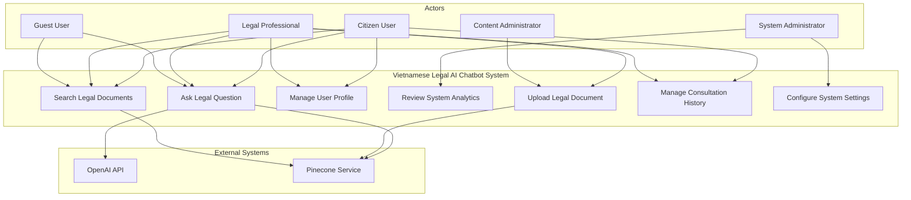
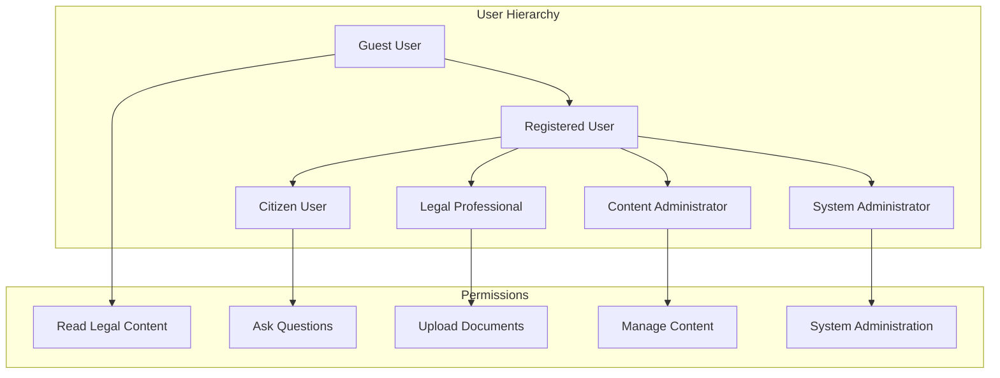

# 🎭 Use Cases Document - Vietnamese Legal AI Chatbot
# Tài liệu Use Cases - Chatbot AI Pháp lý Việt Nam

> **Comprehensive use case specifications for the Vietnamese Legal AI Chatbot system**  
> *Đặc tả use case toàn diện cho hệ thống Chatbot AI Pháp lý Việt Nam*

## 📋 Table of Contents | Mục lục

1. [System Overview](#-system-overview--tổng-quan-hệ-thống)
2. [Actors](#-actors--tác-nhân)
3. [Core Use Cases](#-core-use-cases--use-cases-cốt-lõi)
4. [Extended Use Cases](#-extended-use-cases--use-cases-mở-rộng)
5. [Use Case Diagrams](#-use-case-diagrams--sơ-đồ-use-case)
6. [Traceability Matrix](#-traceability-matrix--ma-trận-truy-xuất)

---

## 🎯 System Overview | Tổng quan Hệ thống

The Vietnamese Legal AI Chatbot system provides intelligent legal consultation services to Vietnamese citizens, legal professionals, and administrators through an AI-powered platform that processes Vietnamese legal documents and provides contextual legal advice.

*Hệ thống Chatbot AI Pháp lý Việt Nam cung cấp dịch vụ tư vấn pháp lý thông minh cho công dân Việt Nam, chuyên gia pháp lý và quản trị viên thông qua nền tảng AI xử lý tài liệu pháp lý Việt Nam và đưa ra lời khuyên pháp lý theo ngữ cảnh.*

### System Boundaries | Ranh giới Hệ thống
- **In Scope:** Vietnamese legal consultation, document processing, user management
- **Out of Scope:** Professional legal representation, payment processing, court filings

---

## 👥 Actors | Tác nhân

### Primary Actors | Tác nhân Chính

#### 1. **Citizen User | Công dân**
- **Description:** Vietnamese citizens seeking legal advice
- **Goals:** Get accurate legal information, understand rights and obligations
- **Characteristics:** Limited legal knowledge, Vietnamese speaker

#### 2. **Legal Professional | Chuyên gia Pháp lý**
- **Description:** Lawyers, paralegals, legal researchers
- **Goals:** Research legal precedents, verify legal information, assist clients
- **Characteristics:** Expert legal knowledge, professional requirements

#### 3. **System Administrator | Quản trị viên Hệ thống**
- **Description:** Technical staff managing the system
- **Goals:** Maintain system performance, manage users, monitor security
- **Characteristics:** Technical expertise, system access privileges

### Secondary Actors | Tác nhân Phụ

#### 4. **Content Administrator | Quản trị viên Nội dung**
- **Description:** Legal experts managing document content
- **Goals:** Ensure legal accuracy, update legal documents, review content
- **Characteristics:** Legal expertise, content management responsibilities

#### 5. **Guest User | Người dùng Khách**
- **Description:** Unregistered users with limited access
- **Goals:** Explore system capabilities, get basic legal information
- **Characteristics:** No account, limited functionality access

### External Actors | Tác nhân Bên ngoài

#### 6. **OpenAI API | API OpenAI**
- **Description:** External AI service for language processing
- **Goals:** Provide AI-powered responses
- **Characteristics:** External service dependency

#### 7. **Pinecone Service | Dịch vụ Pinecone**
- **Description:** Vector database service
- **Goals:** Store and retrieve document embeddings
- **Characteristics:** Cloud-based vector database

---

## 🎯 Core Use Cases | Use Cases Cốt lõi

### UC-001: Ask Legal Question | Đặt Câu hỏi Pháp lý

**Actor:** Citizen User, Legal Professional  
**Goal:** Get accurate legal advice for a specific question  
**Preconditions:** User has access to the system  
**Postconditions:** User receives relevant legal advice with citations  

#### Main Flow | Luồng Chính:
1. User accesses the chat interface
2. User types legal question in Vietnamese
3. System analyzes question and determines legal domain
4. System searches relevant legal documents
5. System generates AI-powered response with legal citations
6. System displays response to user
7. User can ask follow-up questions

#### Alternative Flows | Luồng Thay thế:
- **2a.** User uploads document with question
  - 2a.1. System extracts text from document
  - 2a.2. Continue with step 3

- **3a.** Legal domain cannot be determined
  - 3a.1. System asks user to specify legal domain
  - 3a.2. User selects domain or provides clarification
  - 3a.3. Continue with step 4

- **5a.** No relevant legal documents found
  - 5a.1. System provides general legal guidance
  - 5a.2. System suggests rephrasing the question
  - 5a.3. System offers to connect with legal professional

#### Exception Flows | Luồng Ngoại lệ:
- **E1.** System timeout
  - E1.1. Display error message
  - E1.2. Offer to retry query

- **E2.** Invalid or inappropriate question
  - E2.1. Display appropriate disclaimer
  - E2.2. Suggest alternative phrasing

**Success Criteria:**
- Response time < 3 seconds
- Legal accuracy > 85%
- Proper Vietnamese legal terminology used
- Relevant citations provided

---

### UC-002: Upload Legal Document | Tải lên Tài liệu Pháp lý

**Actor:** Legal Professional, Content Administrator  
**Goal:** Add new legal documents to the system knowledge base  
**Preconditions:** User is authenticated and has upload permissions  
**Postconditions:** Document is processed and available for legal queries  

#### Main Flow | Luồng Chính:
1. User navigates to document upload interface
2. User selects file(s) to upload (PDF, DOCX, TXT)
3. User provides document metadata (domain, type, effective date)
4. System validates file format and size
5. System uploads file to temporary storage
6. System extracts Vietnamese text from document
7. System identifies legal entities and keywords
8. System categorizes document by legal domain
9. System generates vector embeddings
10. System stores document in Pinecone database
11. System notifies user of successful upload
12. Document becomes available for search and consultation

#### Alternative Flows | Luồng Thay thế:
- **3a.** User skips metadata
  - 3a.1. System attempts automatic metadata extraction
  - 3a.2. System prompts user to verify extracted metadata

- **6a.** Text extraction fails
  - 6a.1. System notifies user of extraction error
  - 6a.2. User can provide manual text input
  - 6a.3. Continue with step 7

#### Exception Flows | Luồng Ngoại lệ:
- **E1.** File size exceeds limit
  - E1.1. Display file size error
  - E1.2. Suggest file compression or splitting

- **E2.** Unsupported file format
  - E2.1. Display format error
  - E2.2. List supported formats

- **E3.** Document processing fails
  - E3.1. Log error for administrator review
  - E3.2. Notify user of temporary failure

**Success Criteria:**
- File upload completes successfully
- Vietnamese text extracted with >95% accuracy
- Document properly categorized by legal domain
- Document searchable within 5 minutes

---

### UC-003: Manage User Profile | Quản lý Hồ sơ Người dùng

**Actor:** Citizen User, Legal Professional  
**Goal:** Manage personal information and system preferences  
**Preconditions:** User is registered and authenticated  
**Postconditions:** User profile is updated successfully  

#### Main Flow | Luồng Chính:
1. User accesses profile management interface
2. System displays current profile information
3. User modifies desired fields (name, email, preferences)
4. User saves changes
5. System validates input data
6. System updates user profile in database
7. System confirms successful update
8. System applies new preferences to user session

#### Alternative Flows | Luồng Thay thế:
- **3a.** User changes email address
  - 3a.1. System sends verification email
  - 3a.2. User must verify new email
  - 3a.3. Continue with step 6

- **3b.** User changes password
  - 3b.1. System prompts for current password
  - 3b.2. User enters new password twice
  - 3b.3. System validates password strength
  - 3b.4. Continue with step 6

#### Exception Flows | Luồng Ngoại lệ:
- **E1.** Invalid email format
  - E1.1. Display validation error
  - E1.2. User corrects email format

- **E2.** Weak password
  - E2.1. Display password requirements
  - E2.2. User provides stronger password

**Success Criteria:**
- Profile updates saved successfully
- Email verification completed if applicable
- New preferences applied immediately

---

### UC-004: Review System Analytics | Xem xét Phân tích Hệ thống

**Actor:** System Administrator  
**Goal:** Monitor system performance and user activity  
**Preconditions:** Administrator is authenticated with proper permissions  
**Postconditions:** Administrator has current system status information  

#### Main Flow | Luồng Chính:
1. Administrator accesses analytics dashboard
2. System displays real-time performance metrics
3. Administrator reviews user activity statistics
4. Administrator examines query response times
5. Administrator checks system health indicators
6. Administrator reviews error logs if needed
7. Administrator exports reports if required

#### Alternative Flows | Luồng Thay thế:
- **6a.** Critical errors detected
  - 6a.1. System highlights critical issues
  - 6a.2. Administrator investigates error details
  - 6a.3. Administrator takes corrective action

- **7a.** Scheduled report generation
  - 7a.1. System automatically generates reports
  - 7a.2. System emails reports to stakeholders

#### Exception Flows | Luồng Ngoại lệ:
- **E1.** Analytics service unavailable
  - E1.1. Display service error message
  - E1.2. Show cached metrics if available

**Success Criteria:**
- Current system metrics displayed accurately
- Performance trends visible
- Actionable insights available

---

## 🔄 Extended Use Cases | Use Cases Mở rộng

### UC-005: Search Legal Documents | Tìm kiếm Tài liệu Pháp lý

**Actor:** Citizen User, Legal Professional  
**Goal:** Find specific legal documents or sections  
**Preconditions:** User has access to document search feature  

#### Main Flow | Luồng Chính:
1. User accesses document search interface
2. User enters search terms in Vietnamese
3. User optionally selects filters (domain, date, type)
4. System performs semantic and keyword search
5. System ranks results by relevance
6. System displays search results with highlights
7. User selects document to view
8. System displays full document with search context

#### Alternative Flows | Luồng Thay thế:
- **2a.** User uses advanced search with multiple criteria
- **4a.** No results found - system suggests alternative terms
- **7a.** User exports search results

**Success Criteria:**
- Relevant documents found within 2 seconds
- Search accuracy > 90%
- Results properly ranked by relevance

---

### UC-006: Manage Consultation History | Quản lý Lịch sử Tư vấn

**Actor:** Citizen User, Legal Professional  
**Goal:** Access and organize past legal consultations  
**Preconditions:** User is authenticated and has consultation history  

#### Main Flow | Luồng Chính:
1. User accesses consultation history
2. System displays chronological list of consultations
3. User can search, filter, or categorize consultations
4. User selects consultation to review
5. System displays full conversation with context
6. User can export or share selected consultations

**Success Criteria:**
- All consultations accessible
- Search and filter functions work correctly
- Export functionality available

---

### UC-007: Configure System Settings | Cấu hình Thiết lập Hệ thống

**Actor:** System Administrator  
**Goal:** Configure system parameters and features  
**Preconditions:** Administrator has system configuration access  

#### Main Flow | Luồng Chính:
1. Administrator accesses system configuration
2. Administrator reviews current settings
3. Administrator modifies desired parameters
4. System validates configuration changes
5. Administrator applies changes
6. System restarts affected services if needed
7. System confirms configuration update

**Success Criteria:**
- Configuration changes applied successfully
- System services remain stable
- Changes take effect as expected

---

## 📊 Use Case Diagrams | Sơ Đồ Use Case

### Primary System Use Cases

### Actor Relationships

---

## 🎯 Use Case Prioritization | Ưu tiên Use Case

### High Priority | Ưu tiên Cao
1. **UC-001: Ask Legal Question** - Core functionality
2. **UC-002: Upload Legal Document** - Content management
3. **UC-004: Review System Analytics** - System monitoring

### Medium Priority | Ưu tiên Trung bình
4. **UC-003: Manage User Profile** - User experience
5. **UC-005: Search Legal Documents** - Enhanced functionality
6. **UC-006: Manage Consultation History** - User retention

### Low Priority | Ưu tiên Thấp
7. **UC-007: Configure System Settings** - Administrative features

---

## 📊 Traceability Matrix | Ma trận Truy xuất

| Use Case | User Story | Priority | Complexity | Dependencies |
|----------|------------|----------|------------|--------------|
| UC-001 | US-1.1, US-1.2, US-1.3 | High | Medium | OpenAI API, Pinecone |
| UC-002 | US-2.1, US-2.2 | High | High | Document processing, Pinecone |
| UC-003 | US-3.1, US-3.2 | Medium | Low | User authentication |
| UC-004 | US-4.1, US-4.4 | High | Medium | Analytics service |
| UC-005 | US-2.3 | Medium | Medium | Search indexing, Pinecone |
| UC-006 | US-3.3, US-3.4 | Medium | Low | User authentication |
| UC-007 | US-4.2, US-4.3 | Low | High | System architecture |

---

## 🔍 Quality Attributes | Thuộc tính Chất lượng

### Performance | Hiệu suất
- **Legal Query Response:** < 3 seconds
- **Document Upload:** < 30 seconds for 10MB file
- **Search Results:** < 2 seconds
- **Concurrent Users:** 100+ simultaneous

### Reliability | Độ tin cậy
- **System Uptime:** 99.5%
- **Data Accuracy:** > 95%
- **Legal Accuracy:** > 85%

### Usability | Khả năng sử dụng
- **Vietnamese Language Support:** Complete
- **Accessibility:** WCAG 2.1 AA compliance

### Security | Bảo mật
- **Data Encryption:** At rest and in transit
- **Authentication:** Multi-factor support
- **Authorization:** Role-based access control

### Scalability | Khả năng mở rộng
- **User Growth:** Support 10x user increase
- **Document Storage:** Unlimited cloud storage
- **Geographic Distribution:** Multi-region deployment

---

## 📝 Assumptions and Constraints | Giả định và Ràng buộc

### Assumptions | Giả định
1. Users have basic internet connectivity
2. Vietnamese is the primary language requirement
3. Legal accuracy improves with system usage
4. Users understand limitations of AI legal advice

### Technical Constraints | Ràng buộc Kỹ thuật
1. Python-only technology stack
2. Cloud-based vector database (Pinecone)
3. External AI service dependency (OpenAI)
4. Vietnamese text processing capabilities

### Business Constraints | Ràng buộc Kinh doanh
1. Compliance with Vietnamese data protection laws
2. Legal disclaimers required for all advice
3. Professional legal advice boundaries
4. Budget limitations for external services

### Regulatory Constraints | Ràng buộc Quy định
1. Vietnamese legal system compliance
2. Data residency requirements
3. Professional legal practice regulations
4. Intellectual property considerations

---

## 🎯 Success Metrics | Chỉ số Thành công

### User Engagement | Tương tác Người dùng
- **Daily Active Users:** Target 1,000+
- **Session Duration:** Target 5+ minutes
- **Query Success Rate:** Target 90%+
- **User Retention:** Target 60% monthly

### System Performance | Hiệu suất Hệ thống
- **Response Time:** < 3 seconds average
- **System Availability:** 99.5%+
- **Error Rate:** < 1%
- **Document Processing:** 50+ docs/minute

### Content Quality | Chất lượng Nội dung
- **Legal Accuracy:** 85%+ validated
- **Document Coverage:** 80% of common legal queries
- **Citation Accuracy:** 95%+
- **Vietnamese Language Quality:** Native-level

---

*📅 Document Version: 1.0 | Created: August 2025 | Next Review: September 2025*

---

**Related Documents:**
- [User Stories](user-stories.md)
- [System Requirements](requirements.md)
- [Technical Architecture](architecture.md)
- [Project Plan](project-plan.md)
